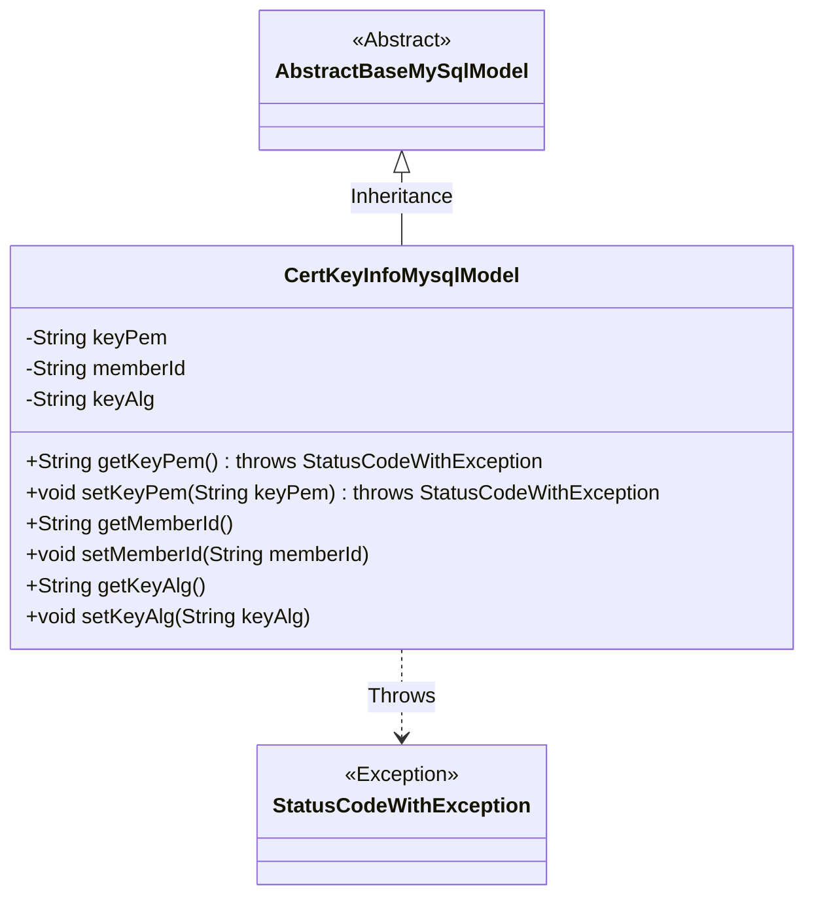

# Basic Information

|      |      |
|------|------|
| Name | CertKeyInfoMysqlModel |
| Language | .java |
| Code Path | WeFe/board/board-service/src/main/java/com/welab/wefe/board/service/database/entity/cert/CertKeyInfoMysqlModel.java |
| Package Name | com.welab.wefe.board.service.database.entity.cert |
| Dependencies | ['javax.persistence.Column', 'javax.persistence.Entity', 'org.hibernate.annotations.TypeDef', 'com.vladmihalcea.hibernate.type.json.JsonStringType', 'com.welab.wefe.board.service.database.entity.base.AbstractBaseMySqlModel', 'com.welab.wefe.common.exception.StatusCodeWithException'] |
| Brief Description | CertKeyInfoMysqlModel is a MySQL entity class containing keyPem, memberId, and keyAlg fields, used for storing certificate key information. |

# Description

The content defines a JPA entity class named `cert_key_info` called `CertKeyInfoMysqlModel`, which extends `AbstractBaseMySqlModel`. The entity contains three fields: `keyPem` stores the key in PEM format string, `memberId` represents the member identifier, and `keyAlg` records the key algorithm. All fields have corresponding getter and setter methods, with the access methods for `keyPem` throwing a `StatusCodeWithException` exception. The class uses the `@TypeDef` annotation to define a custom type named `json` and is annotated with `serialVersionUID` for serialization.

# Class Summary

| Name   | Type  | Description |
|-------|------|-------------|
| CertKeyInfoMysqlModel | class | CertKeyInfoMysqlModel is a MySQL entity class containing keyPem, memberId, and keyAlg fields, used for storing certificate key information. |

## Class CertKeyInfoMysqlModel

|      |      |
|------|------|
| Access Modifier | @Entity(name = "cert_key_info");@TypeDef(name = "json", typeClass = JsonStringType.class);public |
| Type | class |
| Name | CertKeyInfoMysqlModel |
| Description | CertKeyInfoMysqlModel is a MySQL entity class containing keyPem, memberId, and keyAlg fields, used for storing certificate key information. |

### UML Class Diagram

This class diagram illustrates a JPA-based database entity class CertKeyInfoMysqlModel, which inherits from the abstract base class AbstractBaseMySqlModel. The class contains three private fields (keyPem, memberId, and keyAlg) along with their corresponding getter/setter methods, where the keyPem-related methods throw StatusCodeWithException. The @Entity and @Column annotations indicate this is a database-mapped entity, while the @TypeDef annotation specifies the JSON type handling. The overall design reflects the mapping relationship between JPA entities and MySQL database tables.

### Internal Method Call Graph

```mermaid
graph TD
    A["Class CertKeyInfoMysqlModel"]
    B["Annotation: @Entity(name='cert_key_info')"]
    C["Annotation: @TypeDef(name='json', typeClass=JsonStringType.class)"]
    D["Inheritance: AbstractBaseMySqlModel"]
    E["Field: String keyPem"]
    F["Field: String memberId"]
    G["Field: String keyAlg"]
    H["Method: getKeyPem() throws StatusCodeWithException"]
    I["Method: setKeyPem(String) throws StatusCodeWithException"]
    J["Method: getMemberId()"]
    K["Method: setMemberId(String)"]
    L["Method: getKeyAlg()"]
    M["Method: setKeyAlg(String)"]

    A --> B
    A --> C
    A --> D
    A --> E
    A --> F
    A --> G
    A --> H
    A --> I
    A --> J
    A --> K
    A --> L
    A --> M
```

This flowchart illustrates the complete structure of the CertKeyInfoMysqlModel class, including class annotations, inheritance relationships, fields, and methods. As a JPA entity class mapped to the database table 'cert_key_info', it contains three core fields (keyPem, memberId, keyAlg) with their corresponding getter/setter methods. Notably, the keyPem-related methods throw StatusCodeWithException, indicating potential sensitive data handling or complex business logic validation. The @TypeDef annotation defines a JSON type handler, suggesting possible JSON data processing capabilities.

### Field List

| Name  | Type  | Description |
|-------|-------|------|
| serialVersionUID = -7493726478506825680L | long | Defined a private static final serial version ID with a value of -7493726478506825680L. |
| keyAlg | String | Database field mapping: key_alg corresponds to the private string variable keyAlg. |
| memberId | String | Database field mapping: Member ID corresponds to the member_id column. |
| keyPem | String | Database field mapping: keyPem corresponds to the table column key_pem, stored as string type. |

### Method List

| Name  | Type  | Description |
|-------|-------|------|
| getKeyPem | String | Get the key PEM string, throws a StatusCodeWithException on failure. |
| setKeyPem | void | Set the key PEM string, may throw a StatusCodeWithException. |
| getKeyAlg | String | String method for obtaining the key algorithm. |
| getMemberId | String | Methods to obtain member ID, returns a string-type memberId. |
| setMemberId | void | The method to set the member ID assigns the input string to the member variable memberId. |
| setKeyAlg | void | Set the public method for the key algorithm, with the parameter being of string type. |

