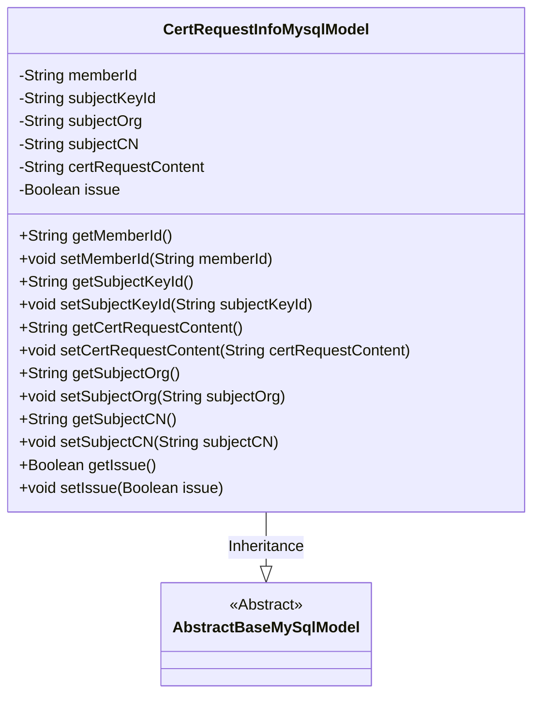

# Basic Information

|      |      |
|------|------|
| Name | CertRequestInfoMysqlModel |
| Language | .java |
| Code Path | WeFe/board/board-service/src/main/java/com/welab/wefe/board/service/database/entity/cert/CertRequestInfoMysqlModel.java |
| Package Name | com.welab.wefe.board.service.database.entity.cert |
| Dependencies | ['javax.persistence.Column', 'javax.persistence.Entity', 'org.hibernate.annotations.TypeDef', 'com.vladmihalcea.hibernate.type.json.JsonStringType', 'com.welab.wefe.board.service.database.entity.base.AbstractBaseMySqlModel'] |
| Brief Description | Certificate Request Information Entity Class, containing fields such as user ID, private key ID, organization name, common name, request content, and issuance status. |

# Description

This is a JPA entity class named `cert_request_info`, designed to map the certificate application information table in the database. The class inherits from the `AbstractBaseMySqlModel` base class and contains six core fields: user ID, applicant private key ID, applicant organization name, applicant common name, certificate application content, and issuance flag. Each field is mapped to a database column via the `@Column` annotation, where `member_id` corresponds to the member ID, `subject_key_id` corresponds to the private key ID, `subject_org` corresponds to the organization name, `subject_cn` corresponds to the common name, `cert_request_content` stores the certificate application content, and `issue` indicates the issuance status. The class provides standard getter and setter methods for field access and modification and implements the serializable interface.

# Class Summary

| Name   | Type  | Description |
|-------|------|-------------|
| CertRequestInfoMysqlModel | class | This is a database entity class named cert_request_info, which includes fields such as user ID, private key ID, organization name, common name, certificate request content, and issuance status. |

## Class CertRequestInfoMysqlModel

|      |      |
|------|------|
| Access Modifier | @Entity(name = "cert_request_info");@TypeDef(name = "json", typeClass = JsonStringType.class);public |
| Type | class |
| Name | CertRequestInfoMysqlModel |
| Description | This is a database entity class named cert_request_info, which includes fields such as user ID, private key ID, organization name, common name, certificate request content, and issuance status. |

### UML Class Diagram

This code defines an entity class named `CertRequestInfoMysqlModel`, which represents certificate request information and inherits from the abstract base class `AbstractBaseMySqlModel`. The class contains multiple private fields, such as user ID, applicant private key ID, organization name, etc., each with corresponding getter and setter methods. The class is marked as an entity using JPA annotations and specifies table name and field mapping relationships, primarily used for database operations. Through inheritance, the class inherits generic database operation capabilities from the base class while extending business attributes specific to certificate requests.

### Internal Method Call Graph

```mermaid
graph TD
    A["Class CertRequestInfoMysqlModel"]
    B["Inheritance: AbstractBaseMySqlModel"]
    C["Annotation: @Entity('cert_request_info')"]
    D["Annotation: @TypeDef(name='json', typeClass=JsonStringType.class)"]
    E["Property: String memberId"]
    F["Property: String subjectKeyId"]
    G["Property: String subjectOrg"]
    H["Property: String subjectCN"]
    I["Property: String certRequestContent"]
    J["Property: Boolean issue"]
    K["Method: getMemberId()/setMemberId()"]
    L["Method: getSubjectKeyId()/setSubjectKeyId()"]
    M["Method: getSubjectOrg()/setSubjectOrg()"]
    N["Method: getSubjectCN()/setSubjectCN()"]
    O["Method: getCertRequestContent()/setCertRequestContent()"]
    P["Method: getIssue()/setIssue()"]

    A --> B
    A --> C
    A --> D
    A --> E
    A --> F
    A --> G
    A --> H
    A --> I
    A --> J
    A --> K
    A --> L
    A --> M
    A --> N
    A --> O
    A --> P
```

This flowchart illustrates the complete structure of the CertRequestInfoMysqlModel class, a JPA-based entity class that inherits from AbstractBaseMySqlModel. The class contains 6 database-mapped fields (memberId, subjectKeyId, etc.) with their corresponding getter/setter methods, and uses @Entity and @TypeDef annotations to define the table name and JSON type handling. All properties and methods are correctly linked to the main class node, reflecting the complete class member relationships.

### Field List

| Name  | Type  | Description |
|-------|-------|------|
| subjectKeyId | String | The database field subject_key_id is mapped to the string type subjectKeyId. |
| issue | Boolean | The entity class field `issue`, of boolean type, corresponds to the database column name `issue`. |
| serialVersionUID = -6973794829218983299L | long | Declare a private static final serial version ID with a value of -6973794829218983299L. |
| memberId | String | The database field member_id is mapped to the member ID string type. |
| subjectOrg | String | Database field mapping: subject_org corresponds to the string variable subjectOrg in the entity class. |
| subjectCN | String | The database field subject_cn maps to the Java variable subjectCN, with a type of String. |
| certRequestContent | String | Database field mapping: certRequestContent corresponds to the table column cert_request_content, with a type of String. |

### Method List

| Name  | Type  | Description |
|-------|-------|------|
| setSubjectOrg | void | The method for setting the subject organization attribute assigns the input string to the `subjectOrg` member variable of the class. |
| setCertRequestContent | void | The method for setting the certificate request content assigns the input parameters to the member variable certRequestContent. |
| getSubjectCN | String | The method to obtain the topic CN, which returns the value of the string-type variable subjectCN. |
| setSubjectCN | void | Method to set the Chinese name of the theme, with the parameter being of string type. |
| setSubjectKeyId | void | The method to set the subject key ID assigns the input string to the member variable subjectKeyId of the class. |
| getSubjectKeyId | String | Methods to obtain the subject key ID, returning the subjectKeyId value as a string type. |
| setMemberId | void | The method to set the member ID assigns the input string to the member variable `memberId`. |
| getCertRequestContent | String | The method returns the certificate request content string. |
| getSubjectOrg | String | Method to obtain the subjectOrg string. |
| getIssue | Boolean | This is a Java method that returns the value of the boolean variable `issue`. |
| setIssue | void | Methods for setting the issue status, with a boolean parameter 'issue' to update the current object's issue status. |
| getMemberId | String | Methods to obtain member ID, returns a string-type memberId. |

