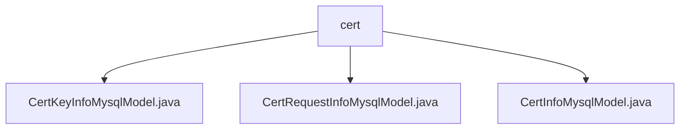

# Basic Information

|      |      |
|------|------|
| Name | cert |
| Language | .java |
| Code Path | WeFe/board/board-service/src/main/java/com/welab/wefe/board/service/database/entity/cert |
| Package Name | docs.board.board-service.src.main.java.com.welab.wefe.board.service.database.entity.cert |
| Brief Description | The CertKeyInfoMysqlModel stores key PEM, member ID, and algorithm; the CertRequestInfoMysqlModel records certificate request information such as private key ID, organization name, etc.; the CertInfoMysqlModel manages certificate data like public key, serial number, etc. All three inherit from AbstractBaseMySqlModel and use JPA annotations to map database fields. |

# Description

## Overview  
The core responsibility of this module is to manage the full lifecycle data of digital certificates, including key storage, certificate application, and issuance information. The interface specification adheres to the JPA entity standard, uniformly using the @Column annotation for database field mapping, and supports JSON type conversion. Key data structures include CertKeyInfoMysqlModel (key PEM), CertRequestInfoMysqlModel (application form), and CertInfoMysqlModel (certificate metadata). External dependencies are limited to the JPA framework. For example, CertKeyInfoMysqlModel stores asymmetric encryption keys via the keyPem field.  

## Primary Business Scenarios  
The module comprehensively covers the certificate generation process: members submit keys and applications (CertRequestInfoMysqlModel), and the CA authority reviews and issues certificates (CertInfoMysqlModel). The interaction mode resembles CRUD operations, with field access implemented through getter/setter methods. Typical applications include consortium blockchain member onboarding authentication, such as the subject_cn field storing user-recognizable names. API types are all data entity classes, and integration examples demonstrate the correlation between certificate status (issue field) and request content (cert_request_content) updates.

### Package Internal Structure View

This flowchart illustrates the hierarchical structure of certificate-related entity classes in the WeFe project. The cert directory contains three Java entity class files, representing MySQL database models for certificate key information, certificate request information, and certificate information respectively. These classes reside in the database entity package of the board-service module and are used to handle data persistence operations related to certificates.

# File List

| Name   | Type  | Description |
|-------|------|-------------|
| [CertKeyInfoMysqlModel.java](CertKeyInfoMysqlModel.md) | file | CertKeyInfoMysqlModel is a MySQL entity class containing keyPem, memberId, and keyAlg fields, used for storing certificate key information. |
| [CertRequestInfoMysqlModel.java](CertRequestInfoMysqlModel.md) | file | Certificate request information entity class, containing fields such as user ID, private key ID, organization name, common name, application content, and issuance status. |
| [CertInfoMysqlModel.java](CertInfoMysqlModel.md) | file | CertInfoMysqlModel is a MySQL entity class for storing certificate information, containing fields such as user ID, public key, organization name, common name, serial number, certificate content, request ID, and status. |

