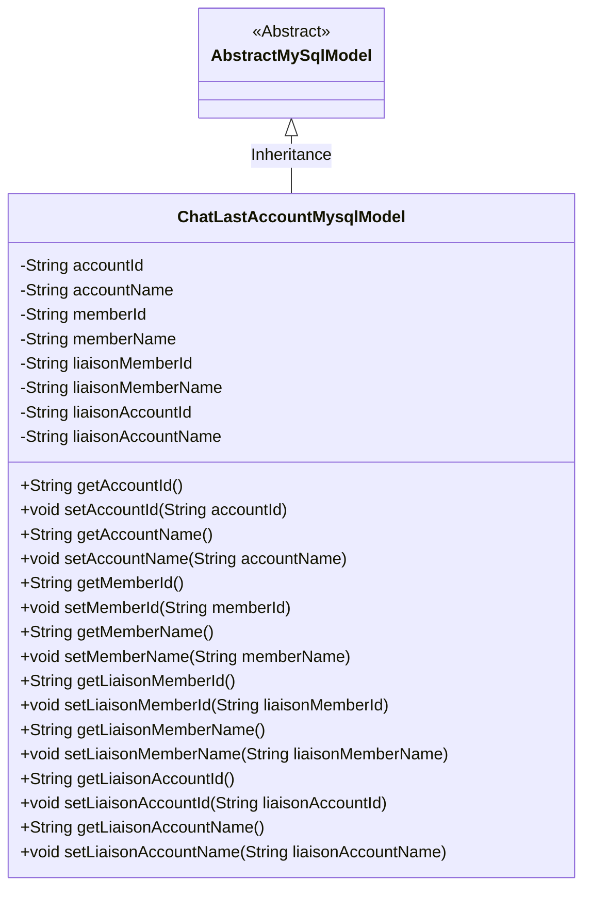

# Basic Information

|      |      |
|------|------|
| Name | ChatLastAccountMysqlModel |
| Language | .java |
| Code Path | WeFe/board/board-service/src/main/java/com/welab/wefe/board/service/database/entity/chat/ChatLastAccountMysqlModel.java |
| Package Name | com.welab.wefe.board.service.database.entity.chat |
| Dependencies | ['com.welab.wefe.board.service.database.entity.base.AbstractMySqlModel', 'javax.persistence.Entity'] |
| Brief Description | ChatLastAccountMysqlModel is a MySQL entity class that includes account ID, name, member ID, name, as well as the ID and name fields of the contact member and account, along with their getter/setter methods. |

# Description

The content defines a Java entity class named `ChatLastAccountMysqlModel`, which maps to the database table `chat_last_account`. The class inherits from `AbstractMySqlModel` and includes fields for account and member information: `accountId`, `accountName`, `memberId`, `memberName`, as well as liaison-related fields such as `liaisonMemberId`, `liaisonMemberName`, `liaisonAccountId`, and `liaisonAccountName`. Each field has corresponding getter and setter methods for data access and modification.

# Class Summary

| Name   | Type  | Description |
|-------|------|-------------|
| ChatLastAccountMysqlModel | class | This is a Java entity class named ChatLastAccountMysqlModel, used to store chat-related account and member information, including account ID, name, member ID, name, as well as the member and account information of contacts. |

## Class ChatLastAccountMysqlModel

|      |      |
|------|------|
| Access Modifier | @Entity(name = "chat_last_account");public |
| Type | class |
| Name | ChatLastAccountMysqlModel |
| Description | This is a Java entity class named ChatLastAccountMysqlModel, used to store chat-related account and member information, including account ID, name, member ID, name, as well as the member and account information of contacts. |

### UML Class Diagram

This class diagram illustrates a ChatLastAccountMysqlModel entity class that inherits from AbstractMySqlModel, primarily used for storing chat-related account and member information. The class contains 8 private String fields, recording account ID/name, member ID/name, as well as liaison's member ID/name and account ID/name, with corresponding getter and setter methods for each field. The class is marked as a JPA entity through the @Entity annotation, indicating its mapping relationship with the database table "chat_last_account".

### Internal Method Call Graph

```mermaid
graph TD
    A["Class ChatLastAccountMysqlModel"]
    B["Inherits: AbstractMySqlModel"]
    C["Property: String accountId"]
    D["Property: String accountName"]
    E["Property: String memberId"]
    F["Property: String memberName"]
    G["Property: String liaisonMemberId"]
    H["Property: String liaisonMemberName"]
    I["Property: String liaisonAccountId"]
    J["Property: String liaisonAccountName"]
    K["Method: getAccountId()"]
    L["Method: setAccountId(String)"]
    M["Method: getAccountName()"]
    N["Method: setAccountName(String)"]
    O["Method: getMemberId()"]
    P["Method: setMemberId(String)"]
    Q["Method: getMemberName()"]
    R["Method: setMemberName(String)"]
    S["Method: getLiaisonMemberId()"]
    T["Method: setLiaisonMemberId(String)"]
    U["Method: getLiaisonMemberName()"]
    V["Method: setLiaisonMemberName(String)"]
    W["Method: getLiaisonAccountId()"]
    X["Method: setLiaisonAccountId(String)"]
    Y["Method: getLiaisonAccountName()"]
    Z["Method: setLiaisonAccountName(String)"]

    A --> B
    A --> C
    A --> D
    A --> E
    A --> F
    A --> G
    A --> H
    A --> I
    A --> J
    A --> K
    A --> L
    A --> M
    A --> N
    A --> O
    A --> P
    A --> Q
    A --> R
    A --> S
    A --> T
    A --> U
    A --> V
    A --> W
    A --> X
    A --> Y
    A --> Z
```

This flowchart illustrates the complete structure of the ChatLastAccountMysqlModel class, including its inheritance relationship and all properties and methods. The class is a JPA entity containing 8 String-type properties representing account and member-related information, along with corresponding getter and setter methods. Each property has explicit data access and modification methods, reflecting the standard JavaBean design pattern. The class inherits from AbstractMySqlModel, indicating it is a MySQL database-mapped entity class.

### Field List

| Name  | Type  | Description |
|-------|-------|------|
| memberId | String | Declare a private string-type variable memberId. |
| liaisonMemberName | String | Private string type variable, storing the name of the contact member. |
| memberName | String | The member variable is named memberName, with a type of String. |
| liaisonAccountId | String | Private string type variable, storing the contact account ID. |
| liaisonAccountName | String | Private string variable storing the contact account name. |
| liaisonMemberId | String | Private string type variable, storing the contact member ID. |
| accountName | String | Declare a private string variable accountName. |
| accountId | String | Private string type variable accountId |

### Method List

| Name  | Type  | Description |
|-------|-------|------|
| getMemberId | String | This is a Java method that returns a member ID string. |
| getLiaisonMemberName | String | Methods for obtaining the name of a contact member, returning a string-type member name variable. |
| getAccountId | String | Public method to obtain the accountId, returns a string type. |
| setLiaisonMemberId | void | The method to set the liaison member ID takes a parameter of string type `liaisonMemberId` and assigns it to the property of the same name in the current object. |
| getAccountName | String | Methods to obtain the account name, returns the accountName string. |
| setLiaisonMemberName | void | The method to set the liaison name assigns the parameter value to the member variable `liaisonMemberName`. |
| getLiaisonMemberId | String | Methods to obtain the contact member ID, returns the member ID as a string type. |
| setMemberName | void | The method to set the member name assigns the input parameter to the member variable. |
| setAccountId | void | Methods for setting the account ID: Assign the parameter accountId to the accountId property of the current object. |
| setMemberId | void | The method to set the member ID assigns the input parameter to the class's member variable memberId. |
| setAccountName | void | This is a Java method used to set the value of the class's accountName property. The method takes a string parameter accountName and assigns it to the member variable of the same name in the class. |
| getMemberName | String | The method to obtain the member name directly returns the value of the member variable memberName. |
| getLiaisonAccountId | String | The method returns the contact account ID string. |
| setLiaisonAccountId | void | The method to set the liaison account ID is to assign the parameter value to the class member variable `liaisonAccountId`. |
| getLiaisonAccountName | String | The method to obtain the liaison account name, which returns a string-type value `liaisonAccountName`. |
| setLiaisonAccountName | void | The method to set the liaison account name assigns the parameter value to the class member variable `liaisonAccountName`. |

