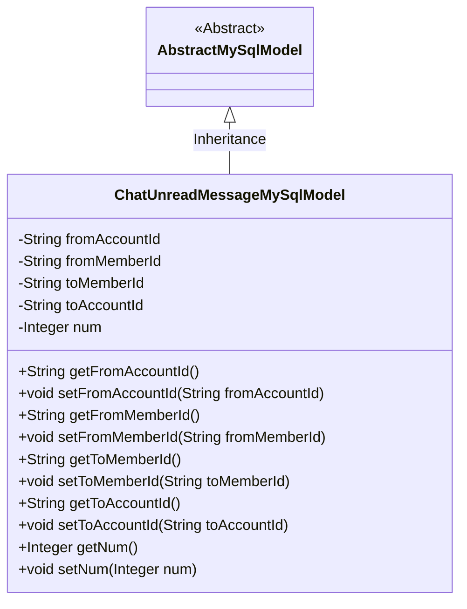

# Basic Information

|      |      |
|------|------|
| Name | ChatUnreadMessageMySqlModel |
| Language | .java |
| Code Path | WeFe/board/board-service/src/main/java/com/welab/wefe/board/service/database/entity/chat/ChatUnreadMessageMySqlModel.java |
| Package Name | com.welab.wefe.board.service.database.entity.chat |
| Dependencies | ['com.welab.wefe.board.service.database.entity.base.AbstractMySqlModel', 'javax.persistence.Entity'] |
| Brief Description | The database entity class ChatUnreadMessageMySqlModel includes fields for the sender's and recipient's account IDs, member IDs, and the count of unread messages. |

# Description

The code defines a JPA entity class named `ChatUnreadMessageMySqlModel`, which represents a database model for unread chat messages. The entity includes fields such as sender account ID, sender member ID, recipient member ID, recipient account ID, and the count of unread messages. All fields are provided with standard getter and setter methods for data access and modification. This class inherits from `AbstractMySqlModel`, indicating it possesses basic MySQL model characteristics.

# Class Summary

| Name   | Type  | Description |
|-------|------|-------------|
| ChatUnreadMessageMySqlModel | class | The database entity class ChatUnreadMessageMySqlModel contains the account and member IDs of both sender and receiver, as well as the count of unread messages. |

## Class ChatUnreadMessageMySqlModel

|      |      |
|------|------|
| Access Modifier | @Entity(name = "chat_unread_message");public |
| Type | class |
| Name | ChatUnreadMessageMySqlModel |
| Description | The database entity class ChatUnreadMessageMySqlModel contains the account and member IDs of both sender and receiver, as well as the count of unread messages. |

### UML Class Diagram

This code defines an entity class named ChatUnreadMessageMySqlModel, which represents a database model for unread chat messages. The class inherits from the abstract class AbstractMySqlModel and includes private fields such as the sender's and receiver's account IDs, member IDs, and the count of unread messages, along with corresponding getter and setter methods. The class diagram clearly illustrates the inheritance relationship and the structure of the class members, showcasing the core attributes and methods of this entity class as a database model.

### Internal Method Call Graph

```mermaid
graph TD
    A["Class ChatUnreadMessageMySqlModel"]
    B["Inherits: AbstractMySqlModel"]
    C["Property: String fromAccountId"]
    D["Property: String fromMemberId"]
    E["Property: String toMemberId"]
    F["Property: String toAccountId"]
    G["Property: Integer num"]
    H["Method: getFromAccountId()"]
    I["Method: setFromAccountId(String)"]
    J["Method: getFromMemberId()"]
    K["Method: setFromMemberId(String)"]
    L["Method: getToMemberId()"]
    M["Method: setToMemberId(String)"]
    N["Method: getToAccountId()"]
    O["Method: setToAccountId(String)"]
    P["Method: getNum()"]
    Q["Method: setNum(Integer)"]

    A --> B
    A --> C
    A --> D
    A --> E
    A --> F
    A --> G
    A --> H
    A --> I
    A --> J
    A --> K
    A --> L
    A --> M
    A --> N
    A --> O
    A --> P
    A --> Q
```

This code defines an entity class named ChatUnreadMessageMySqlModel, which inherits from AbstractMySqlModel and represents a data model for unread chat messages. The class contains five private properties: sender account ID, sender member ID, recipient member ID, recipient account ID, and unread message count, each with corresponding getter and setter methods. This model maps to the database table "chat_unread_message" for persistently storing the unread status information of chat messages.

### Field List

| Name  | Type  | Description |
|-------|-------|------|
| fromMemberId | String | Private string type member variable fromMemberId. |
| num | Integer | Declare a private integer variable num. |
| toAccountId | String | The private string-type variable toAccountId. |
| toMemberId | String | Declare a private string variable toMemberId. |
| fromAccountId | String | Private string type variable fromAccountId |

### Method List

| Name  | Type  | Description |
|-------|-------|------|
| getToMemberId | String | Methods to obtain the recipient member ID, returning the string-type toMemberId value. |
| setFromAccountId | void | The method to set the source account ID assigns the parameter value to the class member variable fromAccountId. |
| getToAccountId | String | Methods to obtain the target account ID, returning the toAccountId as a string. |
| setNum | void | This is a Java method used to set the value of the class member variable num. The method takes an Integer parameter and assigns it to the num property of the current object. |
| getFromAccountId | String | This method returns the value of the fromAccountId variable as a string type. |
| setFromMemberId | void | The method to set the member ID assigns the parameter fromMemberId to the fromMemberId property of the current object. |
| setToAccountId | void | Method to set the target account ID: Assign the parameter value to the class member variable toAccountId. |
| getNum | Integer | This is a Java method that returns the value of an integer-type variable num. |
| getFromMemberId | String | Methods to obtain member ID, returns a string-type fromMemberId. |
| setToMemberId | void | The method to set the target member ID assigns the parameter toMemberId to the toMemberId property of the current object. |

