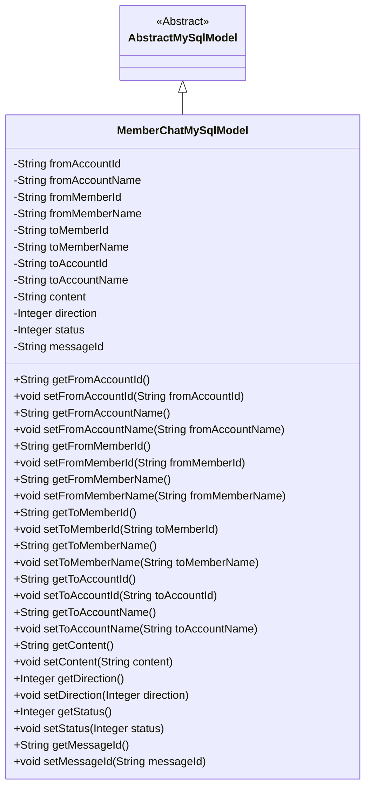

# Basic Information

|      |      |
|------|------|
| Name | MemberChatMySqlModel |
| Language | .java |
| Code Path | WeFe/board/board-service/src/main/java/com/welab/wefe/board/service/database/entity/chat/MemberChatMySqlModel.java |
| Package Name | com.welab.wefe.board.service.database.entity.chat |
| Dependencies | ['com.welab.wefe.board.service.database.entity.base.AbstractMySqlModel', 'javax.persistence.Entity'] |
| Brief Description | Member Chat MySQL Model Class, including attributes such as sender and recipient account and member IDs, names, chat content, message direction, status, and ID, along with their corresponding getter/setter methods. |

# Description

The code defines an entity class named `MemberChatMySqlModel`, which is used to store member chat information. The class includes fields such as the sender's and receiver's account IDs and names, member IDs and names, chat content, message direction (received or sent), status (e.g., read, unread), message ID, and more. All fields are equipped with corresponding getter and setter methods for data access operations. This class inherits from `AbstractMySqlModel`, indicating its use for persistent storage in a MySQL database.

# Class Summary

| Name   | Type  | Description |
|-------|------|-------------|
| MemberChatMySqlModel | class | Member Chat MySQL Model, including fields such as sender/receiver account, member ID and name, message content, direction, status, and message ID. |

## Class MemberChatMySqlModel

|      |      |
|------|------|
| Access Modifier | @Entity(name = "member_chat");public |
| Type | class |
| Name | MemberChatMySqlModel |
| Description | Member Chat MySQL Model, including fields such as sender/receiver account, member ID and name, message content, direction, status, and message ID. |

### UML Class Diagram

This code defines an entity class named `MemberChatMySqlModel`, which represents chat records between members. The class inherits from `AbstractMySqlModel` and includes attributes such as sender and receiver account IDs, member IDs, names, as well as chat content, direction, status, and message ID. All attributes are private and accessed or modified through public getter and setter methods. This class is primarily used for database persistence and is marked as a JPA entity via the `@Entity` annotation.

### Internal Method Call Graph

```mermaid
graph TD
    A["Class MemberChatMySqlModel"]
    B["Inherits: AbstractMySqlModel"]
    C["Property: String fromAccountId"]
    D["Property: String fromAccountName"]
    E["Property: String fromMemberId"]
    F["Property: String fromMemberName"]
    G["Property: String toMemberId"]
    H["Property: String toMemberName"]
    I["Property: String toAccountId"]
    J["Property: String toAccountName"]
    K["Property: String content"]
    L["Property: Integer direction"]
    M["Property: Integer status"]
    N["Property: String messageId"]
    O["Getter/Setter Methods: fromAccountId"]
    P["Getter/Setter Methods: fromAccountName"]
    Q["Getter/Setter Methods: fromMemberId"]
    R["Getter/Setter Methods: fromMemberName"]
    S["Getter/Setter Methods: toMemberId"]
    T["Getter/Setter Methods: toMemberName"]
    U["Getter/Setter Methods: toAccountId"]
    V["Getter/Setter Methods: toAccountName"]
    W["Getter/Setter Methods: content"]
    X["Getter/Setter Methods: direction"]
    Y["Getter/Setter Methods: status"]
    Z["Getter/Setter Methods: messageId"]

    A --> B
    A --> C
    A --> D
    A --> E
    A --> F
    A --> G
    A --> H
    A --> I
    A --> J
    A --> K
    A --> L
    A --> M
    A --> N
    C -.-> O
    D -.-> P
    E -.-> Q
    F -.-> R
    G -.-> S
    H -.-> T
    I -.-> U
    J -.-> V
    K -.-> W
    L -.-> X
    M -.-> Y
    N -.-> Z
```

This code defines an entity class named MemberChatMySqlModel, which represents chat records between members. The class inherits from AbstractMySqlModel and includes properties such as sender and receiver account IDs, member IDs, names, as well as fields for chat content, direction, status, and message ID. Each property has corresponding getter and setter methods for data access operations. This class is primarily used for database mapping to store and manage chat record-related information.

### Field List

| Name  | Type  | Description |
|-------|-------|------|
| direction | Integer | The private integer variable `direction` is used to indicate the direction. |
| fromAccountName | String | Private string variable storing the account name. |
| messageId | String | The private string-type variable messageId is used to store the message identifier. |
| toMemberName | String | Declare a private string variable toMemberName. |
| toAccountId | String | Declare a private string variable toAccountId. |
| toMemberId | String | Send target member ID string |
| status | Integer | Private integer state variables. |
| fromMemberId | String | Private string type member variable, representing the source member ID. |
| fromAccountId | String | Declare a private string variable fromAccountId. |
| fromMemberName | String | Private string-type variable, storing member names. |
| content | String | Private string type variable content. |
| toAccountName | String | Private string variable storing the target account name. |

### Method List

| Name  | Type  | Description |
|-------|-------|------|
| setToMemberName | void | The method to set the member name assigns the input parameter to the class's member variable `toMemberName`. |
| getFromMemberName | String | The method to obtain the member name returns the member variable `fromMemberName` of string type. |
| setFromMemberId | void | Methods for setting member ID: Assign the parameter fromMemberId to the class property of the same name. |
| getToAccountId | String | Methods to obtain the target account ID, returning a string-type toAccountId. |
| setStatus | void | This is a Java method used to set the value of the status property of an object. The method takes an Integer parameter and assigns it to the status field of the object. |
| setToMemberId | void | The method to set the recipient member ID, which takes a string parameter and assigns it to the class member variable `toMemberId`. |
| setFromAccountName | void | The method to set the account name assigns the input parameter to the class member variable `fromAccountName`. |
| setMessageId | void | The method for setting the message ID assigns the input parameter messageId to the messageId property of the current object. |
| getMessageId | String | Methods to obtain the messageId, directly returning the value of messageId. |
| getToMemberName | String | Methods for obtaining the recipient member name, returning a string type value. |
| setToAccountId | void | The method to set the target account ID assigns the parameter value to the class member variable `toAccountId`. |
| setContent | void | Set the content attribute value to the value of the input parameter content. |
| getToMemberId | String | Methods to obtain the recipient member ID, returning the `toMemberId` value as a string. |
| setFromMemberName | void | Java method: Set the value of the member variable fromMemberName. |
| setFromAccountId | void | The method to set the source account ID assigns the parameter value to the class member variable `fromAccountId`. |
| getToAccountName | String | Methods to obtain the target account name, returns the account name as a string. |
| getFromAccountId | String | The method to obtain the source account ID, which returns the account ID as a string type. |
| setDirection | void | This method is used to set the direction property, which takes an integer parameter direction and assigns it to the class member variable direction. |
| getDirection | Integer | Methods to obtain direction values, returns direction values of integer type. |
| getStatus | Integer | Methods to obtain status values, returning integer-type status values. |
| getFromAccountName | String | Methods to obtain the sender's account name, which returns the account name as a string type. |
| getContent | String | Methods to obtain the content string. |
| getFromMemberId | String | Methods to obtain member ID, returns a string-type fromMemberId. |
| setToAccountName | void | The method to set the target account name assigns the parameter `toAccountName` to the class member variable `this.toAccountName`. |

