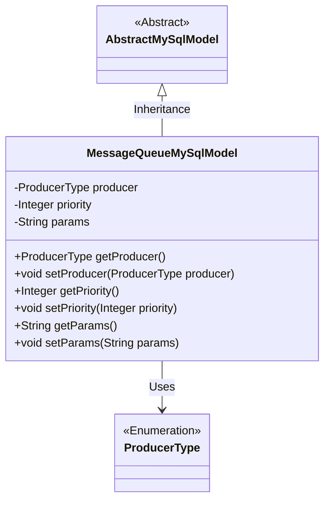
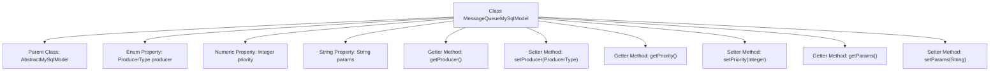

# Basic Information

|      |      |
|------|------|
| Name | MessageQueueMySqlModel |
| Language | .java |
| Code Path | WeFe/board/board-service/src/main/java/com/welab/wefe/board/service/database/entity/chat/MessageQueueMySqlModel.java |
| Package Name | com.welab.wefe.board.service.database.entity.chat |
| Dependencies | ['com.welab.wefe.board.service.database.entity.base.AbstractMySqlModel', 'com.welab.wefe.common.wefe.enums.ProducerType', 'javax.persistence.Entity', 'javax.persistence.EnumType', 'javax.persistence.Enumerated'] |
| Brief Description | Message Queue MySQL Entity Class, including producer type, priority, parameter fields, and their getter/setter methods. |

# Description

This is a JPA entity class named MessageQueueMySqlModel, mapped to the database table message_queue. It inherits from AbstractMySqlModel and contains three core fields: producer indicates the message producer type (enum values board/gateway), priority defines message processing priority (higher values take precedence), and params stores action parameters. The class provides standard getter and setter methods for each field. This entity is used to implement persistent storage for message queues.

# Class Summary

| Name   | Type  | Description |
|-------|------|-------------|
| MessageQueueMySqlModel | class | Message queue MySQL entity class, including producer type (enum), priority, action parameter fields, and corresponding getter/setter methods. |

## Class MessageQueueMySqlModel

|      |      |
|------|------|
| Access Modifier | @Entity(name = "message_queue");public |
| Type | class |
| Name | MessageQueueMySqlModel |
| Description | Message queue MySQL entity class, including producer type (enum), priority, action parameter fields, and corresponding getter/setter methods. |

### UML Class Diagram

This code defines an entity class named MessageQueueMySqlModel, which inherits from the AbstractMySqlModel abstract class. The class contains three main attributes: producer (an enumeration value representing the producer type), priority (a numerical value for priority), and params (a parameter string), along with corresponding getter and setter methods. ProducerType is an enumeration used to identify the message source. The class is marked as a JPA entity with the @Entity annotation and mapped to the database table message_queue. This design is intended for persistent storage of message queues, supporting priority sorting and differentiation between different types of producers.

### Internal Method Call Graph

This flowchart illustrates the complete structure of the MessageQueueMySqlModel class, a JPA entity class inheriting from AbstractMySqlModel. The class contains three core properties: the enum-type "producer" representing message producer types, the Integer-type "priority" indicating message priority, and the String-type "params" storing action parameters. Each property is equipped with corresponding getter and setter methods, which are connected to the main class via arrows, clearly presenting the class member relationships and method invocation paths. The @Entity annotation indicates this is a persistent object, while the @Enumerated annotation specifies the storage method for the enum.

### Field List

| Name  | Type  | Description |
|-------|-------|------|
| producer | ProducerType | Use the @Enumerated annotation to store the enum type ProducerType as a string in the database. |
| params | String | Private string parameter `params`. |
| priority | Integer | Private integer variable indicating priority. |

### Method List

| Name  | Type  | Description |
|-------|-------|------|
| getProducer | ProducerType | Methods to obtain the producer type, returning the producer variable. |
| getParams | String | The method returns the value of the string-type parameter params. |
| setPriority | void | This is a Java method used to set the priority property of an object. The method takes an Integer parameter `priority` and assigns it to the object's `priority` field. |
| setProducer | void | Method to set the producer object, which assigns the passed producer parameter to the producer property of the current object. |
| getPriority | Integer | Get the integer value of priority. |
| setParams | void | Method for setting parameters, assigning the input parameters to the class member variable params. |

