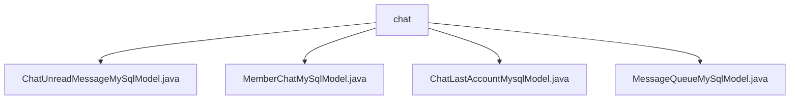

# Basic Information

|      |      |
|------|------|
| Name | chat |
| Language | .java |
| Code Path | WeFe/board/board-service/src/main/java/com/welab/wefe/board/service/database/entity/chat |
| Package Name | docs.board.board-service.src.main.java.com.welab.wefe.board.service.database.entity.chat |
| Brief Description | Four JPA entity classes are defined: ChatUnreadMessageMySqlModel (unread messages), MemberChatMySqlModel (member chat information), ChatLastAccountMysqlModel (account contacts), and MessageQueueMySqlModel (message queue). All inherit from AbstractMySqlModel and contain relevant fields along with getter/setter methods. |

# Description

## Overview  
The core responsibility of this module is to implement data persistence for the chat system, including unread messages, member chat records, recent contacts, and message queue management. The interface specification adheres to the JPA standard, providing getter/setter methods for basic fields. Key data structures include sender/receiver accounts and member information, message content and status, queue priority, etc. The only external dependency is the MySQL database. For example, `ChatUnreadMessageMySqlModel` tracks unread counts, while `MessageQueueMySqlModel` implements priority queue storage.  

## Primary Business Scenarios  
The module supports the complete chat business workflow: message exchange between members (`MemberChatMySqlModel`), unread status maintenance (`ChatUnreadMessageMySqlModel`), recent contact records (`ChatLastAccountMysqlModel`), and asynchronous message processing (`MessageQueueMySqlModel`). The interaction mode resembles an event bus, achieving state synchronization through database tables. Typical applications include real-time message推送 and unread count updates. API types cover CRUD operations, such as automatic JPA-based persistence of message entities.

### Package Internal Structure View

This flowchart illustrates the database entity class structure related to the chat feature in the WeFe project. All entity classes are located under the chat directory, comprising four core components: the unread message model, member chat model, last account model, and message queue model, forming a clear hierarchical relationship. These entity classes collectively support the database operation requirements of the chat functionality.

# File List

| Name   | Type  | Description |
|-------|------|-------------|
| [ChatUnreadMessageMySqlModel.java](ChatUnreadMessageMySqlModel.md) | file | The database entity class ChatUnreadMessageMySqlModel contains fields for the sender's and recipient's account IDs, member IDs, and the count of unread messages. |
| [MemberChatMySqlModel.java](MemberChatMySqlModel.md) | file | Member Chat MySQL Model Class, including attributes such as sender and recipient account and member IDs, names, chat content, message direction, status, and ID, along with their corresponding getter/setter methods. |
| [ChatLastAccountMysqlModel.java](ChatLastAccountMysqlModel.md) | file | ChatLastAccountMysqlModel is a MySQL entity class that includes account ID, name, member ID, name, as well as contact member and account ID, name fields along with their getter/setter methods. |
| [MessageQueueMySqlModel.java](MessageQueueMySqlModel.md) | file | Message Queue MySQL entity class, including producer type, priority, parameter fields, and their getter/setter methods. |

