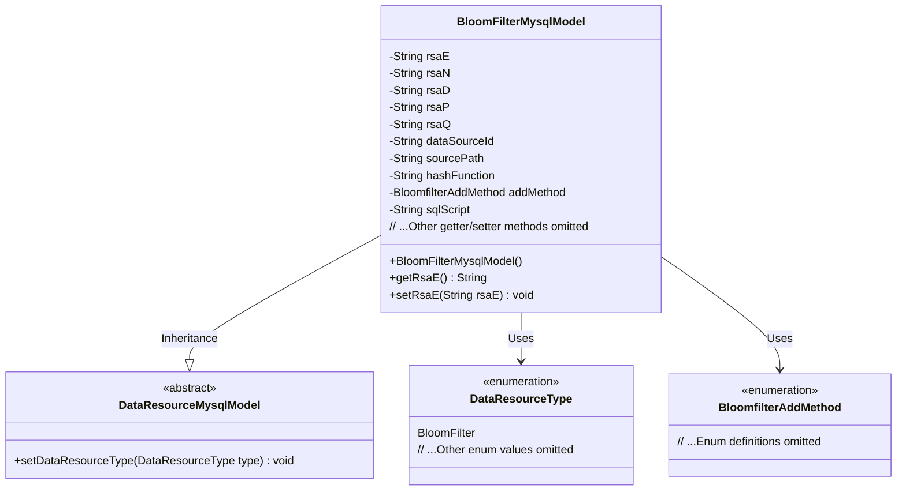

# Basic Information

|      |      |
|------|------|
| Name | BloomFilterMysqlModel |
| Language | .java |
| Code Path | WeFe/board/board-service/src/main/java/com/welab/wefe/board/service/database/entity/data_resource/BloomFilterMysqlModel.java |
| Package Name | com.welab.wefe.board.service.database.entity.data_resource |
| Dependencies | ['com.welab.wefe.board.service.constant.BloomfilterAddMethod', 'com.welab.wefe.common.wefe.enums.DataResourceType', 'javax.persistence'] |
| Brief Description | Bloom Filter MySQL Model Class, including fields such as RSA key parameters, data source ID, path, hash function, add method, and SQL scripts. |

# Description

The code defines a Java class named `BloomFilterMysqlModel`, which represents a database model for a Bloom filter. The class contains multiple attributes, including RSA key-related fields (e, n, d, p, q), data source ID, data source address, primary key hash generation method, Bloom filter addition method enumeration, and SQL statements. This class inherits from `DataResourceMysqlModel` and sets the resource type to Bloom filter in the constructor. All attributes are provided with corresponding getter and setter methods.

# Class Summary

| Name   | Type  | Description |
|-------|------|-------------|
| BloomFilterMysqlModel | class | The BloomFilterMysqlModel class stores Bloom filter data, including RSA key parameters, data source information, hash functions, addition methods, and SQL scripts. |


## Class BloomFilterMysqlModel

|      |      |
|------|------|
| Access Modifier | @Entity(name = "bloom_filter");@Table(name = "bloom_filter");public |
| Type | class |
| Name | BloomFilterMysqlModel |
| Description | The BloomFilterMysqlModel class stores Bloom filter data, including RSA key parameters, data source information, hash functions, addition methods, and SQL scripts. |


### UML Class Diagram



Class diagram description: This diagram illustrates that the BloomFilterMysqlModel class inherits from the abstract base class DataResourceMysqlModel, containing multiple private fields for storing RSA key parameters, data source information, and Bloom filter configurations. Two enumeration types (DataResourceType and BloomfilterAddMethod) are used to define resource types and addition methods. All fields follow standard JPA entity class design patterns with controlled access through getter/setter methods.


### Internal Method Call Graph

```mermaid
graph TD
    A["Class BloomFilterMysqlModel"]
    B["Inherits: DataResourceMysqlModel"]
    C["Property: String rsaE"]
    D["Property: String rsaN"]
    E["Property: String rsaD"]
    F["Property: String rsaP"]
    G["Property: String rsaQ"]
    H["Property: String dataSourceId"]
    I["Property: String sourcePath"]
    J["Property: String hashFunction"]
    K["Property: BloomfilterAddMethod addMethod"]
    L["Property: String sqlScript"]
    M["Constructor: BloomFilterMysqlModel()"]
    N["Method group: getter/setter"]

    A --> B
    A --> C
    A --> D
    A --> E
    A --> F
    A --> G
    A --> H
    A --> I
    A --> J
    A --> K
    A --> L
    A --> M
    A --> N
    M -->|Calls| B
    M -->|Sets| 'super.setDataResourceType(DataResourceType.BloomFilter)'
```

This flowchart illustrates the structure of the BloomFilterMysqlModel class, including its inheritance relationship, property definitions, constructor, and getter/setter method group. As a database entity model, this class primarily stores Bloom filter configurations and RSA key parameters. It inherits from DataResourceMysqlModel to implement basic functionality and initializes the resource type in its constructor. All properties are accessed and controlled through standard getter/setter methods, complying with JavaBean specifications.

### Field List

| Name  | Type  | Description |
|-------|-------|------|
| addMethod | BloomfilterAddMethod | Define an enumeration type field `addMethod`, using string format to store the enumeration values. |
| sourcePath | String | The private string variable sourcePath is used to store the source path. |
| dataSourceId | String | Private string variable dataSourceId. |
| rsaE | String | Database field mapping: rsaE corresponds to the column name rsa_e, with the type String. |
| sqlScript | String | The private string variable sqlScript is used to store SQL scripts. |
| rsaN | String | The database field rsa_n is mapped to a string-type variable rsaN. |
| rsaD | String | Database field mapping: rsaD corresponds to the table column rsa_d, with a string type. |
| rsaQ | String | The entity class field `rsaQ` corresponds to the database column name `rsa_q` and is of type `String`. |
| rsaP | String | The database column rsa_p is mapped to the private string variable rsaP. |
| hashFunction | String | The private string variable hashFunction is used to store the name of the hash function. |

### Method List

| Name  | Type  | Description |
|-------|-------|------|
| setRsaN | void | Java Method: Set RSA Public Key Modulus String Value. |
| getRsaD | String | Methods to Obtain RSA Private Key Parameter D. |
| getDataSourceId | String | This is a Java method that returns the value of a string variable named dataSourceId. |
| getRsaP | String | Get the P value of the RSA private key. |
| setHashFunction | void | This is a Java method used to set the hashFunction property value of an object. The method accepts a string parameter and assigns it to the hashFunction field of the current object. |
| setSqlScript | void | This is a Java method used to set the value of the sqlScript property. The method is named setSqlScript, which accepts a String parameter sqlScript and assigns it to the property of the same name in the current object. |
| getHashFunction | String | This method returns the hashFunction value of string type. |
| getSqlScript | String | The method returns the sqlScript string. |
| getSourcePath | String | The method returns the sourcePath value of string type. |
| setRsaD | void | Set the value of parameter D for the RSA private key. |
| getAddMethod | BloomfilterAddMethod | Method to obtain the addMethod property value of type BloomfilterAddMethod. |
| setAddMethod | void | Set the Bloom filter addition method. |
| setRsaE | void | This is a Java method used to set the rsaE string variable within a class. The method accepts a string parameter rsaE and assigns it to the class member variable of the same name. |
| setDataSourceId | void | The method to set the data source ID assigns the input parameter to the class member variable dataSourceId. |
| getRsaE | String | Methods to Obtain RSA Public Key Exponent Values. |
| setSourcePath | void | The method to set the source path assigns the input string to the `sourcePath` member variable of the class. |
| getRsaN | String | Methods to Obtain the RSA Public Key Modulus N. |
| setRsaP | void | Java Method: Set the value of RSA parameter P. |
| getRsaQ | String | Method to obtain RSA parameter Q, returns the value of rsaQ. |
| setRsaQ | void | Set the value of parameter Q for the RSA private key. |


