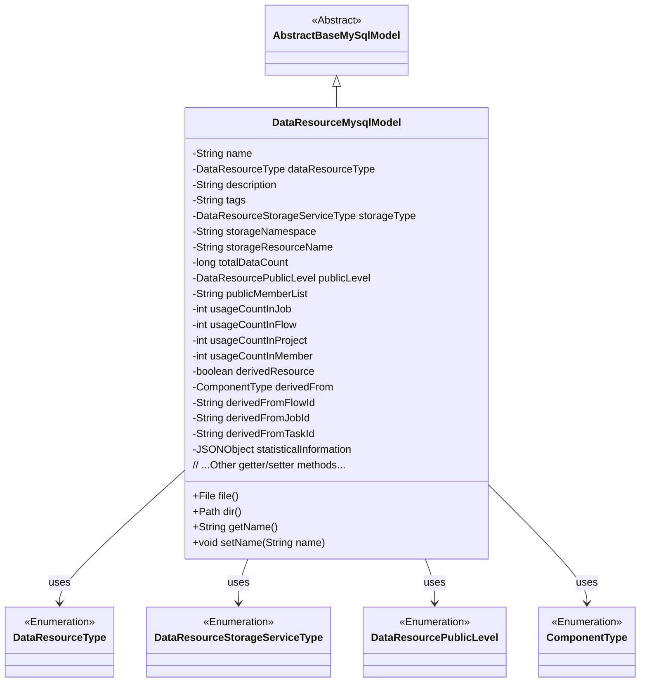
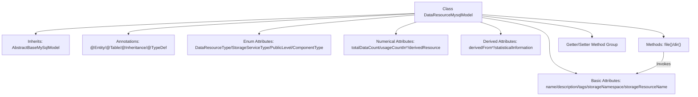

# Basic Information

|      |      |
|------|------|
| Name | DataResourceMysqlModel |
| Language | .java |
| Code Path | WeFe/board/board-service/src/main/java/com/welab/wefe/board/service/database/entity/data_resource/DataResourceMysqlModel.java |
| Package Name | com.welab.wefe.board.service.database.entity.data_resource |
| Dependencies | ['com.alibaba.fastjson.JSONObject', 'com.alibaba.fastjson.annotation.JSONField', 'com.vladmihalcea.hibernate.type.json.JsonStringType', 'com.welab.wefe.board.service.database.entity.base.AbstractBaseMySqlModel', 'com.welab.wefe.common.wefe.enums.ComponentType', 'com.welab.wefe.common.wefe.enums.DataResourcePublicLevel', 'com.welab.wefe.common.wefe.enums.DataResourceStorageServiceType', 'com.welab.wefe.common.wefe.enums.DataResourceType', 'org.hibernate.annotations.Type', 'org.hibernate.annotations.TypeDef', 'javax.persistence', 'java.io.File', 'java.nio.file.Path', 'java.nio.file.Paths'] |
| Brief Description | MySQL model class for data resources, including attributes such as name, type, description, tags, storage information, visibility, usage statistics, and derived sources, with support for JSON-type fields and custom file path methods. |

# Description

The content describes a Java class named `DataResourceMysqlModel`, which represents the model of data resources in MySQL. This class inherits from `AbstractBaseMySqlModel`, uses JPA annotations for entity mapping, and adopts the JOINED inheritance strategy. The class includes multiple fields such as resource name, type, description, tags, storage type, storage namespace, resource name, total data volume, visibility level, and list of visible members. Additionally, it records the usage count of the resource in various scenarios, such as in tasks, workflows, projects, and members. For derived resources, it also includes information like source type, workflow ID, task ID, and subtask ID. The class also provides custom methods for retrieving resource files and directories, as well as getter and setter methods for all fields.

# Class Summary

| Name   | Type  | Description |
|-------|------|-------------|
| DataResourceMysqlModel | class | The DataResourceMysqlModel is a data resource entity class that includes attributes such as name, type, description, storage information, usage statistics, and derived sources, supporting JSON storage and file path operations. |

## Class DataResourceMysqlModel

|      |      |
|------|------|
| Access Modifier | @Entity(name = "data_resource");@Table(name = "data_resource");@Inheritance(strategy = InheritanceType.JOINED);@TypeDef(name = "json", typeClass = JsonStringType.class);public |
| Type | class |
| Name | DataResourceMysqlModel |
| Description | The DataResourceMysqlModel is a data resource entity class that includes attributes such as name, type, description, storage information, usage statistics, and derived sources, supporting JSON storage and file path operations. |

### UML Class Diagram

This class diagram illustrates DataResourceMysqlModel as a subclass of AbstractBaseMySqlModel, containing multiple private attributes and public methods. The attributes involve various enumeration types such as DataResourceType, DataResourceStorageServiceType, etc. This class primarily represents data resource entities in the database, including fields like resource name, type, description, storage information, usage statistics, and provides methods for file path operations. Through inheritance relationships and associations with enumeration types, the structure and dependencies of this data model are clearly presented.

### Internal Method Call Graph

This flowchart illustrates the core structure of the DataResourceMysqlModel class, which is a JPA entity class inheriting from AbstractBaseMySqlModel. It contains four enum-type fields, basic resource description attributes, usage statistics, derived resource-related fields, and file path operation methods. The class implements table inheritance via JOINED strategy, processes statistical information fields using json type, and exposes all attributes through standard Getter/Setter methods. The two utility methods file() and dir() rely on path-related attributes like storageNamespace.

### Field List

| Name  | Type  | Description |
|-------|-------|------|
| description | String | Private string type variable description. |
| usageCountInProject | int | Project Internal Usage Counter |
| derivedFromFlowId | String | The field `derivedFromFlowId` represents the source flow ID, used to identify the origin of the current data or process. |
| tags | String | Private string variable tags |
| name | String | Private string type variable name |
| totalDataCount | long | Private long integer variable, recording the total amount of data. |
| usageCountInFlow | int | Private integer variable that records the number of uses in the process. |
| storageResourceName | String | The private string variable storageResourceName is used to store the resource name. |
| statisticalInformation | JSONObject | The JSON type field `statisticalInformation` is defined and stored using a JSON column. |
| derivedFrom | ComponentType | The enumeration type field `derivedFrom` is stored in string format. |
| dataResourceType | DataResourceType | Define an enum type field dataResourceType, using string format to store enum values. |
| derivedFromTaskId | String | Private string variable storing the source task ID. |
| derivedResource | boolean | Declare a boolean variable named derivedResource to indicate whether the resource is derived. |
| usageCountInJob | int | Private integer variable that records the number of uses in the job. |
| usageCountInMember | int | The member variable `usageCountInMember` records the usage count and is of private integer type. |
| publicMemberList | String | The private string variable publicMemberList is used to store the public member list. |
| storageNamespace | String | The private string variable storageNamespace is used to store namespace information. |
| derivedFromJobId | String | Private string variable storing the ID of the source task. |
| storageType | DataResourceStorageServiceType | Define an enum type field storageType, using string format to store enum values. |
| publicLevel | DataResourcePublicLevel | The enumeration type field publicLevel uses string values for storage. |

### Method List

| Name  | Type  | Description |
|-------|-------|------|
| getDescription | String | Methods for obtaining descriptive information, returning the description content as a string type. |
| getDerivedFrom | ComponentType | Get the component type of the derived source. |
| setPublicMemberList | void | The method to set the public member list assigns the input string to the class member variable publicMemberList. |
| setStorageType | void | The method for setting the data resource storage service type assigns the input parameter to the class member variable `storageType`. |
| setUsageCountInProject | void | Method to set the usage count within the project, with the parameter being an integer usageCountInProject. |
| setDerivedResource | void | The method for setting the derived resource flag, with the parameter being a boolean value `derivedResource`. |
| getTags | String | The method getTags returns the value of the string tags. |
| setStorageResourceName | void | The method to set the storage resource name assigns the input parameter to the class member variable `storageResourceName`. |
| setDataResourceType | void | This is a Java method used to set the data resource type property of a class. The method accepts a parameter of type DataResourceType and assigns it to the member variable dataResourceType of the class. |
| file | File | The method returns a File object composed of the storage path and resource name, which is not involved in JSON serialization. |
| setTotalDataCount | void | The method for setting the total data volume assigns the parameter totalDataCount to the class member variable of the same name. |
| getPublicMemberList | String | The method to obtain the public member list returns a string-type variable named publicMemberList. |
| getStorageType | DataResourceStorageServiceType | The method returns a storage type object DataResourceStorageServiceType. |
| setTags | void | The method `setTags` is used to set the `tags` property, and the parameter is of string type. |
| isDerivedResource | boolean | Method checks if it is a derived resource, returns a boolean value derivedResource. |
| getStorageResourceName | String | Methods to obtain the name of storage resources, returning the value of the variable `storageResourceName`. |
| getDataResourceType | DataResourceType | This is a Java method that returns an object of type DataResourceType named dataResourceType. |
| dir | Path | The code defines a public method `dir()`, which returns a `Path` type path constructed from the value of the `getStorageNamespace()` method. The `@JSONField(serialize=false)` annotation is used to disable JSON serialization. |
| setPublicLevel | void | Set the public level of the data resource by method, with the parameter being publicLevel. |
| getTotalDataCount | Long | Methods to obtain the total data count, returning a long integer value `totalDataCount`. |
| setUsageCountInMember | void | Set a public method for the usage count within members, with the parameter as integer usageCountInMember, and assign it to the class variable usageCountInMember. |
| getUsageCountInFlow | int | The number of times the method is used in the process. |
| setStorageNamespace | void | The method for setting the storage namespace assigns the input parameter to the class member variable storageNamespace. |
| setDerivedFrom | void | Set the derivation source of the current component. The parameter is a component type object. |
| setUsageCountInJob | void | The method to set the number of uses within a job, with the parameter being usageCountInJob. |
| setName | void | The method to set the object name is to assign the parameter 'name' to the 'name' property of the object. |
| getUsageCountInProject | int | The method returns the number of times the item is used in the project. |
| getName | String | Methods to obtain the name, returning the value of the name variable of string type. |
| setDescription | void | This is a Java method used to set the description property of an object. The method takes a string parameter `description` and assigns it to the `description` member variable of the current object. |
| getPublicLevel | DataResourcePublicLevel | Obtain the public access level of the data resource. |
| getStorageNamespace | String | Methods to obtain the storage namespace, returning a string-type storageNamespace value. |
| setDerivedFromFlowId | void | Method for setting the derived flow ID, assigning the parameter value to the class member variable derivedFromFlowId. |
| getDerivedFromJobId | String | Methods to obtain the derived task ID, which returns the derivedFromJobId as a string type. |
| setDerivedFromJobId | void | The method to set the derived task ID assigns the input parameter to the class member variable `derivedFromJobId`. |
| getDerivedFromTaskId | String | Method to obtain derived task ID, returns string type. |
| setDerivedFromTaskId | void | Methods for setting derived task IDs. |
| getStatisticalInformation | JSONObject | Methods for obtaining statistical information in JSON object format. |
| setStatisticalInformation | void | This is a Java method used to set the statistical information attributes of a class, with the parameter being a JSONObject type named statisticalInformation. |
| getUsageCountInMember | int | Get the integer value of member usage count. |
| getUsageCountInJob | int | Method returns the usage count in the job. |
| setUsageCountInFlow | void | Set the public method for the number of uses within the flow, with the parameter as usageCountInFlow. |
| getDerivedFromFlowId | String | Method to obtain the derived flow ID, returns a string-type variable `derivedFromFlowId`. |

