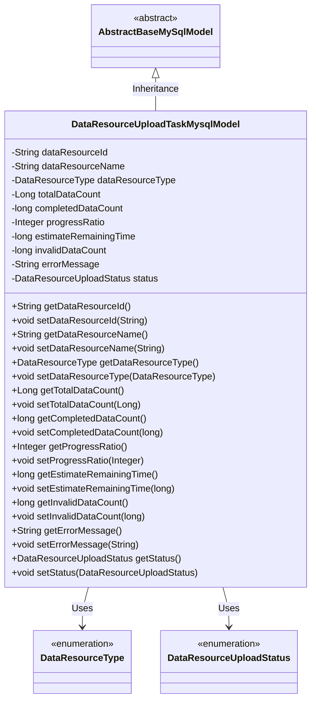

# Basic Information

|      |      |
|------|------|
| Name | DataResourceUploadTaskMysqlModel |
| Language | .java |
| Code Path | WeFe/board/board-service/src/main/java/com/welab/wefe/board/service/database/entity/data_resource/DataResourceUploadTaskMysqlModel.java |
| Package Name | com.welab.wefe.board.service.database.entity.data_resource |
| Dependencies | ['com.welab.wefe.board.service.database.entity.base.AbstractBaseMySqlModel', 'com.welab.wefe.common.wefe.enums.DataResourceType', 'com.welab.wefe.common.wefe.enums.DataResourceUploadStatus', 'javax.persistence.Entity', 'javax.persistence.EnumType', 'javax.persistence.Enumerated', 'javax.persistence.Table'] |
| Brief Description | Data resource upload task entity class, containing fields such as resource ID, name, type, total data volume, completed volume, progress, remaining time, invalid data volume, error messages, and status. |

# Description

This is a Java entity class named DataResourceUploadTaskMysqlModel, mapped to the database table `data_resource_upload_task`. It inherits from `AbstractBaseMySqlModel` and includes attributes related to data resource upload tasks: resource ID, name, type, total data rows, completed rows, progress percentage, estimated remaining time, invalid data volume, error message, and task status (uploading/completed/failed). The class provides getter and setter methods for each attribute.

# Class Summary

| Name   | Type  | Description |
|-------|------|-------------|
| DataResourceUploadTaskMysqlModel | class | Data resource upload task entity class, including fields such as resource ID, name, type, total rows, completed rows, progress, remaining time, invalid data volume, error messages, and status. |

## Class DataResourceUploadTaskMysqlModel

|      |      |
|------|------|
| Access Modifier | @Entity(name = "data_resource_upload_task");@Table(name = "data_resource_upload_task");public |
| Type | class |
| Name | DataResourceUploadTaskMysqlModel |
| Description | Data resource upload task entity class, including fields such as resource ID, name, type, total rows, completed rows, progress, remaining time, invalid data volume, error messages, and status. |

### UML Class Diagram

This code defines an entity class named DataResourceUploadTaskMysqlModel, which represents information related to data resource upload tasks. The class inherits from the abstract base class AbstractBaseMySqlModel and includes fields such as data resource ID, name, type, total data count, completed data count, progress ratio, estimated remaining time, invalid data count, error message, and task status. Among these, DataResourceType and DataResourceUploadStatus are enumeration types, representing resource type and task status respectively. The class provides getter and setter methods for all fields to access and modify these properties. This class is primarily used to store and manage information related to data resource upload tasks in a MySQL database.

### Internal Method Call Graph

```mermaid
graph TD
    A["Class DataResourceUploadTaskMysqlModel"]
    B["Inherits: AbstractBaseMySqlModel"]
    C["Annotations: @Entity, @Table"]
    D["Attribute: String dataResourceId"]
    E["Attribute: String dataResourceName"]
    F["Attribute: DataResourceType dataResourceType"]
    G["Attribute: Long totalDataCount"]
    H["Attribute: long completedDataCount"]
    I["Attribute: Integer progressRatio"]
    J["Attribute: long estimateRemainingTime"]
    K["Attribute: long invalidDataCount"]
    L["Attribute: String errorMessage"]
    M["Attribute: DataResourceUploadStatus status"]
    N["Group of getter/setter methods"]

    A --> B
    A --> C
    A --> D
    A --> E
    A --> F
    A --> G
    A --> H
    A --> I
    A --> J
    A --> K
    A --> L
    A --> M
    A --> N
```

This code defines a JPA entity class named DataResourceUploadTaskMysqlModel, which maps to the database table data_resource_upload_task. The class inherits from AbstractBaseMySqlModel and contains 12 attributes that record data resource ID, name, type, data statistics, task progress, and status. All attributes are equipped with corresponding getter and setter methods, with the status attribute using the @Enumerated annotation to indicate enum type storage. This entity class is primarily used to track detailed status information of data resource upload tasks.

### Field List

| Name  | Type  | Description |
|-------|-------|------|
| completedDataCount | long | Private long integer variable, recording the number of completed data. |
| status | DataResourceUploadStatus | Define an enumeration type field `status`, using string format to store the enumeration values. |
| dataResourceId | String | Declare a private string variable dataResourceId. |
| progressRatio | Integer | The integer variable progressRatio is used to store the progress ratio. |
| dataResourceType | DataResourceType | Private data resource type variable `dataResourceType`. |
| errorMessage | String | Private string variable used to store error messages. |
| invalidDataCount | long | Private long integer variable, recording the number of invalid data. |
| totalDataCount | Long | Private long integer variable, recording the total amount of data. |
| estimateRemainingTime | long | Private long integer variable used to estimate the remaining time. |
| dataResourceName | String | Declare a private string variable dataResourceName. |

### Method List

| Name  | Type  | Description |
|-------|-------|------|
| setInvalidDataCount | void | The method for setting invalid data count assigns the parameter `invalidDataCount` to the class member variable `invalidDataCount`. |
| getErrorMessage | String | Methods to obtain error messages, returns a string-type errorMessage. |
| getEstimateRemainingTime | long | The method to obtain the estimated remaining time returns a long integer variable estimateRemainingTime. |
| setCompletedDataCount | void | Method for setting completed data count. |
| getInvalidDataCount | long | Methods to obtain the count of invalid data, returning the quantity of invalid data. |
| setEstimateRemainingTime | void | Method for setting the remaining time estimate, with a parameter of type long. |
| setDataResourceType | void | The method for setting the data resource type assigns the input parameters to the member variables of the class. |
| setDataResourceName | void | The method for setting the data resource name assigns the input parameter to the class member variable `dataResourceName`. |
| setProgressRatio | void | The method to set the progress ratio, which accepts an integer parameter and assigns it to the class member variable progressRatio. |
| getProgressRatio | Integer | Method to obtain the progress ratio, returns an integer value progressRatio. |
| setDataResourceId | void | The method to set the data resource ID assigns the input parameter to the class member variable `dataResourceId`. |
| setTotalDataCount | void | The method to set the total data volume, with the parameter of type Long named totalDataCount, assigns the value to the class variable totalDataCount. |
| getCompletedDataCount | long | Method to get the count of completed data, returns a long integer value completedDataCount. |
| getTotalDataCount | Long | The method returns the total data count. |
| getDataResourceName | String | Methods to obtain the name of the data resource, returning a string-type value dataResourceName. |
| getDataResourceType | DataResourceType | Methods for obtaining data resource types, returning the value of the dataResourceType field. |
| getDataResourceId | String | Methods to obtain the data resource ID, which returns a string-type dataResourceId. |
| setErrorMessage | void | Method for setting error message, assigning the input string to the errorMessage variable of the class. |
| getStatus | DataResourceUploadStatus | The method to obtain the current data resource upload status returns a value of type DataResourceUploadStatus. |
| setStatus | void | Methods for setting the data resource upload status. |

