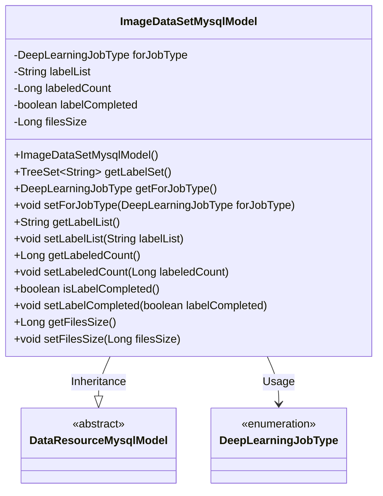
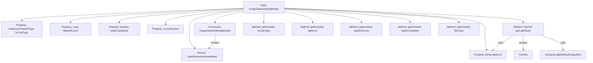

# Basic Information

|      |      |
|------|------|
| Name | ImageDataSetMysqlModel |
| Language | .java |
| Code Path | WeFe/board/board-service/src/main/java/com/welab/wefe/board/service/database/entity/data_resource/ImageDataSetMysqlModel.java |
| Package Name | com.welab.wefe.board.service.database.entity.data_resource |
| Dependencies | ['com.alibaba.fastjson.annotation.JSONField', 'com.welab.wefe.common.util.StringUtil', 'com.welab.wefe.common.wefe.enums.DataResourceType', 'com.welab.wefe.common.wefe.enums.DeepLearningJobType', 'javax.persistence.Entity', 'javax.persistence.EnumType', 'javax.persistence.Enumerated', 'javax.persistence.Table', 'java.util.List', 'java.util.TreeSet'] |
| Brief Description | Image dataset entity class, containing attributes such as task type, label list, annotation count, completion status, and file size, providing label set conversion methods. |

# Description

The code defines an entity class named `ImageDataSetMysqlModel`, which represents an image dataset. This class inherits from `DataResourceMysqlModel` and is annotated as the database table `image_data_set`. Key attributes include task type (e.g., object detection), label list, annotated count, annotation completion status, and dataset size. The constructor initializes the resource type as `ImageDataSet`. It provides a method to retrieve the label set, converting a comma-separated label string into an ordered collection. The class includes getter and setter methods for all attributes, supporting data access and modification.

# Class Summary

| Name   | Type  | Description |
|-------|------|-------------|
| ImageDataSetMysqlModel | class | Image dataset entity class, containing attributes such as task type, label list, annotation count, completion status, and size, providing label set conversion methods. |

## Class ImageDataSetMysqlModel

|      |      |
|------|------|
| Access Modifier | @Entity(name = "image_data_set");@Table(name = "image_data_set");public |
| Type | class |
| Name | ImageDataSetMysqlModel |
| Description | Image dataset entity class, containing attributes such as task type, label list, annotation count, completion status, and size, providing label set conversion methods. |

### UML Class Diagram

This code defines an entity class named ImageDataSetMysqlModel, which inherits from DataResourceMysqlModel and is used to store information related to image datasets. The class includes attributes such as job type, label list, labeled count, label completion status, and dataset size, along with corresponding getter and setter methods. Notably, the getLabelSet method converts a comma-separated label string into a TreeSet collection. The class is marked as a database entity using JPA annotations and is associated with the enumeration type DeepLearningJobType.

### Internal Method Call Graph

This code defines an entity class named ImageDataSetMysqlModel for representing image dataset information. The class inherits from DataResourceMysqlModel and contains properties such as task type, label list, labeled count, labeling completion status, and dataset size. The getLabelSet method converts comma-separated label strings into a TreeSet collection, providing complete getter and setter methods. The constructor sets the data resource type as ImageDataSet.

### Field List

| Name  | Type  | Description |
|-------|-------|------|
| labelCompleted | boolean | Private boolean variable indicating whether completion is achieved. |
| forJobType | DeepLearningJobType | The enumeration type field `forJobType` stores the `DeepLearningJobType` enum values in string format. |
| labelList | String | The private string variable labelList is used to store the list of labels. |
| labeledCount | Long | Private long integer variable, recording the number of tags. |
| filesSize | Long | Private long integer variable used to store file size. |

### Method List

| Name  | Type  | Description |
|-------|-------|------|
| getLabelSet | TreeSet<String> | The method getLabelSet returns a TreeSet; if labelList is empty, it returns an empty set; otherwise, it converts the comma-separated labelList into a TreeSet and returns it. |
| getForJobType | DeepLearningJobType | Get the deep learning assignment type of the current task. |
| getLabelList | String | The method returns the value of the labelList variable, which is of string type. |
| isLabelCompleted | boolean | This is a Java method used to check if the label is completed, returning a boolean value labelCompleted. |
| setLabelList | void | This is a Java method used to set the value of the class's labelList property. The method takes a string parameter labelList and assigns it to the class's member variable of the same name. |
| setForJobType | void | This method is used to set the type of deep learning job, assigning the parameter forJobType to the class member variable forJobType. |
| setLabelCompleted | void | Public method for setting label completion status, with a boolean parameter. |
| getLabeledCount | Long | Methods to obtain the labeled count, returns a long integer value labeledCount. |
| setLabeledCount | void | Methods for setting the marked quantity, with the parameter being of type long. |
| getFilesSize | Long | This is a Java method that returns the file size as a long integer value. |
| setFilesSize | void | The method to set the file size, with the parameter being a long integer filesSize, assigns it to the class member variable filesSize. |

