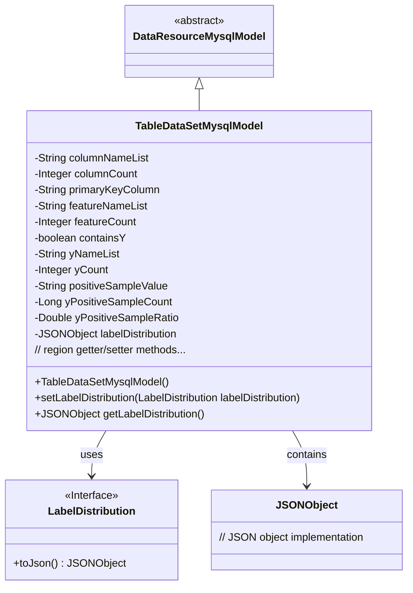

# Basic Information

|      |      |
|------|------|
| Name | TableDataSetMysqlModel |
| Language | .java |
| Code Path | WeFe/board/board-service/src/main/java/com/welab/wefe/board/service/database/entity/data_resource/TableDataSetMysqlModel.java |
| Package Name | com.welab.wefe.board.service.database.entity.data_resource |
| Dependencies | ['com.alibaba.fastjson.JSONObject', 'com.vladmihalcea.hibernate.type.json.JsonStringType', 'com.welab.wefe.board.service.dto.vo.data_set.table_data_set.LabelDistribution', 'com.welab.wefe.common.wefe.enums.DataResourceType', 'org.hibernate.annotations.Type', 'org.hibernate.annotations.TypeDef', 'javax.persistence.Column', 'javax.persistence.Entity', 'javax.persistence.Table'] |
| Brief Description | Dataset entity class, containing field lists, primary keys, features, Y-value related attributes, and label distributions, used for storing tabular data information. |

# Description

This is a Java class named TableDataSetMysqlModel, designed to map the database table `table_data_set`. It inherits from DataResourceMysqlModel and primarily stores dataset-related attributes. The class includes basic information such as dataset field lists, column count, primary key fields, feature lists, and their quantities. Special attention is given to whether it contains Y values, Y column information, positive sample values, and their quantity ratios. It uses JSON type to store label distribution data and provides complete getter and setter methods. During initialization, the constructor sets the resource type to TableDataSet.

# Class Summary

| Name   | Type  | Description |
|-------|------|-------------|
| TableDataSetMysqlModel | class | The TableDataSetMysqlModel class represents a table dataset, containing field lists, primary keys, features, Y-value related attributes, and label distributions, with JSON used to store label distributions. |

## Class TableDataSetMysqlModel

|      |      |
|------|------|
| Access Modifier | @Entity(name = "table_data_set");@Table(name = "table_data_set");@TypeDef(name = "json", typeClass = JsonStringType.class);public |
| Type | class |
| Name | TableDataSetMysqlModel |
| Description | The TableDataSetMysqlModel class represents a table dataset, containing field lists, primary keys, features, Y-value related attributes, and label distributions, with JSON used to store label distributions. |

### UML Class Diagram

This code demonstrates a TableDataSetMysqlModel class that inherits from DataResourceMysqlModel, representing tabular datasets in a database. The class includes multiple fields to store various attributes of the dataset, such as column name lists, feature counts, primary key fields, etc., and uses JSONObject to store label distribution information. It provides complete getter/setter methods and handles label distribution data conversion through the LabelDistribution interface. This design enables persistent storage of data resources and is particularly suited for handling structured tabular data.

### Internal Method Call Graph

```mermaid
graph TD
    A["Class TableDataSetMysqlModel"]
    B["Inherits: DataResourceMysqlModel"]
    C["Attribute: String columnNameList"]
    D["Attribute: Integer columnCount"]
    E["Attribute: String primaryKeyColumn"]
    F["Attribute: String featureNameList"]
    G["Attribute: Integer featureCount"]
    H["Attribute: boolean containsY"]
    I["Attribute: String yNameList"]
    J["Attribute: Integer yCount"]
    K["Attribute: String positiveSampleValue"]
    L["Attribute: Long yPositiveSampleCount"]
    M["Attribute: Double yPositiveSampleRatio"]
    N["Attribute: JSONObject labelDistribution"]
    O["Constructor: TableDataSetMysqlModel()"]
    P["Method: setLabelDistribution(LabelDistribution)"]
    Q["Method: getLabelDistribution()"]
    R["Method group: getter/setter"]

    A --> B
    A --> C
    A --> D
    A --> E
    A --> F
    A --> G
    A --> H
    A --> I
    A --> J
    A --> K
    A --> L
    A --> M
    A --> N
    A --> O
    A --> P
    A --> Q
    A --> R
    O -->|Calls| B
    P -->|Converts| N
    Q -->|Null check| N
```

This flowchart illustrates the complete structure of the TableDataSetMysqlModel class, including 12 core attributes and key methods. As a data table entity class, it inherits from DataResourceMysqlModel, initializes resource types through the constructor, specially handles the JSON-formatted labelDistribution attribute (with null checks and type conversion), and provides a complete set of getter/setter methods. All attributes are mapped to database table fields, where containsY uses a specific column name and labelDistribution is configured with JSON type conversion.

### Field List

| Name  | Type  | Description |
|-------|-------|------|
| labelDistribution | JSONObject | The field `labelDistribution` in the entity class uses the JSON type, and the database column is defined in JSON format. |
| yNameList | String | The private string variable yNameList is used to store a list of names. |
| yCount | Integer | Private integer variable yCount. |
| featureCount | Integer | Private integer variable used to record the number of features. |
| yPositiveSampleRatio | Double | Private double-precision floating-point variable representing the proportion of positive samples. |
| containsY | boolean | The database field name is contains_y, corresponding to the boolean variable containsY. |
| primaryKeyColumn | String | Primary key column field declaration, type is String. |
| columnCount | Integer | Private integer variable representing the number of columns. |
| yPositiveSampleCount | Long | Private long integer variable, recording the number of positive samples. |
| positiveSampleValue | String | Private string variable storing positive sample values. |
| featureNameList | String | The private string variable featureNameList is used to store the list of feature names. |
| columnNameList | String | The private string variable columnNameList is used to store the list of column names. |

### Method List

| Name  | Type  | Description |
|-------|-------|------|
| getyPositiveSampleRatio | Double | Methods to obtain the proportion of y positive samples, returning a Double type value. |
| getFeatureCount | Integer | Methods to obtain the number of features, returns an integer value featureCount. |
| setPositiveSampleValue | void | A public method for setting the positive sample value, with the parameter being of string type. |
| getyCount | Integer | Public method to get the yCount value, returns an Integer type. |
| getPrimaryKeyColumn | String | The method returns the primary key column name. |
| setFeatureCount | void | Set the feature count method, assign the input parameter to the class variable featureCount. |
| getyPositiveSampleCount | Long | The method to obtain the yPositiveSampleCount value, with a return type of Long. |
| setFeatureNameList | void | This is a Java method used to set the value of the featureNameList property. The method takes a string parameter and assigns it to the member variable of the class. |
| setContainsY | void | This is a Java method used to set the value of the boolean member variable `containsY`. The method accepts a boolean parameter and assigns it to the `containsY` property of the current object. |
| isContainsY | boolean | The method isContainsY returns the state of the boolean containsY. |
| setyNameList | void | Java Method: Set the string property value of yNameList. |
| setyPositiveSampleRatio | void | The method for setting the positive sample ratio accepts a Double-type parameter and assigns it to the class member variable yPositiveSampleRatio. |
| setLabelDistribution | void | The method `setLabelDistribution` is used to set the `labelDistribution` property, with the parameter being of type `JSONObject`. |
| getPositiveSampleValue | String | The public method to obtain the positive sample value, which returns a string-type variable `positiveSampleValue`. |
| setPrimaryKeyColumn | void | Methods for setting the primary key column, assigning the input string to the primaryKeyColumn member variable of the class. |
| getColumnCount | Integer | This method returns an integer value representing the number of columns. |
| getColumnNameList | String | Methods to obtain a list of column names, returning a list of column names as strings. |
| setLabelDistribution | void | Set the label distribution and convert the input object into JSON format for storage. |
| setyPositiveSampleCount | void | Set the Y positive sample counting method with the parameter as long integer yPositiveSampleCount, and assign it to the class member variable. |
| getyNameList | String | Method to obtain the yNameList string. |
| getFeatureNameList | String | Methods to obtain the list of feature names, returning a string-type featureNameList. |
| setyCount | void | The method to set the yCount property, with the parameter being of Integer type. |
| setColumnCount | void | Method to set the number of columns, which accepts an integer parameter columnCount and assigns it to the class member variable columnCount. |
| setColumnNameList | void | Methods for setting the column name list, assigning the input string to the class member variable columnNameList. |
| getLabelDistribution | JSONObject | Get the tag distribution data, return an empty JSON object if it is empty. |

