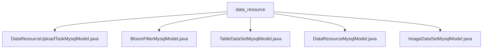

# Basic Information

|      |      |
|------|------|
| Name | data_resource |
| Language | .java |
| Code Path | WeFe/board/board-service/src/main/java/com/welab/wefe/board/service/database/entity/data_resource |
| Package Name | docs.board.board-service.src.main.java.com.welab.wefe.board.service.database.entity.data_resource |
| Brief Description | The `DataResourceUploadTaskMysqlModel` class maps to the data resource upload task table, containing attributes such as progress and status. The `BloomFilterMysqlModel` class represents the Bloom filter model, including fields like RSA keys. The `TableDataSetMysqlModel` class stores dataset information, including features and Y values. `DataResourceMysqlModel` is the base class, encompassing common resource attributes and usage statistics. The `ImageDataSetMysqlModel` class is specialized for image datasets, containing annotation details, among others. All classes inherit from the base model and provide complete getter/setter methods. |

# Description

## Overview  
The core responsibility of this module is to manage the storage of heterogeneous data resources and metadata modeling, achieving unified abstraction of various data types through an inheritance hierarchy. The interface specification adheres to the JPA entity mapping standard, employing the JOINED inheritance strategy, with all subclasses providing complete getter/setter methods. Key data structures include the base resource model (DataResourceMysqlModel) and its subclasses: tabular dataset (TableDataSetMysqlModel), image dataset (ImageDataSetMysqlModel), Bloom filter (BloomFilterMysqlModel), and upload task (DataResourceUploadTaskMysqlModel). External dependencies primarily consist of MySQL database and the JPA annotation framework. For example, TableDataSetMysqlModel stores label distributions in JSON format, while ImageDataSetMysqlModel implements the conversion of label strings to sets.

## Primary Business Scenarios  
The module supports full lifecycle management of data resources, akin to a digital asset warehouse model. Business processes encompass data upload (recording progress via UploadTask), structured storage (e.g., management of primary keys/features in tabular data), unstructured processing (e.g., tracking image annotation status), and cryptographic applications (RSA parameters for Bloom filters). Typical interactions include real-time task status updates (e.g., progress percentage calculation), dataset feature analysis (e.g., Y-value statistics), and resource provenance (via derived information records). For instance, BloomFilterMysqlModel stores SQL statement execution contexts, while TableDataSetMysqlModel tracks positive sample ratios. API integration cases involve resource type identification (constructor initialization) and cross-scenario usage statistics (e.g., project/task reference counts).

### Package Internal Structure View

This flowchart illustrates the relationships between 5 Java entity class files under the data_resource directory. All files are directly subordinate to the data_resource node with no intermediate hierarchy, featuring a flat design structure. Each MysqlModel class represents different types of data resource models, including business entities such as upload tasks, Bloom filters, table datasets, basic data resources, and image datasets.

# File List

| Name   | Type  | Description |
|-------|------|-------------|
| [DataResourceUploadTaskMysqlModel.java](DataResourceUploadTaskMysqlModel.md) | file | Data resource upload task entity class, containing fields such as resource ID, name, type, total data volume, completed volume, progress, remaining time, invalid data volume, error information, and status. |
| [BloomFilterMysqlModel.java](BloomFilterMysqlModel.md) | file | Bloom Filter MySQL Model Class, including fields such as RSA key parameters, data source ID, path, hash function, add method, and SQL scripts. |
| [TableDataSetMysqlModel.java](TableDataSetMysqlModel.md) | file | Dataset entity class, containing field lists, primary keys, features, Y-value related attributes, and label distributions, used for storing tabular data information. |
| [DataResourceMysqlModel.java](DataResourceMysqlModel.md) | file | MySQL model class for data resources, including attributes such as name, type, description, tags, storage information, visibility, usage statistics, and derived sources, supporting JSON-type fields and custom file path methods. |
| [ImageDataSetMysqlModel.java](ImageDataSetMysqlModel.md) | file | Image dataset entity class, containing attributes such as task type, label list, annotation count, completion status, and file size, providing label set conversion methods. |

