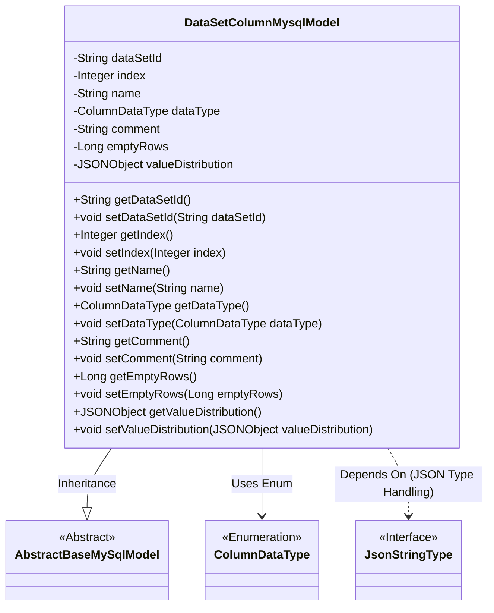

# Basic Information

|      |      |
|------|------|
| Name | DataSetColumnMysqlModel |
| Language | .java |
| Code Path | WeFe/board/board-service/src/main/java/com/welab/wefe/board/service/database/entity/data_set/DataSetColumnMysqlModel.java |
| Package Name | com.welab.wefe.board.service.database.entity.data_set |
| Dependencies | ['com.alibaba.fastjson.JSONObject', 'com.vladmihalcea.hibernate.type.json.JsonStringType', 'com.welab.wefe.board.service.database.entity.base.AbstractBaseMySqlModel', 'com.welab.wefe.common.wefe.enums.ColumnDataType', 'org.hibernate.annotations.Type', 'org.hibernate.annotations.TypeDef', 'javax.persistence.Column', 'javax.persistence.Entity', 'javax.persistence.EnumType', 'javax.persistence.Enumerated'] |
| Brief Description | Dataset column entity class, including ID, sequence number, name, type, comments, count of null value rows, and a JSON-formatted field for value distribution. |

# Description

This is a Java entity class named `DataSetColumnMysqlModel`, designed to map the `data_set_column` table in the database. It extends `AbstractBaseMySqlModel` and includes attributes such as dataset ID, field sequence number, field name, enumerated data type, comments, and null value row count. The `valueDistribution` field stores numerical distribution information in JSON format, specified as a JSON type via the `@Type` annotation. The class provides standard getter and setter methods for all attributes.

# Class Summary

| Name   | Type  | Description |
|-------|------|-------------|
| DataSetColumnMysqlModel | class | Dataset column entity class, containing fields for ID, sequence number, name, data type, comments, null value row count, and a JSON-formatted value distribution field. |

## Class DataSetColumnMysqlModel

|      |      |
|------|------|
| Access Modifier | @Entity(name = "data_set_column");@TypeDef(name = "json", typeClass = JsonStringType.class);public |
| Type | class |
| Name | DataSetColumnMysqlModel |
| Description | Dataset column entity class, containing fields for ID, sequence number, name, data type, comments, null value row count, and a JSON-formatted value distribution field. |

### UML Class Diagram

This code demonstrates a JPA entity class `DataSetColumnMysqlModel` representing a dataset column, which inherits from the abstract base class `AbstractBaseMySqlModel`. The class includes attributes such as dataset ID, field index, name, data type enumeration, comment, empty row count, and JSON-formatted value distribution, accessed via getter/setter methods. The `@TypeDef` annotation specifies that JSON field processing uses the `JsonStringType`, reflecting the integration of JPA entities with JSON data types. The class diagram clearly illustrates inheritance relationships, enum usage, and dependencies for JSON type handling.

### Internal Method Call Graph

```mermaid
graph TD
    A["Class DataSetColumnMysqlModel"]
    B["Inheritance: AbstractBaseMySqlModel"]
    C["Annotation: @Entity('data_set_column')"]
    D["Annotation: @TypeDef(name='json', typeClass=JsonStringType.class)"]
    E["Property: String dataSetId"]
    F["Property: @Column('index') Integer index"]
    G["Property: String name"]
    H["Property: @Enumerated ColumnDataType dataType"]
    I["Property: String comment"]
    J["Property: Long emptyRows"]
    K["Property: @Type('json') @Column JSONObject valueDistribution"]
    L["Method: getDataSetId/setDataSetId"]
    M["Method: getIndex/setIndex"]
    N["Method: getName/setName"]
    O["Method: getDataType/setDataType"]
    P["Method: getComment/setComment"]
    Q["Method: getEmptyRows/setEmptyRows"]
    R["Method: getValueDistribution/setValueDistribution"]

    A --> B
    A --> C
    A --> D
    A --> E
    A --> F
    A --> G
    A --> H
    A --> I
    A --> J
    A --> K
    A --> L
    A --> M
    A --> N
    A --> O
    A --> P
    A --> Q
    A --> R
```

This code defines a JPA entity class named DataSetColumnMysqlModel, which maps to the data_set_column table in the database. The class inherits from AbstractBaseMySqlModel and contains 7 main properties: dataSetId, index, name, dataType, comment, emptyRows, and valueDistribution. The index field uses the @Column annotation to specify the database column name, dataType uses the @Enumerated annotation to indicate an enum type, and valueDistribution uses the @Type and @Column annotations to specify it as a JSON type. Each property has corresponding getter and setter methods, located within the //region marked code block.

### Field List

| Name  | Type  | Description |
|-------|-------|------|
| name | String | private String variable name |
| index | Integer | The database field "index" is mapped to a private integer variable named index. |
| valueDistribution | JSONObject | The field `valueDistribution` is stored in JSON type, with the database column defined as json format. |
| dataType | ColumnDataType | Use the @Enumerated annotation to store the enum type ColumnDataType as a string in the database. |
| comment | String | Declare a private string variable comment. |
| emptyRows | Long | Number of blank lines, long integer. |
| dataSetId | String | The private string variable for dataset ID. |

### Method List

| Name  | Type  | Description |
|-------|-------|------|
| getValueDistribution | JSONObject | Get the JSON object of valueDistribution. |
| setDataSetId | void | The method to set the dataset ID assigns the input parameter to the class member variable dataSetId. |
| getDataSetId | String | Methods to obtain the dataset ID, returning the value of the dataSetId field. |
| setDataType | void | The method `setDataType` is used to set the column data type, with the parameter being of type `ColumnDataType`, and assigns the value to the member variable `dataType`. |
| setIndex | void | This is a Java method used to set the value of the integer member variable `index` of a class. The method accepts an `Integer` parameter and assigns it to the `index` property of the class. |
| getComment | String | Methods to obtain the comment string. |
| getDataType | ColumnDataType | The method getDataType returns the value of the dataType field of type ColumnDataType. |
| setName | void | This is a Java method used to set the name property of an object, assigning the passed string parameter to the object's name variable. |
| getEmptyRows | Long | Methods to obtain the number of empty lines, returning the value of emptyRows. |
| getIndex | Integer | The method returns the value of the integer variable index. |
| setEmptyRows | void | Method for setting the number of empty lines, with a parameter of type Long named emptyRows, which is assigned to the class member variable emptyRows. |
| getName | String | This is a Java method that returns the value of the private member variable `name`. |
| setComment | void | This is a Java method used to set the comment property value of an object. The method takes a string parameter comment and assigns it to the comment member variable of the current object. |
| setValueDistribution | void | Set the value distribution method, which takes a JSONObject parameter and assigns it to the member variable valueDistribution. |

