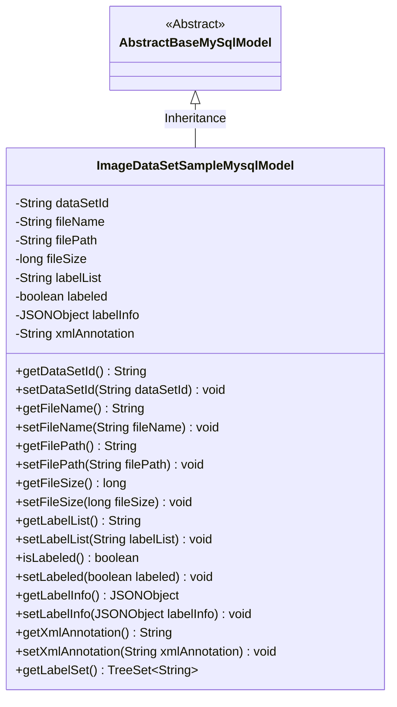
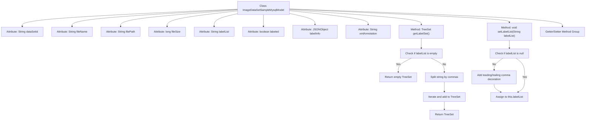

# Basic Information

|      |      |
|------|------|
| Name | ImageDataSetSampleMysqlModel |
| Language | .java |
| Code Path | WeFe/board/board-service/src/main/java/com/welab/wefe/board/service/database/entity/data_set/ImageDataSetSampleMysqlModel.java |
| Package Name | com.welab.wefe.board.service.database.entity.data_set |
| Dependencies | ['com.alibaba.fastjson.JSONObject', 'com.alibaba.fastjson.annotation.JSONField', 'com.vladmihalcea.hibernate.type.json.JsonStringType', 'com.welab.wefe.board.service.database.entity.base.AbstractBaseMySqlModel', 'com.welab.wefe.common.util.StringUtil', 'org.hibernate.annotations.Type', 'org.hibernate.annotations.TypeDef', 'javax.persistence.Column', 'javax.persistence.Entity', 'java.util.List', 'java.util.TreeSet'] |
| Brief Description | Image dataset sample entity class, containing dataset ID, file name, path, size, label list, annotation status, and JSON/XML annotation information, providing label set processing and getter/setter methods. |

# Description

The code defines an entity class named `ImageDataSetSampleMysqlModel`, which is used to store image dataset sample information. The entity includes fields such as dataset ID, file name, file path, file size, label list, annotation flag, JSON-formatted annotation data, and XML-formatted annotation data. The class provides a method to retrieve the label set and formats the label list to ensure commas are present before and after for SQL matching. All fields are equipped with corresponding getter and setter methods. This class inherits from `AbstractBaseMySqlModel`, is marked as a database entity with the `@Entity` annotation, and defines JSON type handling via the `@TypeDef` annotation.

# Class Summary

| Name   | Type  | Description |
|-------|------|-------------|
| ImageDataSetSampleMysqlModel | class | Image dataset sample entity class, containing dataset ID, file name, path, size, label list, annotation status, and JSON/XML annotation information, providing label set processing and getter/setter methods. |

## Class ImageDataSetSampleMysqlModel

|      |      |
|------|------|
| Access Modifier | @Entity(name = "image_data_set_sample");@TypeDef(name = "json", typeClass = JsonStringType.class);public |
| Type | class |
| Name | ImageDataSetSampleMysqlModel |
| Description | Image dataset sample entity class, containing dataset ID, file name, path, size, label list, annotation status, and JSON/XML annotation information, providing label set processing and getter/setter methods. |

### UML Class Diagram

This class diagram illustrates the structure where ImageDataSetSampleMysqlModel inherits from AbstractBaseMySqlModel. As a database entity, this class contains basic attributes such as dataset ID, file name, file path, file size, as well as annotation-related fields like labelList, labeled, labelInfo, and xmlAnnotation. Notably, the getLabelSet() method converts the comma-separated labelList into a TreeSet collection, while the setLabelList() method performs special processing on input values to ensure commas are present at both ends for SQL matching. All fields in the class have corresponding getter and setter methods, reflecting the standard JavaBean design pattern.

### Internal Method Call Graph

This code defines a JPA entity class named ImageDataSetSampleMysqlModel for storing image dataset sample information. The class contains file attributes (name, path, size) and annotation attributes (label list, JSON annotation, XML annotation). The getLabelSet() method converts comma-separated label strings into an ordered set, while setLabelList() normalizes label strings (adding leading/trailing commas). All attributes are accessed through standard getter/setter methods, complying with JavaBean specifications.

### Field List

| Name  | Type  | Description |
|-------|-------|------|
| xmlAnnotation | String | The private string variable xmlAnnotation is used to store XML annotation content. |
| fileName | String | The private string variable fileName is used to store the file name. |
| labelList | String | Declare a private string variable labelList. |
| labelInfo | JSONObject | The field labelInfo is stored in JSON type, with the database column defined as json format. |
| labeled | boolean | The boolean variable labeled indicates whether it has been marked. |
| filePath | String | Private string variable storing the file path. |
| fileSize | long | Private long integer variable fileSize, used to store the file size. |
| dataSetId | String | Private string type variable dataSetId. |

### Method List

| Name  | Type  | Description |
|-------|-------|------|
| getFileName | String | The method returns the filename. |
| getDataSetId | String | Methods to obtain the dataset ID, returns dataSetId. |
| isLabeled | boolean | The method isLabeled returns the boolean state of labeled. |
| setFileName | void | Methods for setting the file name, assigning the input string to the fileName property of the class. |
| getFileSize | long | This is a Java method that returns the file size as a long integer value `fileSize`. |
| getLabelList | String | This is a Java method that returns the value of the string-type variable labelList. |
| setLabeled | void | Methods for setting object label status, with parameters determining whether to mark. |
| getLabelInfo | JSONObject | The method returns a JSONObject object of labelInfo. |
| setLabelInfo | void | The method `setLabelInfo` takes a JSONObject parameter `labelInfo` and assigns it to the property of the same name in the current object. |
| getXmlAnnotation | String | Methods to obtain the xmlAnnotation string. |
| setXmlAnnotation | void | Java Method: Set the value of the xmlAnnotation property. The parameter is a string xmlAnnotation, which is directly assigned to the class member variable. |
| setDataSetId | void | The method for setting the dataset ID assigns the input parameter to the class's dataSetId member variable. |
| getFilePath | String | Methods to obtain the file path, returning a filePath string. |
| getLabelSet | TreeSet<String> | The method getLabelSet returns a TreeSet, which will be an empty set if labelList is null; otherwise, it populates the set by splitting non-empty items with commas and returns the result. |
| setFilePath | void | Methods for setting the file path, assigning the input parameter to the member variable filePath. |
| setLabelList | void | The method `setLabelList` is used to process the label list string, ensuring there are commas before and after for SQL matching. If the input is non-empty, it checks and adds missing commas, then assigns the result to the member variable `labelList`. |
| setFileSize | void | The method to set the file size is to assign the parameter fileSize to the member variable fileSize of the class. |

