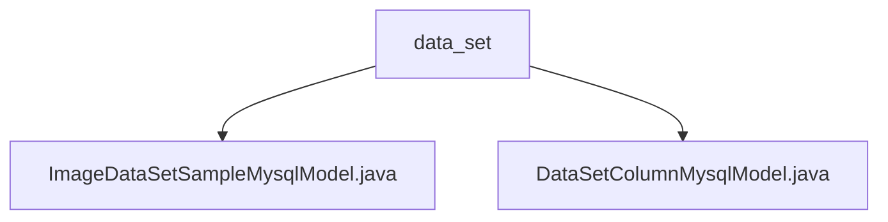

# Basic Information

|      |      |
|------|------|
| Name | data_set |
| Language | .java |
| Code Path | WeFe/board/board-service/src/main/java/com/welab/wefe/board/service/database/entity/data_set |
| Package Name | docs.board.board-service.src.main.java.com.welab.wefe.board.service.database.entity.data_set |
| Brief Description | The ImageDataSetSampleMysqlModel entity class stores image dataset sample information, including fields such as ID, filename, and labels, inheriting from AbstractBaseMySqlModel. The DataSetColumnMysqlModel maps to the data_set_column table, containing attributes like dataset ID, field name, and data type, inheriting from the same base class. Both entities use JSON format to store partial data. |

# Description

## Overview  
The core responsibility of this module is to manage structured dataset metadata and image sample data, achieving database mapping through JPA entity classes. The interface specification includes standard field access methods and supports storing special fields (such as numerical distributions and annotation information) in JSON format. Key data structures consist of a base model with dataset ID, multi-format annotations for image samples (JSON/XML), and field statistical distribution data. External dependencies involve JPA annotations, Hibernate type extensions (JSON), and MySQL databases. For example, the `ImageDataSetSampleMysqlModel` handles multi-format annotations, while the `DataSetColumnMysqlModel` records field analysis metrics.  

## Primary Business Scenarios  
The module supports field-level metadata management for datasets and image sample annotation storage, similar to a data catalog pattern. The complete business workflow includes: field statistical analysis (e.g., null value counts), persistent storage of multi-format annotations for image samples, and retrieval optimization based on label collections. Typical applications include data quality analysis (via the `valueDistribution` field) and annotation system integration (e.g., XML/JSON conversion). The API types focus on entity CRUD operations, such as enabling efficient SQL queries through formatted label lists.

### Package Internal Structure View

This flowchart illustrates the relationship between two Java entity class files under the data_set directory. The top-level node is the data_set folder, which directly contains two child nodes: ImageDataSetSampleMysqlModel.java and DataSetColumnMysqlModel.java. These files represent the MySQL data models for image dataset samples and dataset columns, respectively, and belong to the same hierarchical level of database entity class files.

# File List

| Name   | Type  | Description |
|-------|------|-------------|
| [ImageDataSetSampleMysqlModel.java](ImageDataSetSampleMysqlModel.md) | file | Image dataset sample entity class, containing dataset ID, file name, path, size, label list, annotation status, and JSON/XML annotation information, providing label set processing and getter/setter methods. |
| [DataSetColumnMysqlModel.java](DataSetColumnMysqlModel.md) | file | Dataset column entity class, including ID, sequence number, name, type, comments, null value row count, and a JSON-formatted value distribution field. |

