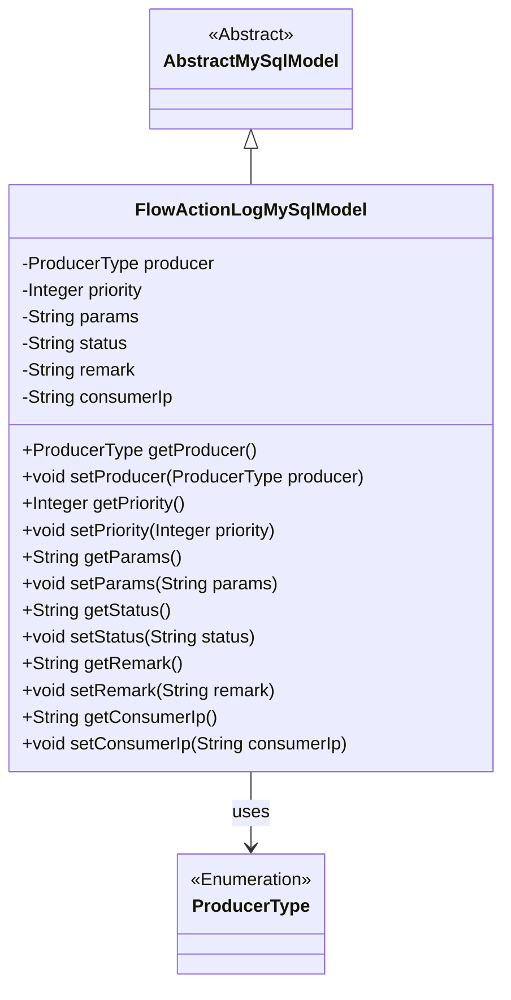

# Basic Information

|      |      |
|------|------|
| Name | FlowActionLogMySqlModel |
| Language | .java |
| Code Path | WeFe/board/board-service/src/main/java/com/welab/wefe/board/service/database/entity/flow/FlowActionLogMySqlModel.java |
| Package Name | com.welab.wefe.board.service.database.entity.flow |
| Dependencies | ['com.welab.wefe.board.service.database.entity.base.AbstractMySqlModel', 'com.welab.wefe.common.wefe.enums.ProducerType', 'javax.persistence.Entity', 'javax.persistence.EnumType', 'javax.persistence.Enumerated'] |
| Brief Description | The FlowActionLogMySqlModel is a MySQL entity class that includes fields such as producer type, priority, action parameters, execution status, remarks, and consumer IP, providing getter/setter methods. |

# Description

The `FlowActionLogMySqlModel` is a MySQL database entity class designed to record workflow action logs. It contains the following fields: `producer` indicates the message producer type (enum values: board/gateway), `priority` represents the priority level, `params` stores action parameters, `status` records the execution status (enum values: success/fail), `remark` saves remark information, and `consumerIp` logs the consumer IP address. The class provides corresponding getter and setter methods for each field.

# Class Summary

| Name   | Type  | Description |
|-------|------|-------------|
| FlowActionLogMySqlModel | class | FlowActionLogMySqlModel is a MySQL entity class for recording flow actions, containing fields such as producer type, priority, action parameters, execution status, remarks, and consumer IP, along with corresponding getter/setter methods. |


## Class FlowActionLogMySqlModel

|      |      |
|------|------|
| Access Modifier | @Entity(name = "flow_action_log");public |
| Type | class |
| Name | FlowActionLogMySqlModel |
| Description | FlowActionLogMySqlModel is a MySQL entity class for recording flow actions, containing fields such as producer type, priority, action parameters, execution status, remarks, and consumer IP, along with corresponding getter/setter methods. |


### UML Class Diagram



This code defines an entity class named FlowActionLogMySqlModel, which inherits from the abstract class AbstractMySqlModel. The class is used to record flow action logs, containing fields such as producer type, priority, action parameters, execution status, remarks, and consumer IP, along with corresponding getter and setter methods. The producer field uses the enumeration type ProducerType. The class is marked as a database entity through JPA annotations and mapped to a table named "flow_action_log".


### Internal Method Call Graph

```mermaid
graph TD
    A["Class FlowActionLogMySqlModel"]
    B["Inherits: AbstractMySqlModel"]
    C["Annotation: @Entity(name='flow_action_log')"]
    D["Enum Property: ProducerType producer"]
    E["Property: Integer priority"]
    F["Property: String params"]
    G["Property: String status"]
    H["Property: String remark"]
    I["Property: String consumerIp"]
    J["Getter/Setter Method Group"]

    A --> B
    A --> C
    A --> D
    A --> E
    A --> F
    A --> G
    A --> H
    A --> I
    A --> J
    D -->|@Enumerated| K["EnumType.STRING"]
```

This code defines a JPA entity class named FlowActionLogMySqlModel, which inherits from AbstractMySqlModel. The class contains six core properties: an enumerated type producer (annotated with @Enumerated), integer priority, string-type params/status/remark/consumerIp, and provides standard getter/setter methods for each property. The entity maps to the database table "flow_action_log" and is primarily used to record workflow action logs, including key information such as producer type, execution status, and parameters, reflecting the structural mapping relationship between JPA entities and database tables.

### Field List

| Name  | Type  | Description |
|-------|-------|------|
| status | String | The private string variable `status` is used to store status information. |
| params | String | Declare a private string variable params. |
| remark | String | Private string type comment field. |
| producer | ProducerType | The enumeration field producer uses a string type for storage. |
| priority | Integer | Private integer variable priority, representing the priority level. |
| consumerIp | String | Private string variable storing the consumer's IP address. |

### Method List

| Name  | Type  | Description |
|-------|-------|------|
| setPriority | void | Methods for setting priority, assigning the input parameter to the priority property of the class. |
| getProducer | ProducerType | Methods to obtain the producer type, returning the producer variable. |
| getStatus | String | Methods for obtaining status values, returning status variables of string type. |
| getPriority | Integer | Methods to obtain the integer value of priority. |
| setParams | void | Method for setting parameters, assigning the input string to the class member variable params. |
| setStatus | void | This is a Java method used to set the value of the object's status property. The method takes a string parameter status and assigns it to the member variable of the same name in the object. |
| getParams | String | This is a Java method that returns the value of the member variable `params` of type String. |
| setProducer | void | Method to set the producer object, assigning the input parameter to the class member variable producer. |
| getRemark | String | Public method for retrieving remark information, returns the remark content as a string type. |
| setRemark | void | The method for setting remark information assigns the input string to the remark field of the class. |
| getConsumerIp | String | Methods to obtain the consumer's IP address, returning a string type. |
| setConsumerIp | void | Methods for setting the consumer IP address, assigning the input parameter to the class member variable consumerIp. |


