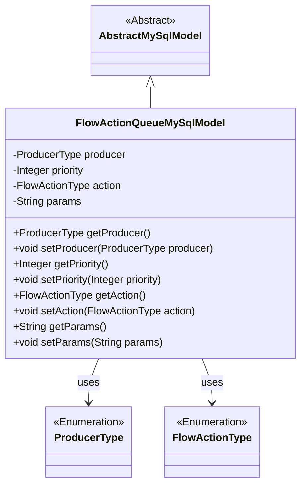
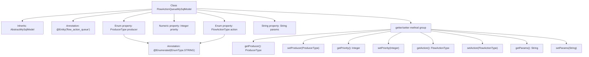

# Basic Information

|      |      |
|------|------|
| Name | FlowActionQueueMySqlModel |
| Language | .java |
| Code Path | WeFe/board/board-service/src/main/java/com/welab/wefe/board/service/database/entity/flow/FlowActionQueueMySqlModel.java |
| Package Name | com.welab.wefe.board.service.database.entity.flow |
| Dependencies | ['com.welab.wefe.board.service.database.entity.base.AbstractMySqlModel', 'com.welab.wefe.common.wefe.enums.FlowActionType', 'com.welab.wefe.common.wefe.enums.ProducerType', 'javax.persistence.Entity', 'javax.persistence.EnumType', 'javax.persistence.Enumerated'] |
| Brief Description | FlowActionQueueMySqlModel is a MySQL entity class that includes producer type, priority, action type, and parameter fields, providing getter/setter methods. |

# Description

This is a JPA entity class named FlowActionQueueMySqlModel, mapped to the database table flow_action_queue. It inherits from the base class AbstractMySqlModel and contains four core fields: producer indicates the message producer type (enum values: board/gateway), priority defines consumption priority (higher values take precedence), action stores the action type (enum value), and params holds action parameters. Each field has corresponding getter and setter methods, with the producer and action fields storing enum values as strings. This model is used to manage flow action queue data.

# Class Summary

| Name   | Type  | Description |
|-------|------|-------------|
| FlowActionQueueMySqlModel | class | The FlowActionQueueMySqlModel class defines the flow action queue, including producer type, priority, action type, and parameter fields, providing getter/setter methods. |

## Class FlowActionQueueMySqlModel

|      |      |
|------|------|
| Access Modifier | @Entity(name = "flow_action_queue");public |
| Type | class |
| Name | FlowActionQueueMySqlModel |
| Description | The FlowActionQueueMySqlModel class defines the flow action queue, including producer type, priority, action type, and parameter fields, providing getter/setter methods. |

### UML Class Diagram

This code defines an entity class named `FlowActionQueueMySqlModel`, which inherits from the abstract class `AbstractMySqlModel` and represents a data model for a flow action queue. The class contains four private fields: `producer` (an enumeration of producer types), `priority` (a numerical priority value), `action` (an enumeration of action types), and `params` (a string of action parameters), along with corresponding getter and setter methods for each field. The class is marked as a database entity using JPA annotations, with the two enumeration-type fields stored in string format.

### Internal Method Call Graph

This code defines a JPA entity class named FlowActionQueueMySqlModel that inherits from AbstractMySqlModel. The class contains four main properties: producer (enum of producer type), priority (numeric value), action (enum of action type), and params (parameter string), each with corresponding getter and setter methods. The producer and action properties are marked with @Enumerated annotation for string storage format. The entity is mapped to the "flow_action_queue" table in the database, representing a typical JPA entity implementation for persisting flow action queue data.

### Field List

| Name  | Type  | Description |
|-------|-------|------|
| params | String | Private string parameter variables. |
| priority | Integer | The private integer variable `priority` represents the priority level. |
| producer | ProducerType | The enumeration type producer uses string values for storage. |
| action | FlowActionType | The enumeration type field `action` is stored in string format. |

### Method List

| Name  | Type  | Description |
|-------|-------|------|
| getProducer | ProducerType | Methods to obtain the producer type, returning the value of the producer variable. |
| setPriority | void | Methods for setting priority: Assign the input parameter to the priority attribute of the class. |
| getPriority | Integer | Methods for obtaining the priority value, returns an integer-type priority value. |
| getAction | FlowActionType | Method to obtain the current flow action type, returns a FlowActionType object. |
| setProducer | void | This is a Java method used to set the producer property of type ProducerType. The method is named setProducer, which takes a ProducerType parameter and assigns it to the producer field of the current object. |
| setAction | void | The method for setting the process action type assigns the input parameters to the `action` property of the class. |
| getParams | String | Get the string value of the params parameter. |
| setParams | void | Method for setting parameters, assigning the input string to the class member variable params. |

