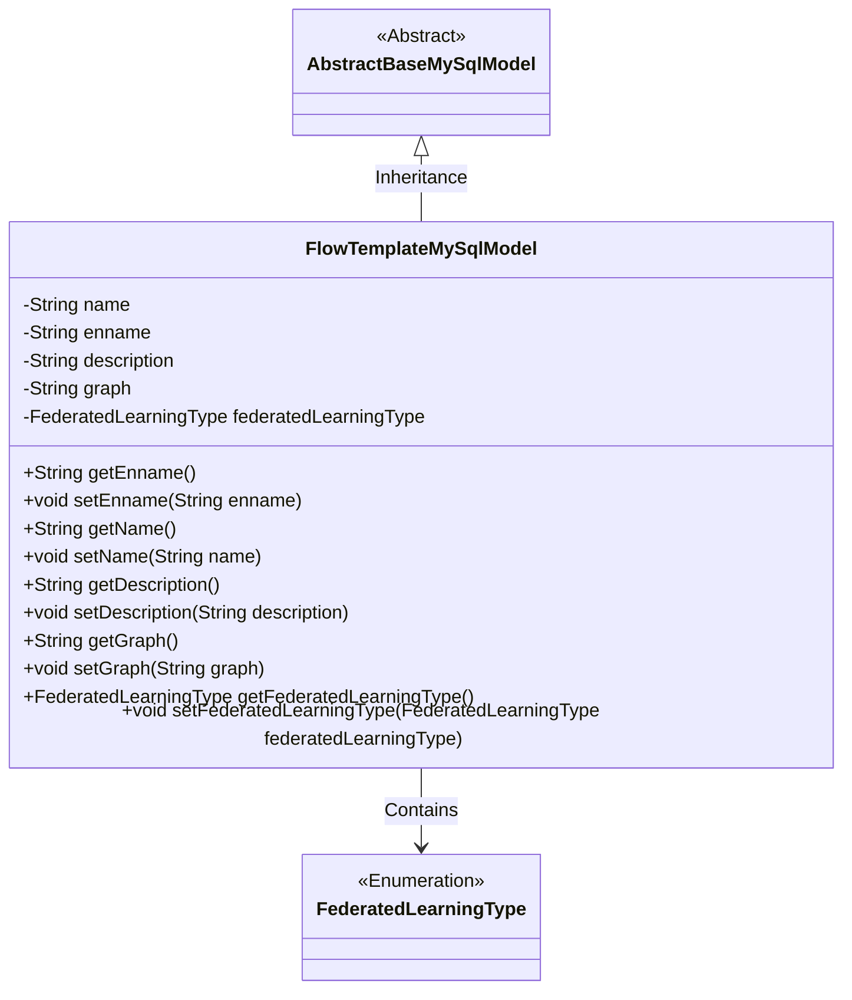

# Basic Information

|      |      |
|------|------|
| Name | FlowTemplateMySqlModel |
| Language | .java |
| Code Path | WeFe/board/board-service/src/main/java/com/welab/wefe/board/service/database/entity/flow/FlowTemplateMySqlModel.java |
| Package Name | com.welab.wefe.board.service.database.entity.flow |
| Dependencies | ['com.welab.wefe.board.service.database.entity.base.AbstractBaseMySqlModel', 'com.welab.wefe.common.wefe.enums.FederatedLearningType', 'javax.persistence.Entity', 'javax.persistence.EnumType', 'javax.persistence.Enumerated'] |
| Brief Description | The `FlowTemplateMySqlModel` class defines the database entity for project workflow templates, including fields such as name, English name, description, flowchart, and federated learning type, along with their corresponding getter/setter methods. |

# Description

The content describes a Java class named FlowTemplateMySqlModel, which is a database entity class mapped to the table named project_flow_template. This class inherits from AbstractBaseMySqlModel and includes a serialization ID field. The main attributes include the template name `name`, template type `enname`, template description `description`, canvas editing graph `graph`, and federated learning type `federatedLearningType` (an enum type, either horizontal or vertical). Each attribute has corresponding getter and setter methods for accessing and modifying.

# Class Summary

| Name   | Type  | Description |
|-------|------|-------------|
| FlowTemplateMySqlModel | class | FlowTemplateMySqlModel is the database entity class for project workflow templates, containing fields such as name, English name, description, flowchart, and federated learning type. |

## Class FlowTemplateMySqlModel

|      |      |
|------|------|
| Access Modifier | @Entity(name = "project_flow_template");public |
| Type | class |
| Name | FlowTemplateMySqlModel |
| Description | FlowTemplateMySqlModel is the database entity class for project workflow templates, containing fields such as name, English name, description, flowchart, and federated learning type. |

### UML Class Diagram

This code defines an entity class named FlowTemplateMySqlModel, which inherits from the abstract class AbstractBaseMySqlModel. The class includes attributes such as template name, English name, description, graph data, and federated learning type, along with corresponding getter and setter methods. The federated learning type is an enumeration type called FederatedLearningType. This class is primarily used to store information related to project flow templates and inherits the functionality of a basic database model.

### Internal Method Call Graph

```mermaid
graph TD
    A["Class FlowTemplateMySqlModel"]
    B["Inherits: AbstractBaseMySqlModel"]
    C["Property: String name"]
    D["Property: String enname"]
    E["Property: String description"]
    F["Property: String graph"]
    G["Property: FederatedLearningType federatedLearningType"]
    H["Method: getEnname()"]
    I["Method: setEnname(String enname)"]
    J["Method: getName()"]
    K["Method: setName(String name)"]
    L["Method: getDescription()"]
    M["Method: setDescription(String description)"]
    N["Method: getGraph()"]
    O["Method: setGraph(String graph)"]
    P["Method: getFederatedLearningType()"]
    Q["Method: setFederatedLearningType(FederatedLearningType)"]

    A --> B
    A --> C
    A --> D
    A --> E
    A --> F
    A --> G
    A --> H
    A --> I
    A --> J
    A --> K
    A --> L
    A --> M
    A --> N
    A --> O
    A --> P
    A --> Q
```

This flowchart illustrates the structure of the FlowTemplateMySqlModel class, which inherits from AbstractBaseMySqlModel. It contains five private properties (name, enname, description, graph, and federatedLearningType) along with their corresponding getter and setter methods. The federatedLearningType property is marked with the @Enumerated annotation as an enum type. Each property has associated accessor and mutator methods, forming a standard Java Bean structure for database entity mapping.

### Field List

| Name  | Type  | Description |
|-------|-------|------|
| enname | String | Define a private string variable enname. |
| federatedLearningType | FederatedLearningType | The code defines an enumeration type field named federatedLearningType, which stores enumeration values in string format. |
| description | String | Private string type variable description. |
| serialVersionUID = -8452977095072329750L | long | Define the serial version UID with a value of -8452977095072329750L to ensure class version compatibility. |
| name | String | private String variable name |
| graph | String | Private string variable graph |

### Method List

| Name  | Type  | Description |
|-------|-------|------|
| setEnname | void | This is a Java method used to set the English name property of an object. The method takes a string parameter enname and assigns it to the enname member variable of the object. |
| setGraph | void | Methods for setting graphic attributes, assigning the input string to the class variable graph. |
| getName | String | The method returns the value of the name variable of type String. |
| setDescription | void | The method for setting description information assigns the input parameter to the `description` property of the object. |
| setName | void | This is a Java method used to set the name property of an object. The method accepts a string parameter name and assigns it to the name member variable of the current object. |
| getDescription | String | String methods for obtaining descriptive information. |
| getEnname | String | This is a Java method that returns the enname attribute value of type String. |
| getGraph | String | Methods to obtain the graph string. |
| getFederatedLearningType | FederatedLearningType | The method to obtain the federated learning type returns the value of the federatedLearningType field. |
| setFederatedLearningType | void | The method for setting the federated learning type assigns the parameter value to the member variable of the class. |

