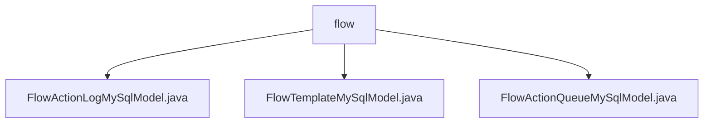

# Basic Information

|      |      |
|------|------|
| Name | flow |
| Language | .java |
| Code Path | WeFe/board/board-service/src/main/java/com/welab/wefe/board/service/database/entity/flow |
| Package Name | docs.board.board-service.src.main.java.com.welab.wefe.board.service.database.entity.flow |
| Brief Description | The FlowActionLogMySqlModel records flow logs, including fields such as producer, priority, and status. The FlowTemplateMySqlModel maps to the project_flow_template table, containing attributes like template name and type. The FlowActionQueueMySqlModel manages flow action queues, with fields such as producer and priority. |

# Description

## Overview  
The core responsibility of this module is to manage action logs, template configurations, and queue data in federated learning workflows, achieving persistent storage through MySQL entity classes. The interface specification includes three models: FlowActionLogMySqlModel records execution status and parameters, FlowTemplateMySqlModel stores workflow template metadata, and FlowActionQueueMySqlModel manages pending action queues. Key data structures involve producer types (enum board/gateway), federated learning types (horizontal/vertical enum), and priority numeric fields. External dependencies are limited to the MySQL database and JPA framework. For example, FlowActionLogMySqlModel marks action success/failure states via the status field.  

## Key Business Scenarios  
The module supports full lifecycle management of federated learning workflows, resembling a data-layer implementation of a workflow engine. FlowTemplateMySqlModel defines reusable workflow templates, FlowActionQueueMySqlModel implements priority queue scheduling (higher numeric values indicate higher priority), and FlowActionLogMySqlModel tracks action execution traces. Typical applications include template creation (e.g., the graph field stores canvas configurations), asynchronous action processing (e.g., producer distinguishes message sources), and execution auditing (e.g., recording callers via consumerIp). API types cover CRUD operations and status queries, such as filtering horizontal or vertical learning templates using the federatedLearningType enum.

### Package Internal Structure View

This flowchart illustrates the hierarchical structure of the flow directory under the board-service module in the WeFe project. The parent node "flow" encompasses three Java entity class files: FlowActionLogMySqlModel, FlowTemplateMySqlModel, and FlowActionQueueMySqlModel, all of which belong to database entity models related to data flow. The entire structure clearly reflects the organization of data flow entities within the project.

# File List

| Name   | Type  | Description |
|-------|------|-------------|
| [FlowActionLogMySqlModel.java](FlowActionLogMySqlModel.md) | file | FlowActionLogMySqlModel is a MySQL entity class containing producer type, priority, action parameters, execution status, remarks, and consumer IP fields, providing getter/setter methods. |
| [FlowTemplateMySqlModel.java](FlowTemplateMySqlModel.md) | file | The FlowTemplateMySqlModel class defines the database entity for project workflow templates, containing fields such as name, English name, description, flowchart, federated learning type, and their corresponding getter/setter methods. |
| [FlowActionQueueMySqlModel.java](FlowActionQueueMySqlModel.md) | file | FlowActionQueueMySqlModel is a MySQL entity class that includes producer type, priority, action type, and parameter fields, providing getter/setter methods. |

