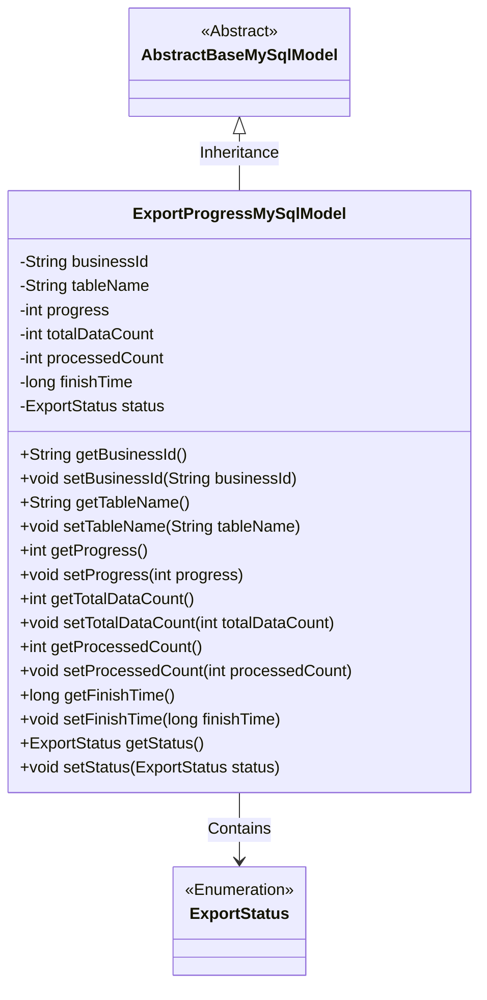

# Basic Information

|      |      |
|------|------|
| Name | ExportProgressMySqlModel |
| Language | .java |
| Code Path | WeFe/board/board-service/src/main/java/com/welab/wefe/board/service/database/entity/fusion/ExportProgressMySqlModel.java |
| Package Name | com.welab.wefe.board.service.database.entity.fusion |
| Dependencies | ['com.welab.wefe.board.service.database.entity.base.AbstractBaseMySqlModel', 'com.welab.wefe.board.service.fusion.enums.ExportStatus', 'javax.persistence.Entity', 'javax.persistence.EnumType', 'javax.persistence.Enumerated'] |
| Brief Description | The `ExportProgressMySqlModel` class records the export progress of data fusion tasks, containing fields such as business ID, table name, progress percentage, total count, processed count, completion time, and status. |

# Description

The content defines a Java entity class named `ExportProgressMySqlModel`, which is used to track the export progress of fusion tasks. The class includes fields such as business ID, export table name, progress percentage, total data volume, processed count, completion time, and export status, along with corresponding getter and setter methods for each field. The entity is mapped to the database table `fusion_result_export_progress` and inherits from the base class `AbstractBaseMySqlModel`. The status field is stored using the enum type `ExportStatus`.

# Class Summary

| Name   | Type  | Description |
|-------|------|-------------|
| ExportProgressMySqlModel | class | The `ExportProgressMySqlModel` class records export progress, including task ID, table name, progress, total count, processed count, completion time, and status. |

## Class ExportProgressMySqlModel

|      |      |
|------|------|
| Access Modifier | @Entity(name = "fusion_result_export_progress");public |
| Type | class |
| Name | ExportProgressMySqlModel |
| Description | The `ExportProgressMySqlModel` class records export progress, including task ID, table name, progress, total count, processed count, completion time, and status. |

### UML Class Diagram

This code defines an entity class named `ExportProgressMySqlModel` for tracking export task progress information. The class inherits from `AbstractBaseMySqlModel` and contains fields such as business ID, table name, progress percentage, total data count, processed count, completion time, and status. The `ExportStatus` is an enumeration type representing different states of an export task. The class provides getter and setter methods for all fields, serving as a typical data model class mapped to the database table `fusion_result_export_progress`.

### Internal Method Call Graph

```mermaid
graph TD
    A["Class ExportProgressMySqlModel"]
    B["Inheritance: AbstractBaseMySqlModel"]
    C["Property: String businessId"]
    D["Property: String tableName"]
    E["Property: int progress"]
    F["Property: int totalDataCount"]
    G["Property: int processedCount"]
    H["Property: long finishTime"]
    I["Property: ExportStatus status"]
    J["Method: getBusinessId()"]
    K["Method: setBusinessId(String)"]
    L["Method: getTableName()"]
    M["Method: setTableName(String)"]
    N["Method: getProgress()"]
    O["Method: setProgress(int)"]
    P["Method: getTotalDataCount()"]
    Q["Method: setTotalDataCount(int)"]
    R["Method: getProcessedCount()"]
    S["Method: setProcessedCount(int)"]
    T["Method: getFinishTime()"]
    U["Method: setFinishTime(long)"]
    V["Method: getStatus()"]
    W["Method: setStatus(ExportStatus)"]

    A --> B
    A --> C
    A --> D
    A --> E
    A --> F
    A --> G
    A --> H
    A --> I
    A --> J
    A --> K
    A --> L
    A --> M
    A --> N
    A --> O
    A --> P
    A --> Q
    A --> R
    A --> S
    A --> T
    A --> U
    A --> V
    A --> W
```

This code defines a JPA entity class named ExportProgressMySqlModel, which inherits from AbstractBaseMySqlModel and is used to track the progress status of data export tasks. The class contains 7 core properties: business ID, table name, progress percentage, total data volume, processed count, completion time, and export status, each with corresponding getter and setter methods. This entity maps to the database table "fusion_result_export_progress" and records export status through the enum type ExportStatus. The overall structure clearly reflects the core monitoring metrics of export tasks.

### Field List

| Name  | Type  | Description |
|-------|-------|------|
| tableName | String | Define a string variable tableName. |
| processedCount | int | Processed count variable. |
| businessId | String | Business identification string |
| totalDataCount | int | Total data count variable |
| status | ExportStatus | Using @Enumerated(EnumType.STRING) to store the enum type ExportStatus as a string in the database. |
| progress | int | The integer variable `progress` is used to track progress. |
| finishTime | long | Long integer completion time variable |

### Method List

| Name  | Type  | Description |
|-------|-------|------|
| getStatus | ExportStatus | The method to obtain the current export status returns an ExportStatus object. |
| setFinishTime | void | Method to set the completion time, with the parameter being a long integer finishTime. |
| getBusinessId | String | This is a Java method that returns the value of the string-type variable `businessId`. |
| setProcessedCount | void | The method to set the processed count assigns the parameter processedCount to the class member variable processedCount. |
| getTotalDataCount | int | This is a method that returns the total data volume, directly retrieving the value of the member variable `totalDataCount`. |
| setTableName | void | Method for setting the table name, which assigns the input parameter tableName to the tableName property of the current object. |
| getFinishTime | long | Methods to obtain the completion time, returns the finishTime value. |
| getProcessedCount | int | Get the processed count method, returns the value of the processedCount variable. |
| setTotalDataCount | void | This is a Java method used to set the value of the totalDataCount variable. The method accepts an integer parameter totalDataCount and assigns it to the class's member variable of the same name. |
| getTableName | String | Methods to obtain table names, returning a string-type table name variable. |
| setBusinessId | void | Defines a public method `setBusinessId` for setting the value of the `businessId` property in the class. The parameter is of type `String`. |
| setProgress | void | Method to set the progress value, which assigns the input parameter `progress` to the `progress` property of the current object. |
| getProgress | int | The method to obtain the current progress value, which returns an integer-type variable `progress`. |
| setStatus | void | The method to set the export status assigns the incoming status value to the status property of the current object. |

