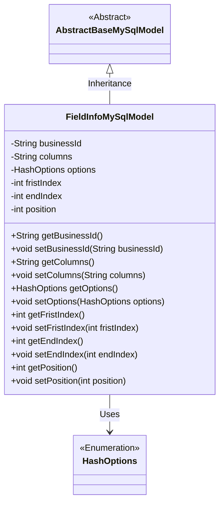

# Basic Information

|      |      |
|------|------|
| Name | FieldInfoMySqlModel |
| Language | .java |
| Code Path | WeFe/board/board-service/src/main/java/com/welab/wefe/board/service/database/entity/fusion/FieldInfoMySqlModel.java |
| Package Name | com.welab.wefe.board.service.database.entity.fusion |
| Dependencies | ['com.welab.wefe.board.service.database.entity.base.AbstractBaseMySqlModel', 'com.welab.wefe.common.wefe.enums.HashOptions', 'javax.persistence.Entity', 'javax.persistence.EnumType', 'javax.persistence.Enumerated'] |
| Brief Description | The FieldInfoMySqlModel class includes fields such as businessId, columns, options enumeration, firstIndex, endIndex, and position, along with their corresponding getter/setter methods. |

# Description

This is a Java entity class named FieldInfoMySqlModel, mapped to the database table `fusion_field_info`. It inherits from `AbstractBaseMySqlModel` and contains six attributes: `businessId` (business ID), `columns` (column information), `options` (hash option enum type), `fristIndex` (starting index), `endIndex` (ending index), and `position` (position). Each attribute has corresponding getter and setter methods. The `options` attribute uses the `@Enumerated` annotation to specify storing enum values as strings.

# Class Summary

| Name   | Type  | Description |
|-------|------|-------------|
| FieldInfoMySqlModel | class | The FieldInfoMySqlModel class includes fields such as business ID, column name, hash options, start/end indexes, and position, providing corresponding getter and setter methods. |

## Class FieldInfoMySqlModel

|      |      |
|------|------|
| Access Modifier | @Entity(name = "fusion_field_info");public |
| Type | class |
| Name | FieldInfoMySqlModel |
| Description | The FieldInfoMySqlModel class includes fields such as business ID, column name, hash options, start/end indexes, and position, providing corresponding getter and setter methods. |

### UML Class Diagram

This class diagram illustrates that FieldInfoMySqlModel inherits from the abstract class AbstractBaseMySqlModel and contains multiple private fields along with their corresponding getter/setter methods. HashOptions is an enumeration type used as a field type by FieldInfoMySqlModel. The diagram clearly reflects the inheritance relationship between entity classes and field dependencies, conforming to JPA entity modeling specifications.

### Internal Method Call Graph

```mermaid
graph TD
    A["Class FieldInfoMySqlModel"]
    B["Inheritance: AbstractBaseMySqlModel"]
    C["Annotation: @Entity(name='fusion_field_info')"]
    D["Property: String businessId"]
    E["Property: String columns"]
    F["Property: HashOptions options"]
    G["Annotation: @Enumerated(EnumType.STRING)"]
    H["Property: int fristIndex"]
    I["Property: int endIndex"]
    J["Property: int position"]
    K["Method: getBusinessId/setBusinessId"]
    L["Method: getColumns/setColumns"]
    M["Method: getOptions/setOptions"]
    N["Method: getFristIndex/setFristIndex"]
    O["Method: getEndIndex/setEndIndex"]
    P["Method: getPosition/setPosition"]

    A --> B
    A --> C
    A --> D
    A --> E
    A --> F
    F --> G
    A --> H
    A --> I
    A --> J
    A --> K
    A --> L
    A --> M
    A --> N
    A --> O
    A --> P
```

This code defines a JPA entity class named FieldInfoMySqlModel, which inherits from AbstractBaseMySqlModel and is used to store field information. The class contains six properties: businessId, columns, options (with enum annotation), fristIndex, endIndex, and position, each with corresponding getter and setter methods. The entity is mapped to the database table "fusion_field_info" via the @Entity annotation, where the options property uses @Enumerated to specify the enum storage type as string. This model class is primarily used for mapping operations between the ORM framework and database tables.

### Field List

| Name  | Type  | Description |
|-------|-------|------|
| position | int | The private integer variable `position` is used to store location information. |
| options | HashOptions | The enumeration type field "options" is stored in string format. |
| businessId | String | Private business identifier string |
| fristIndex | int | Private integer variable firstIndex. |
| endIndex | int | The private integer variable `endIndex` is used to mark the end position. |
| columns | String | The private string variable `columns` is used to store column information. |

### Method List

| Name  | Type  | Description |
|-------|-------|------|
| setPosition | void | Methods for setting the position property, assigning the input parameter to the object's position variable. |
| setColumns | void | This is a Java method used to set the value of the string-type member variable `columns` of a class. The method is named `setColumns`, which accepts a string parameter `columns` and assigns it to the `columns` property of the current object. |
| getFristIndex | int | A public method to obtain the fristIndex value. |
| setFristIndex | void | Method to set the class member variable fristIndex, with an integer parameter fristIndex. |
| getColumns | String | The method returns the value of the string variable columns. |
| setBusinessId | void | The method to set the business ID assigns the passed string parameter to the class's member variable businessId. |
| getBusinessId | String | Common method to obtain businessId, returns a string-type businessId. |
| getOptions | HashOptions | The method returns a HashOptions object named options. |
| setOptions | void | Method for setting hash options, assigning the input parameters to the class member variable options. |
| getEndIndex | int | Get the integer value of the end index. |
| setEndIndex | void | The method to set the end index assigns the parameter `endIndex` to the member variable `endIndex` of the class. |
| getPosition | int | This is a Java method that returns the value of the integer variable `position`. |

