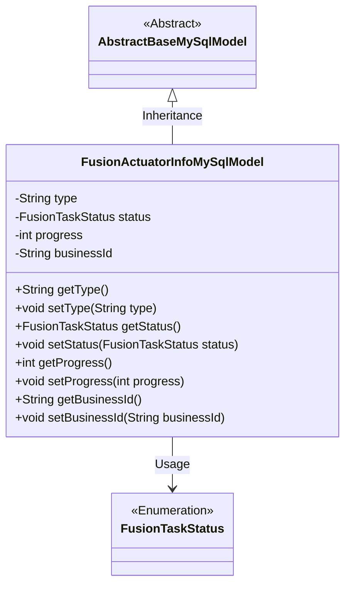
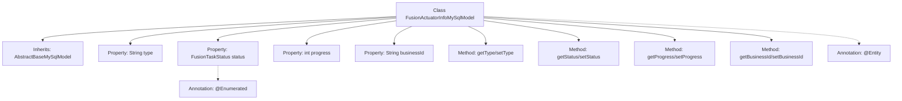

# Basic Information

|      |      |
|------|------|
| Name | FusionActuatorInfoMySqlModel |
| Language | .java |
| Code Path | WeFe/board/board-service/src/main/java/com/welab/wefe/board/service/database/entity/fusion/FusionActuatorInfoMySqlModel.java |
| Package Name | com.welab.wefe.board.service.database.entity.fusion |
| Dependencies | ['com.welab.wefe.board.service.database.entity.base.AbstractBaseMySqlModel', 'com.welab.wefe.fusion.core.enums.FusionTaskStatus', 'javax.persistence.Entity', 'javax.persistence.EnumType', 'javax.persistence.Enumerated'] |
| Brief Description | Java entity class FusionActuatorInfoMySqlModel, containing fields for type, status, progress, and business ID along with corresponding getter/setter methods. |

# Description

The content defines a Java entity class named `FusionActuatorInfoMySqlModel`, which extends `AbstractBaseMySqlModel`. The entity is mapped to the database table `fusion_actuator_info`. The class includes four fields: `type` represents the type, `status` is an enum type `FusionTaskStatus` indicating the task status, `progress` records the progress value, and `businessId` stores the business identifier. Each field has corresponding getter and setter methods for accessing and modifying the property values.

# Class Summary

| Name   | Type  | Description |
|-------|------|-------------|
| FusionActuatorInfoMySqlModel | class | Defined a JPA entity class named fusion_actuator_info, containing fields for type, status, progress, and business ID along with their getter and setter methods. |

## Class FusionActuatorInfoMySqlModel

|      |      |
|------|------|
| Access Modifier | @Entity(name = "fusion_actuator_info");public |
| Type | class |
| Name | FusionActuatorInfoMySqlModel |
| Description | Defined a JPA entity class named fusion_actuator_info, containing fields for type, status, progress, and business ID along with their getter and setter methods. |

### UML Class Diagram

This class diagram illustrates that FusionActuatorInfoMySqlModel inherits from AbstractBaseMySqlModel and contains four private fields (type, status, progress, businessId) along with their corresponding getter/setter methods. The status field utilizes the enumeration type FusionTaskStatus, with enum value-to-string mapping achieved through the @Enumerated annotation. Marked as a JPA entity (via @Entity annotation), this class is designed for persisting actuator information to a MySQL database.

### Internal Method Call Graph

This flowchart illustrates the complete structure of the FusionActuatorInfoMySqlModel class, including its inheritance relationship, property definitions, method composition, and key annotations. The class inherits from AbstractBaseMySqlModel and contains four core properties (type, status, progress, businessId) along with their corresponding getter/setter methods. It specifically highlights the @Entity annotation for the entity class and the @Enumerated annotation for the status field, reflecting the mapping relationship between this JPA entity class and the database table "fusion_actuator_info", as well as the special handling of enumeration fields.

### Field List

| Name  | Type  | Description |
|-------|-------|------|
| businessId | String | Business identification string |
| status | FusionTaskStatus | Store the state values of the enum type FusionTaskStatus as strings. |
| progress | int | The integer variable `progress` is used to record the progress. |
| type | String | Declaration of string type variables. |

### Method List

| Name  | Type  | Description |
|-------|-------|------|
| setStatus | void | Methods for setting task status, assigning the input parameter `status` to the `status` property of the current object. |
| setType | void | This is a Java method used to set the type property of an object. The method is named setType, which takes a String parameter type and assigns it to the type member variable of the current object. |
| setProgress | void | Method to set the progress value: Assign the input parameter `progress` to the class member variable `progress`. |
| getBusinessId | String | This is a Java method that returns the value of the businessId variable of type String. |
| setBusinessId | void | Methods for setting the business ID: Assign the input string to the class's businessId member variable. |
| getStatus | FusionTaskStatus | The method to obtain the current task status returns a status value of type FusionTaskStatus. |
| getProgress | int | This is a Java method that returns the current value of the integer variable progress. |
| getType | String | This is a Java method that returns the value of a string-type variable named type. |

