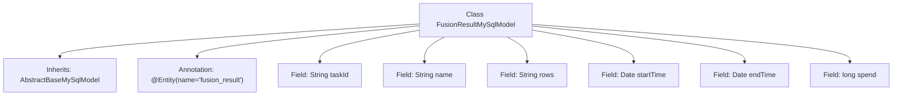

# Basic Information

|      |      |
|------|------|
| Name | FusionResultMySqlModel |
| Language | .java |
| Code Path | WeFe/board/board-service/src/main/java/com/welab/wefe/board/service/database/entity/fusion/FusionResultMySqlModel.java |
| Package Name | com.welab.wefe.board.service.database.entity.fusion |
| Dependencies | ['com.welab.wefe.board.service.database.entity.base.AbstractBaseMySqlModel', 'javax.persistence.Entity', 'java.util.Date'] |
| Brief Description | FusionResultMySqlModel is a MySQL entity class that includes fields for task ID, name, row count, start/end time, and time consumption. |

# Description

This is a Java persistence entity class named FusionResultMySqlModel, mapped to the database table fusion_result. It inherits from the base class AbstractBaseMySqlModel and contains 6 fields: taskId represents the task ID, name stores the name, rows records the number of rows, startTime and endTime indicate the start and end time respectively, and spend stores the time consumed. All fields use primitive data types or standard Java classes.

# Class Summary

| Name   | Type  | Description |
|-------|------|-------------|
| FusionResultMySqlModel | class | FusionResultMySqlModel is a MySQL entity class that includes fields such as task ID, name, row count, start/end time, and time consumed. |


## Class FusionResultMySqlModel

|      |      |
|------|------|
| Access Modifier | @Entity(name = "fusion_result");public |
| Type | class |
| Name | FusionResultMySqlModel |
| Description | FusionResultMySqlModel is a MySQL entity class that includes fields such as task ID, name, row count, start/end time, and time consumed. |


### UML Class Diagram

```mermaid
classDiagram
    class AbstractBaseMySqlModel {
        <<Abstract>>
        // Base model class containing common fields and methods
    }

    class FusionResultMySqlModel {
        -String taskId
        -String name
        -String rows
        -Date startTime
        -Date endTime
        -long spend
    }

    AbstractBaseMySqlModel <|-- FusionResultMySqlModel : Inheritance
    FusionResultMySqlModel ..|> Entity : Implements

    <<Interface>> Entity {
        <<JPA>>
    }
```

This class diagram illustrates that FusionResultMySqlModel inherits from the AbstractBaseMySqlModel abstract class and implements the JPA Entity interface. The class contains six private fields: taskId (task ID), name (name), rows (row data), startTime (start time), endTime (end time), and spend (duration), which are used to store fusion task result data. The @Entity annotation indicates this is a JPA persistence entity, corresponding to the database table "fusion_result".


### Internal Method Call Graph



This flowchart describes the structure of the FusionResultMySqlModel class, which inherits from AbstractBaseMySqlModel and is annotated as a JPA entity. The class contains six fields: three String-type fields (taskId, name, rows), two Date-type fields (startTime, endTime), and one long-type field (spend). All fields have default access permissions with no explicit getter/setter methods declared.

### Field List

| Name  | Type  | Description |
|-------|-------|------|
| startTime | Date | Start date and time |
| endTime | Date | Declare a date type variable named endTime. |
| rows | String | Definition of the string variable rows. |
| taskId | String | Task ID string variable |
| name | String | Declare a string variable named name |
| spend | long | Long-term overhead |

### Method List

| Name  | Type  | Description |
|-------|-------|------|


