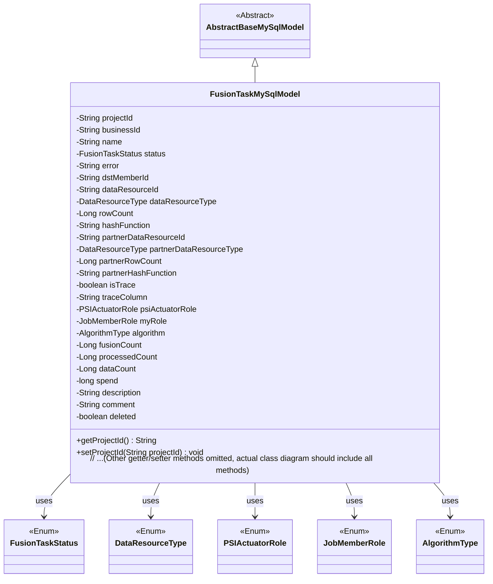
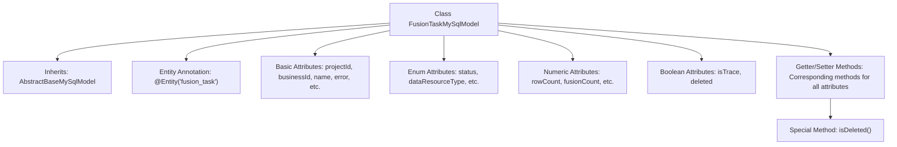

# Basic Information

|      |      |
|------|------|
| Name | FusionTaskMySqlModel |
| Language | .java |
| Code Path | WeFe/board/board-service/src/main/java/com/welab/wefe/board/service/database/entity/fusion/FusionTaskMySqlModel.java |
| Package Name | com.welab.wefe.board.service.database.entity.fusion |
| Dependencies | ['com.welab.wefe.board.service.database.entity.base.AbstractBaseMySqlModel', 'com.welab.wefe.common.wefe.enums.DataResourceType', 'com.welab.wefe.common.wefe.enums.JobMemberRole', 'com.welab.wefe.fusion.core.enums.AlgorithmType', 'com.welab.wefe.fusion.core.enums.FusionTaskStatus', 'com.welab.wefe.fusion.core.enums.PSIActuatorRole', 'javax.persistence.Column', 'javax.persistence.Entity', 'javax.persistence.EnumType', 'javax.persistence.Enumerated'] |
| Brief Description | The FusionTaskMySqlModel class defines the data fusion task entity, containing attributes such as project ID, business ID, task status, data resource information, algorithm type, role, row count statistics, and tracking fields. |

# Description

The `FusionTaskMySqlModel` is a database entity class designed to represent fusion tasks. It includes basic task information such as project ID, business ID, name, status, and error messages. It records relevant attributes of data resources, such as resource ID, type, row count, hash function, as well as corresponding attributes of partners. Additionally, it contains tracking fields, PSI execution roles, algorithm types, fusion count, processing count, data count, time consumption, description, notes, and deletion flags. All fields are equipped with corresponding getter and setter methods.

# Class Summary

| Name   | Type  | Description |
|-------|------|-------------|
| FusionTaskMySqlModel | class | The `FusionTaskMySqlModel` class defines the data fusion task entity, which includes attributes such as project ID, business ID, task status, data resource information, role type, algorithm type, row count statistics, tracking fields, and deletion markers. |

## Class FusionTaskMySqlModel

|      |      |
|------|------|
| Access Modifier | @Entity(name = "fusion_task");public |
| Type | class |
| Name | FusionTaskMySqlModel |
| Description | The `FusionTaskMySqlModel` class defines the data fusion task entity, which includes attributes such as project ID, business ID, task status, data resource information, role type, algorithm type, row count statistics, tracking fields, and deletion markers. |

### UML Class Diagram

Class Diagram Description:
The FusionTaskMySqlModel class inherits from AbstractBaseMySqlModel and is an entity class containing multi-party data fusion task information. It includes 34 fields with corresponding getter/setter methods, primarily recording task IDs, resource information, status, algorithm types, data statistics, and other attributes. This class has associations with 5 enumeration types (FusionTaskStatus, DataResourceType, etc.) to represent classifications such as status, roles, and algorithms. The entity annotation indicates this is a JPA persistence object.

### Internal Method Call Graph

This code defines a JPA entity class named FusionTaskMySqlModel, which inherits from AbstractBaseMySqlModel and represents the data model for data fusion tasks. The class contains various types of attributes: basic string types (e.g., projectId), enum types (e.g., status), numeric types (e.g., rowCount), and boolean flags (e.g., isTrace). All attributes are equipped with corresponding getter and setter methods, with the isDeleted() method specifically used to check deletion status. The class is mapped to the database table "fusion_task" via the @Entity annotation, and the storage method for enum fields is configured using annotations such as @Enumerated and @Column.

### Field List

| Name  | Type  | Description |
|-------|-------|------|
| spend | long | The variable `spend`, of type long integer, represents the expenditure amount. |
| dataResourceId | String | String-type data resource identifier. |
| dataCount = 0L | Long | Define a long integer variable dataCount with an initial value of 0. |
| traceColumn | String | Declare a public string variable traceColumn. |
| partnerRowCount | Long | Long integer variable, recording the number of partner rows. |
| partnerHashFunction | String | String-type partner hash function variable. |
| businessId | String | Business identification string |
| name | String | Declare a string variable name |
| processedCount = 0L | Long | Number of records processed, initial value is 0. |
| psiActuatorRole | PSIActuatorRole | Use the @Enumerated annotation to store the enumeration type PSIActuatorRole as a string in the database column psi_actuator_role. |
| rowCount | Long | Declare a long integer variable rowCount. |
| algorithm | AlgorithmType | Entity class field annotation: Use string to store the enumeration type AlgorithmType, corresponding to the database column name algorithm. |
| status | FusionTaskStatus | Use the @Enumerated annotation to store the enum type FusionTaskStatus as a string in the database. |
| description | String | The public string variable `description` is used to store descriptive information. |
| comment | String | The public string variable `comment` is used to store comment content. |
| isTrace | boolean | The boolean variable isTrace is used to track the state. |
| dstMemberId | String | Define a string type variable dstMemberId. |
| fusionCount = 0L | Long | Defined a long integer variable named fusionCount with an initial value of 0. |
| partnerDataResourceId | String | Declare the string variable `partnerDataResourceId` to store the partner data resource ID. |
| myRole | JobMemberRole | Use the @Enumerated annotation to store the enum type JobMemberRole as a string in the database table field my_role. |
| partnerDataResourceType | DataResourceType | Use the @Enumerated annotation to store the enum type DataResourceType as a string in the partner_data_resource_type column of the database table. |
| error | String | String type error variable. |
| dataResourceType | DataResourceType | Entity class fields use the @Enumerated annotation to store enum types as strings in the database, with the corresponding column name being data_resource_type. |
| deleted = false | boolean | The boolean variable `deleted` has an initial value of false, indicating an undeleted state. |
| hashFunction | String | String Hashing Function |
| projectId | String | Project ID string variable declaration. |

### Method List

| Name  | Type  | Description |
|-------|-------|------|
| setDataCount | void | This is a Java method used to set the value of the dataCount property for a class. The method accepts a parameter of type Long and assigns it to the member variable dataCount of the class. |
| getPartnerDataResourceId | String | This is a Java method that returns the value of a string variable named partnerDataResourceId. |
| getDescription | String | String methods for obtaining descriptive information. |
| setHashFunction | void | This is a Java method used to set the hashFunction property value of an object. The method accepts a string parameter hashFunction and assigns it to the property of the same name in the current object. |
| getHashFunction | String | Methods to Obtain Hash Function Names. |
| setDataResourceId | void | The method to set the data resource ID assigns the parameter value to the class member variable `dataResourceId`. |
| getBusinessId | String | This is a Java method that returns the value of the businessId field as a string. |
| getPartnerDataResourceType | DataResourceType | Methods for obtaining partner data resource types, returns partnerDataResourceType. |
| getPartnerRowCount | Long | Method to obtain the number of partner rows, returns a long integer value partnerRowCount. |
| getError | String | String methods for retrieving error messages. |
| getRowCount | Long | Methods to obtain the number of rows, returning a long integer value rowCount. |
| getMyRole | JobMemberRole | Get the current user's role information. |
| setPartnerDataResourceType | void | The method for setting the partner data resource type assigns the input parameter to the member variable `partnerDataResourceType`. |
| setBusinessId | void | Methods for setting the business ID: Assign the input string to the businessId member variable of the class. |
| setProcessedCount | void | Method to set the processed count, with a parameter of type long processedCount. |
| getTraceColumn | String | Common methods for obtaining traceColumn values. |
| setPartnerDataResourceId | void | The method for setting the partner data resource ID assigns the input parameter to the class member variable `partnerDataResourceId`. |
| getPartnerHashFunction | String | Method to obtain the partner hash function, with a return value of partnerHashFunction. |
| getDataResourceId | String | Methods to obtain the data resource ID, returning the dataResourceId as a string type. |
| setDataResourceType | void | This method is used to set the data resource type, with the parameter of type DataResourceType, which is assigned to the class member variable dataResourceType. |
| setStatus | void | Methods for setting task status, assigning the incoming status parameter to the status property of the current object. |
| getSpend | long | Public method to get the spend value, returning data of type long. |
| setMyRole | void | Java Method: Sets the role attribute of the current object, with the parameter of type JobMemberRole. |
| setTrace | void | This method is used to set the boolean value trace and assign it to the member variable isTrace. |
| setSpend | void | This is a Java method used to set the value of the class member variable `spend`, with the parameter type being `long`. |
| getProcessedCount | Long | Method to get the processed count, returns a long integer value processedCount. |
| setTraceColumn | void | Method for setting the trace column, which assigns the input string to the traceColumn member variable of the class. |
| setError | void | Methods for setting error messages, assigning the passed string to the class's error variable. |
| setComment | void | Method to set the object comment attribute, with the parameter being a string comment. |
| isTrace | boolean | This is a Java method that returns the state of the boolean value isTrace. |
| getDataResourceType | DataResourceType | Methods for obtaining data resource types, returns dataResourceType. |
| getComment | String | The method returns the value of the comment variable, which is of type string. |
| getStatus | FusionTaskStatus | The method to obtain the current task status returns a status value of type FusionTaskStatus. |
| setPartnerRowCount | void | Method for setting the number of partner rows, with a parameter of type long. |
| setPsiActuatorRole | void | Method for setting the PSI actuator role, which assigns the input parameter to the class member variable psiActuatorRole. |
| isDeleted | boolean | This is a Java method that returns a boolean value "deleted", indicating whether the object has been deleted. |
| setProjectId | void | Methods for setting the project ID: Assign the parameter projectId to the projectId property of the current object. |
| setFusionCount | void | Java Method: Set the value of the fusionCount property. |
| setDescription | void | The method for setting the description content assigns the input parameter to the object's description property. |
| getDataCount | Long | Methods to obtain the data count, returning a long integer value dataCount. |
| getName | String | Methods to obtain the name, returning the value of the string-type name variable. |
| setAlgorithm | void | The method to set the algorithm type assigns the input parameter to the class member variable `algorithm`. |
| setDstMemberId | void | The method to set the target member ID assigns the parameter value to the class member variable `dstMemberId`. |
| setPartnerHashFunction | void | The method to set the partner hash function assigns the input parameter to the member variable partnerHashFunction. |
| setDeleted | void | A public method to set the object's deletion status, with a boolean parameter `deleted`. |
| getProjectId | String | The method returns the project ID string. |
| setRowCount | void | The method to set the number of rows assigns the input parameter rowCount to the class member variable rowCount. |
| setName | void | This is a Java method used to set the name property of an object, which accepts a String parameter name and assigns it to the name field of the current object. |
| getPsiActuatorRole | PSIActuatorRole | Methods to Obtain PSI Executor Role Objects. |
| getFusionCount | Long | Method to obtain the fused count value, with a return type of Long. |
| getDstMemberId | String | Methods to obtain the target member ID, returning the dstMemberId string. |
| getAlgorithm | AlgorithmType | The method to obtain the current algorithm type, with a return value of the AlgorithmType type. |

