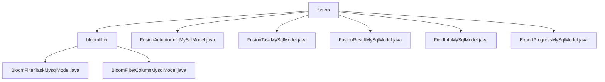

# Basic Information

|      |      |
|------|------|
| Name | fusion |
| Language | .java |
| Code Path | WeFe/board/board-service/src/main/java/com/welab/wefe/board/service/database/entity/fusion |
| Package Name | docs.board.board-service.src.main.java.com.welab.wefe.board.service.database.entity.fusion |
| Brief Description | This module manages Bloom filter tasks and field metadata, including models for task progress and field characteristics, supporting CRUD operations and statistical analysis. It involves multiple MySQL entity classes, such as task status, merge tasks, results, field information, and export progress, all inheriting from the base model and mapped to database tables. |

# Description

## Overview  
The core responsibility of this module is to manage the full lifecycle of data fusion tasks, including task execution monitoring, field metadata analysis, and result export. The interface specification comprises five models: FusionTaskMySqlModel records basic task information (e.g., project ID, status), FusionActuatorInfoMySqlModel tracks execution progress (e.g., progress percentage), FieldInfoMySqlModel stores field-level configurations (e.g., hashing options), FusionResultMySqlModel saves result statistics (e.g., row count and time consumption), and ExportProgressMySqlModel manages export status. Key data structures include master-slave models linked by business IDs, enumerated status fields, and time-consumption statistics fields. External dependencies involve JPA annotations, MySQL databases, and enum serialization libraries. For example, FieldInfoMySqlModel uses @Enumerated to implement enum persistence.

## Primary Business Scenarios  
The module implements fusion task management akin to a data pipeline, covering task scheduling, execution monitoring, and result analysis. The master model, FusionTaskMySqlModel, maintains task metadata (e.g., tracking task phases via the status field), while the slave model, FusionActuatorInfoMySqlModel, updates execution progress in real time (e.g., the progress field). Typical application patterns include: creating the master model during task initialization, configuring field mapping rules via FieldInfoMySqlModel during execution, and recording statistical metrics in FusionResultMySqlModel for final results. API types encompass task CRUD, progress queries, and export control, such as ExportProgressMySqlModel supporting export status management.

### Package Internal Structure View

This flowchart illustrates the hierarchical structure under the fusion directory, which includes 1 subdirectory (bloomfilter) and 5 Java files. The bloomfilter subdirectory further contains 2 Java model files. The entire structure clearly presents the organization of database entity classes, with the total node count exactly matching the original path quantities.

# File List

| Name   | Type  | Description |
|-------|------|-------------|
| [bloomfilter](bloomfilter/_module.md) | package | The BloomFilterTaskMysqlModel class stores Bloom filter task information, including fields such as name, ID, and progress, and inherits from AbstractBaseMySqlModel. The BloomFilterColumnMysqlModel class maps to a database table, containing filter ID, field sequence, name, etc., and supports JSON storage, inheriting from AbstractBaseMySqlModel. |
| [FusionActuatorInfoMySqlModel.java](FusionActuatorInfoMySqlModel.md) | file | Java entity class FusionActuatorInfoMySqlModel, containing fields for type, status, progress, and business ID along with corresponding getter/setter methods. |
| [FusionTaskMySqlModel.java](FusionTaskMySqlModel.md) | file | The `FusionTaskMySqlModel` class defines the data fusion task entity, containing attributes such as project ID, business ID, task status, data resource information, algorithm type, role, row count statistics, and tracking fields. |
| [FusionResultMySqlModel.java](FusionResultMySqlModel.md) | file | FusionResultMySqlModel is a MySQL entity class that includes fields for task ID, name, row count, start/end time, and time consumption. |
| [FieldInfoMySqlModel.java](FieldInfoMySqlModel.md) | file | The FieldInfoMySqlModel class includes fields such as businessId, columns, options enumeration, firstIndex, endIndex, and position, along with their corresponding getter/setter methods. |
| [ExportProgressMySqlModel.java](ExportProgressMySqlModel.md) | file | The `ExportProgressMySqlModel` class records the export progress of data fusion tasks, containing fields such as business ID, table name, progress percentage, total count, processed count, completion time, and status. |

