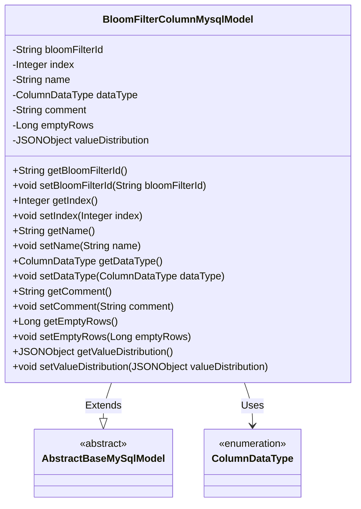

# Basic Information

|      |      |
|------|------|
| Name | BloomFilterColumnMysqlModel |
| Language | .java |
| Code Path | WeFe/board/board-service/src/main/java/com/welab/wefe/board/service/database/entity/fusion/bloomfilter/BloomFilterColumnMysqlModel.java |
| Package Name | com.welab.wefe.board.service.database.entity.fusion.bloomfilter |
| Dependencies | ['com.alibaba.fastjson.JSONObject', 'com.vladmihalcea.hibernate.type.json.JsonStringType', 'com.welab.wefe.board.service.database.entity.base.AbstractBaseMySqlModel', 'com.welab.wefe.common.wefe.enums.ColumnDataType', 'org.hibernate.annotations.Type', 'org.hibernate.annotations.TypeDef', 'javax.persistence.Column', 'javax.persistence.Entity', 'javax.persistence.EnumType', 'javax.persistence.Enumerated'] |
| Brief Description | The BloomFilterColumnMysqlModel entity class includes attributes such as filter ID, field sequence number, name, data type, comments, null value row count, and value distribution in JSON format. |

# Description

The code defines an entity class named `BloomFilterColumnMysqlModel`, which maps to the database table `bloom_filter_column`. The class inherits from `AbstractBaseMySqlModel` and includes multiple fields: `bloomFilterId` represents the filter ID, `index` denotes the field sequence number, `name` indicates the field name, `dataType` is an enum type representing the data type, `comment` stores annotation information, `emptyRows` records the count of null-value data rows, and `valueDistribution` stores value distribution in JSON format. All fields are equipped with corresponding getter and setter methods. The entity class utilizes JPA annotations for ORM mapping, including `@Entity`, `@TypeDef`, etc., and supports JSON-type field storage.

# Class Summary

| Name   | Type  | Description |
|-------|------|-------------|
| BloomFilterColumnMysqlModel | class | BloomFilterColumnMysqlModel is a MySQL entity class that contains attributes such as filter ID, field sequence number, name, data type, comments, null value count, and value distribution in JSON format. |

## Class BloomFilterColumnMysqlModel

|      |      |
|------|------|
| Access Modifier | @Entity(name = "bloom_filter_column");@TypeDef(name = "json", typeClass = JsonStringType.class);public |
| Type | class |
| Name | BloomFilterColumnMysqlModel |
| Description | BloomFilterColumnMysqlModel is a MySQL entity class that contains attributes such as filter ID, field sequence number, name, data type, comments, null value count, and value distribution in JSON format. |

### UML Class Diagram

This code defines an entity class named `BloomFilterColumnMysqlModel`, which extends the abstract base class `AbstractBaseMySqlModel` and represents Bloom filter column information in a MySQL database. The class contains multiple private fields (such as filter ID, column index, name, data type, etc.) along with their corresponding getter/setter methods. The `dataType` field uses the enumeration type `ColumnDataType`, while the `valueDistribution` field stores value distribution data in JSON format. The class is marked as an entity using JPA annotations and specifies the table name and JSON type mapping.

### Internal Method Call Graph

```mermaid
graph TD
    A["Class BloomFilterColumnMysqlModel"]
    B["Annotation: @Entity('bloom_filter_column')"]
    C["Annotation: @TypeDef(name='json', typeClass=JsonStringType.class)"]
    D["Inheritance: AbstractBaseMySqlModel"]
    E["Property: String bloomFilterId"]
    F["Property: @Column Integer index"]
    G["Property: String name"]
    H["Property: @Enumerated ColumnDataType dataType"]
    I["Property: String comment"]
    J["Property: Long emptyRows"]
    K["Property: @Type @Column JSONObject valueDistribution"]
    L["Method: getter/setter bloomFilterId"]
    M["Method: getter/setter index"]
    N["Method: getter/setter name"]
    O["Method: getter/setter dataType"]
    P["Method: getter/setter comment"]
    Q["Method: getter/setter emptyRows"]
    R["Method: getter/setter valueDistribution"]

    A --> B
    A --> C
    A --> D
    A --> E
    A --> F
    A --> G
    A --> H
    A --> I
    A --> J
    A --> K
    A --> L
    A --> M
    A --> N
    A --> O
    A --> P
    A --> Q
    A --> R
```

This flowchart illustrates the structure of the BloomFilterColumnMysqlModel class, including class annotations, inheritance relationships, properties, and methods. The class utilizes @Entity and @TypeDef annotations, inherits from AbstractBaseMySqlModel, and contains multiple properties such as bloomFilterId, index, etc., each with corresponding getter and setter methods. Various JPA annotations like @Column and @Enumerated are used to define database mapping rules for the properties.

### Field List

| Name  | Type  | Description |
|-------|-------|------|
| name | String | Declare a private string variable named name. |
| index | Integer | Database field mapping: The private integer variable `index` corresponds to the column name `index` in the table. |
| comment | String | Private string type variable comment. |
| dataType | ColumnDataType | Define an enum type field `dataType`, storing enum values in string format. |
| bloomFilterId | String | Private string variable storing the Bloom filter ID. |
| emptyRows | Long | Private long integer variable emptyRows, used to record the number of empty lines. |
| valueDistribution | JSONObject | The field valueDistribution uses JSON type for storage, and the database column is defined in json format. |

### Method List

| Name  | Type  | Description |
|-------|-------|------|
| getEmptyRows | Long | Method returns the number of empty lines. |
| setComment | void | Method to set the object's comment content, which assigns the input string to the member variable comment. |
| getIndex | Integer | Public method to get the index value, returns an Integer type. |
| setBloomFilterId | void | Method for setting the Bloom filter ID, which assigns the input parameter to the class member variable bloomFilterId. |
| setEmptyRows | void | Method to set the number of blank lines, with the parameter as emptyRows. |
| getDataType | ColumnDataType | Common method for retrieving column data types, returns the value of the dataType field. |
| getBloomFilterId | String | The method to obtain the Bloom filter ID directly returns the value of the member variable bloomFilterId. |
| getValueDistribution | JSONObject | Get the JSON object of valueDistribution. |
| setName | void | The method to set the object name is to assign the parameter 'name' to the 'name' property of the object. |
| setIndex | void | This is a Java method used to set the value of the class member variable `index`. The method takes an Integer parameter and assigns it to the `index` property of the current object. |
| setDataType | void | The method `setDataType` is used to set the column data type, with the parameter being of type `ColumnDataType`, and assigns the value to the member variable `dataType`. |
| getComment | String | Methods to obtain the comment string. |
| setValueDistribution | void | The method `setValueDistribution` is used to set the `valueDistribution` property of an object, with the parameter being a JSONObject-type `valueDistribution`. |
| getName | String | The method returns the value of the name variable of type string. |

