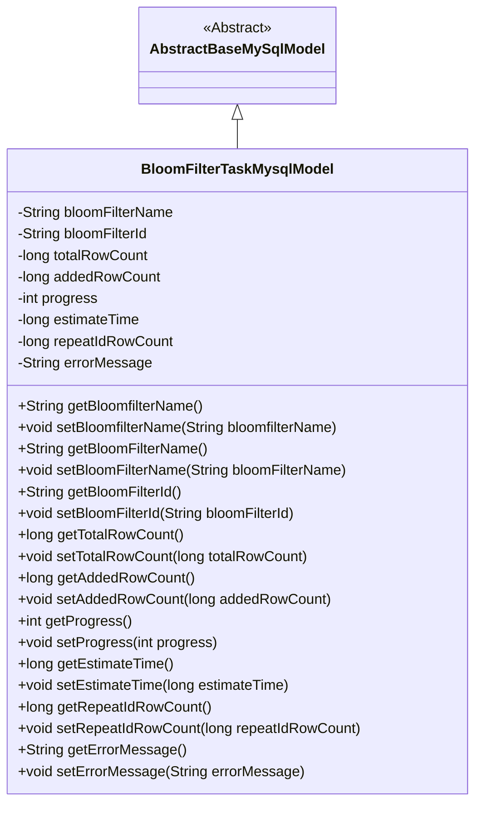

# Basic Information

|      |      |
|------|------|
| Name | BloomFilterTaskMysqlModel |
| Language | .java |
| Code Path | WeFe/board/board-service/src/main/java/com/welab/wefe/board/service/database/entity/fusion/bloomfilter/BloomFilterTaskMysqlModel.java |
| Package Name | com.welab.wefe.board.service.database.entity.fusion.bloomfilter |
| Dependencies | ['com.welab.wefe.board.service.database.entity.base.AbstractBaseMySqlModel', 'javax.persistence.Entity'] |
| Brief Description | The BloomFilterTaskMysqlModel class is used for Bloom filter task management, containing fields such as name, ID, data row count, progress, remaining time, duplicate ID count, and error messages. |

# Description

The code defines an entity class named BloomFilterTaskMysqlModel, which is used to store information related to Bloom filter tasks. The class includes fields such as filter name, ID, total data row count, written row count, task progress percentage, estimated remaining time, duplicate primary key count, and error messages. All fields are provided with corresponding getter and setter methods for retrieving and setting property values. This class inherits from AbstractBaseMySqlModel, indicating its use as a model class for MySQL databases.

# Class Summary

| Name   | Type  | Description |
|-------|------|-------------|
| BloomFilterTaskMysqlModel | class | The BloomFilterTaskMysqlModel class is used to record Bloom filter task information, including fields such as name, ID, data row count, progress, remaining time, duplicate primary key count, and error messages. |

## Class BloomFilterTaskMysqlModel

|      |      |
|------|------|
| Access Modifier | @Entity(name = "bloom_filter_task");public |
| Type | class |
| Name | BloomFilterTaskMysqlModel |
| Description | The BloomFilterTaskMysqlModel class is used to record Bloom filter task information, including fields such as name, ID, data row count, progress, remaining time, duplicate primary key count, and error messages. |

### UML Class Diagram

This class diagram illustrates the structure where BloomFilterTaskMysqlModel inherits from the abstract class AbstractBaseMySqlModel. BloomFilterTaskMysqlModel is an entity class designed to store Bloom filter task-related data, including filter name, ID, task progress statistics (total rows, written rows, progress percentage), time estimation, and error handling fields. The class provides complete getter/setter methods for accessing private fields, embodying the standard Java Bean design pattern. Through inheritance, this class reuses the database operation capabilities of the abstract base class, making it suitable as an entity mapping class for ORM frameworks.

### Internal Method Call Graph

```mermaid
graph TD
    A["Class BloomFilterTaskMysqlModel"]
    B["Inherits: AbstractBaseMySqlModel"]
    C["Annotation: @Entity('bloom_filter_task')"]
    D["Property: String bloomFilterName"]
    E["Property: String bloomFilterId"]
    F["Property: long totalRowCount"]
    G["Property: long addedRowCount"]
    H["Property: int progress"]
    I["Property: long estimateTime"]
    J["Property: long repeatIdRowCount"]
    K["Property: String errorMessage"]
    L["Method: getBloomfilterName/setBloomfilterName"]
    M["Method: getBloomFilterName/setBloomFilterName"]
    N["Method: getBloomFilterId/setBloomFilterId"]
    O["Method: getTotalRowCount/setTotalRowCount"]
    P["Method: getAddedRowCount/setAddedRowCount"]
    Q["Method: getProgress/setProgress"]
    R["Method: getEstimateTime/setEstimateTime"]
    S["Method: getRepeatIdRowCount/setRepeatIdRowCount"]
    T["Method: getErrorMessage/setErrorMessage"]

    A --> B
    A --> C
    A --> D
    A --> E
    A --> F
    A --> G
    A --> H
    A --> I
    A --> J
    A --> K
    A --> L
    A --> M
    A --> N
    A --> O
    A --> P
    A --> Q
    A --> R
    A --> S
    A --> T
```

This flowchart illustrates the structure of the BloomFilterTaskMysqlModel class, which inherits from AbstractBaseMySqlModel and is marked with the @Entity annotation. The class includes multiple properties such as bloomFilterName, bloomFilterId, etc., along with corresponding getter and setter methods. The flowchart clearly presents the class's inheritance relationship, property definitions, and method composition, facilitating a comprehensive understanding of the entity class's complete structure.

### Field List

| Name  | Type  | Description |
|-------|-------|------|
| bloomFilterName | String | Private string variable used to store the name of the Bloom filter. |
| totalRowCount = 0 | long | The private long variable totalRowCount is initialized to 0, used to record the total row count. |
| addedRowCount = 0 | long | Private long integer variable, recording the number of newly added rows, with an initial value of 0. |
| repeatIdRowCount | long | Private long integer variable, recording the number of rows with duplicate IDs. |
| estimateTime | long | Private long integer variable used to store estimated time. |
| progress | int | Private integer variable progress, used to record progress. |
| bloomFilterId | String | Private string variable storing the Bloom filter ID. |
| errorMessage | String | Private string variable used to store error messages. |

### Method List

| Name  | Type  | Description |
|-------|-------|------|
| setBloomFilterId | void | Method for setting the Bloom filter ID, which assigns the input parameter to the class member variable bloomFilterId. |
| setBloomfilterName | void | Method for setting the Bloom filter name, which assigns the input parameter to the class member variable bloomFilterName. |
| getTotalRowCount | long | Methods to obtain the total number of rows, returning the value of totalRowCount. |
| setAddedRowCount | void | The method for setting the number of new rows assigns the parameter value to the class member variable `addedRowCount`. |
| getProgress | int | This is a Java method that returns the value of the integer variable progress. |
| getBloomFilterId | String | Methods to obtain the Bloom filter ID, returns a string-type bloomFilterId. |
| setBloomFilterName | void | The method for setting the Bloom filter name assigns the input parameter to the member variable of the class. |
| getBloomfilterName | String | This method returns the name string of the Bloom filter. |
| setTotalRowCount | void | Method to set the total number of rows: assign the parameter totalRowCount to the class member variable of the same name. |
| getAddedRowCount | long | Method to obtain the number of newly added rows, returns the value of the long integer variable addedRowCount. |
| getBloomFilterName | String | Methods to obtain the Bloom filter name, returning a string-type variable `bloomFilterName`. |
| setProgress | void | Method to set the progress value: Assign the input parameter `progress` to the class member variable `progress`. |
| getEstimateTime | long | Public method to obtain the estimated time, returns a long integer value estimateTime. |
| setEstimateTime | void | The method for setting the estimated time assigns the parameter estimateTime to the member variable of the class with the same name. |
| getRepeatIdRowCount | long | Method to retrieve the count of duplicate ID rows, with the return value being of long type. |
| setRepeatIdRowCount | void | Set the number of rows with duplicate IDs. |
| getErrorMessage | String | Methods to obtain error messages, returns a string-type errorMessage. |
| setErrorMessage | void | Defined a public method `setErrorMessage` for setting the error message string. |

