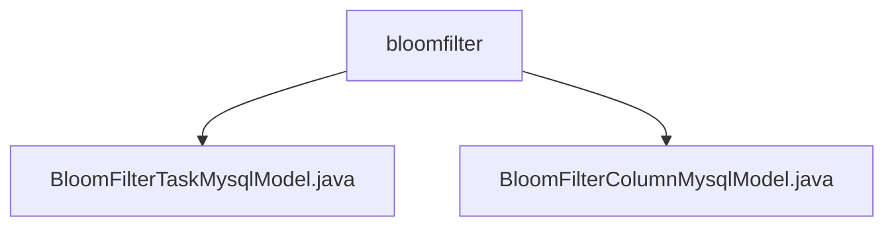

# Basic Information

|      |      |
|------|------|
| Name | bloomfilter |
| Language | .java |
| Code Path | WeFe/board/board-service/src/main/java/com/welab/wefe/board/service/database/entity/fusion/bloomfilter |
| Package Name | docs.board.board-service.src.main.java.com.welab.wefe.board.service.database.entity.fusion.bloomfilter |
| Brief Description | The BloomFilterTaskMysqlModel class stores Bloom filter task information, including fields such as name, ID, and progress, and inherits from AbstractBaseMySqlModel. The BloomFilterColumnMysqlModel class maps to a database table, containing filter ID, field sequence, name, etc., and supports JSON storage, inheriting from AbstractBaseMySqlModel. |

# Description

## Overview  
The core responsibility of this module is to manage Bloom Filter tasks and their field metadata, achieving data persistence through MySQL entity classes. The interface specification includes two types of models: BloomFilterTaskMysqlModel records task progress and statistical information (e.g., total rows, error messages), while BloomFilterColumnMysqlModel stores field-level metadata (e.g., data types, null value statistics). Key data structures include master-slave models linked by task IDs and JSON-formatted value distribution fields. External dependencies involve JPA annotations, MySQL databases, and JSON type processing libraries. For example, BloomFilterColumnMysqlModel uses @TypeDef to support JSON field mapping.  

## Main Business Scenarios  
The module supports the full lifecycle management of Bloom Filters, similar to an ETL monitoring system. The master model, BloomFilterTaskMysqlModel, tracks task execution status (e.g., progress percentage, remaining time), while the slave model, BloomFilterColumnMysqlModel, analyzes field characteristics (e.g., calculating null value rates via emptyRows). Typical application patterns include initializing the master model during task creation and updating the slave model's valueDistribution during the data scanning phase. API types encompass CRUD operations and statistical analysis, such as querying master-slave data associations via bloomFilterId.

### Package Internal Structure View

This flowchart illustrates the structural relationship between two Java files under the bloomfilter directory. The bloomfilter acts as the parent node, containing two model class files: BloomFilterTaskMysqlModel and BloomFilterColumnMysqlModel. Both files reside in the database entity layer of the fusion module and are used for handling data persistence operations related to Bloom filters.

# File List

| Name   | Type  | Description |
|-------|------|-------------|
| [BloomFilterTaskMysqlModel.java](BloomFilterTaskMysqlModel.md) | file | The BloomFilterTaskMysqlModel class is used for Bloom filter task management, containing fields such as name, ID, data row count, progress, remaining time, duplicate ID count, and error messages. |
| [BloomFilterColumnMysqlModel.java](BloomFilterColumnMysqlModel.md) | file | The BloomFilterColumnMysqlModel entity class contains attributes such as filter ID, field sequence number, name, data type, comments, null value row count, and value distribution in JSON format. |

