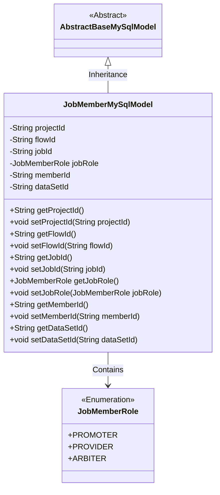

# Basic Information

|      |      |
|------|------|
| Name | JobMemberMySqlModel |
| Language | .java |
| Code Path | WeFe/board/board-service/src/main/java/com/welab/wefe/board/service/database/entity/job/JobMemberMySqlModel.java |
| Package Name | com.welab.wefe.board.service.database.entity.job |
| Dependencies | ['com.welab.wefe.board.service.database.entity.base.AbstractBaseMySqlModel', 'com.welab.wefe.common.wefe.enums.JobMemberRole', 'javax.persistence.Entity', 'javax.persistence.EnumType', 'javax.persistence.Enumerated'] |
| Brief Description | The JobMemberMySqlModel class represents a job member, containing project, workflow, task IDs, member roles (promoter/provider/arbiter), member ID, and dataset ID. |

# Description

This is a Java entity class named JobMemberMySqlModel, mapped to the database table job_member. It inherits from AbstractBaseMySqlModel and contains six main fields: projectId represents the project ID, flowId represents the flow ID, jobId represents the job ID, jobRole indicates the member's role in the job (an enumeration type including promoter/provider/arbiter), memberId represents the member ID, and dataSetId represents the dataset ID. Each field has corresponding getter and setter methods for accessing and modifying the property values.

# Class Summary

| Name   | Type  | Description |
|-------|------|-------------|
| JobMemberMySqlModel | class | The JobMemberMySqlModel entity class includes fields for project, process, task ID, member role (promoter/provider/arbiter), member ID, and dataset ID, along with their corresponding getter and setter methods. |

## Class JobMemberMySqlModel

|      |      |
|------|------|
| Access Modifier | @Entity(name = "job_member");public |
| Type | class |
| Name | JobMemberMySqlModel |
| Description | The JobMemberMySqlModel entity class includes fields for project, process, task ID, member role (promoter/provider/arbiter), member ID, and dataset ID, along with their corresponding getter and setter methods. |

### UML Class Diagram

This code defines an entity class named JobMemberMySqlModel, which represents the task member model in MySQL. The class inherits from the abstract base class AbstractBaseMySqlModel and includes fields such as project ID, flow ID, job ID, etc. It uses the enumeration type JobMemberRole to represent the member's role in the task. The class provides getter and setter methods for each field, implementing encapsulation and access control for member data.

### Internal Method Call Graph

```mermaid
graph TD
    A["Class JobMemberMySqlModel"]
    B["Inherits: AbstractBaseMySqlModel"]
    C["Property: String projectId"]
    D["Property: String flowId"]
    E["Property: String jobId"]
    F["Property: JobMemberRole jobRole"]
    G["Property: String memberId"]
    H["Property: String dataSetId"]
    I["Method: getProjectId()"]
    J["Method: setProjectId(String)"]
    K["Method: getFlowId()"]
    L["Method: setFlowId(String)"]
    M["Method: getJobId()"]
    N["Method: setJobId(String)"]
    O["Method: getJobRole()"]
    P["Method: setJobRole(JobMemberRole)"]
    Q["Method: getMemberId()"]
    R["Method: setMemberId(String)"]
    S["Method: getDataSetId()"]
    T["Method: setDataSetId(String)"]

    A --> B
    A --> C
    A --> D
    A --> E
    A --> F
    A --> G
    A --> H
    A --> I
    A --> J
    A --> K
    A --> L
    A --> M
    A --> N
    A --> O
    A --> P
    A --> Q
    A --> R
    A --> S
    A --> T
```

This code defines a JPA entity class named JobMemberMySqlModel, which inherits from AbstractBaseMySqlModel. The class contains 7 core properties representing project ID, flow ID, job ID, member role, member ID, and dataset ID, where the jobRole property uses the enum type JobMemberRole. The class provides standard getter and setter methods for each property to enable reading and modification. This entity maps to the database table "job_member" and serves as a typical data persistence model for storing task member-related information.

### Field List

| Name  | Type  | Description |
|-------|-------|------|
| projectId | String | Project ID string variable |
| flowId | String | Declare a private string variable flowId. |
| dataSetId | String | Private string type variable dataSetId. |
| jobRole | JobMemberRole | The enumeration type field jobRole stores role values in string format. |
| jobId | String | Private string type variable jobId |
| memberId | String | Member ID string type private variable. |

### Method List

| Name  | Type  | Description |
|-------|-------|------|
| setJobId | void | This is a Java method used to set the value of the jobId property in a class. The method takes a string parameter jobId and assigns it to the member variable this.jobId of the class. |
| getFlowId | String | The method to obtain the current flow ID directly returns the value of the member variable flowId. |
| getJobId | String | Obtain the unique identifier jobId of the current task. |
| getProjectId | String | This is a Java method that returns the value of the projectId member variable of type String. |
| setJobRole | void | The method `setJobRole` is used to set a member's job role, with the parameter being of type `JobMemberRole`. |
| setFlowId | void | The method to set the flow ID involves assigning the parameter flowId to the class's member variable flowId. |
| setProjectId | void | Methods to set the project ID, assigning the input parameter to the projectId member variable of the class. |
| getJobRole | JobMemberRole | Get the jobRole property value of the current object. |
| getMemberId | String | The method to obtain the member ID, which returns a string-type memberId. |
| setMemberId | void | The method to set the member ID assigns the input string to the member variable `memberId`. |
| getDataSetId | String | Methods to obtain the dataset ID, returning the dataset ID as a string type. |
| setDataSetId | void | The method for setting the dataset ID assigns the input parameter to the class member variable dataSetId. |

