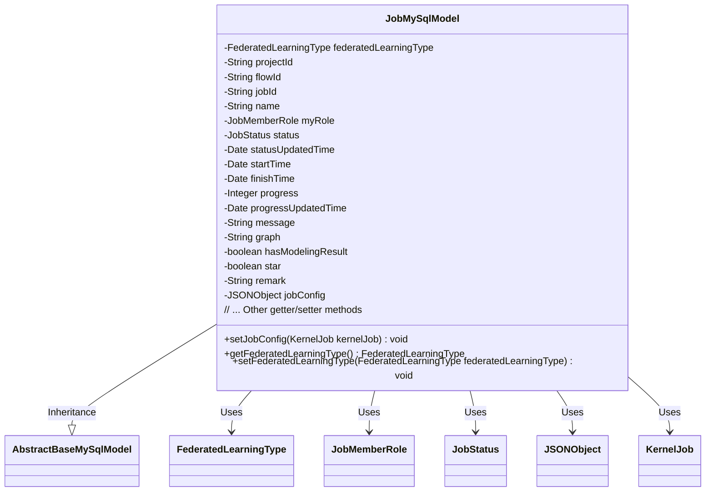

# Basic Information

|      |      |
|------|------|
| Name | JobMySqlModel |
| Language | .java |
| Code Path | WeFe/board/board-service/src/main/java/com/welab/wefe/board/service/database/entity/job/JobMySqlModel.java |
| Package Name | com.welab.wefe.board.service.database.entity.job |
| Dependencies | ['com.alibaba.fastjson.JSONObject', 'com.vladmihalcea.hibernate.type.json.JsonStringType', 'com.welab.wefe.board.service.database.entity.base.AbstractBaseMySqlModel', 'com.welab.wefe.board.service.dto.kernel.machine_learning.KernelJob', 'com.welab.wefe.common.wefe.enums.FederatedLearningType', 'com.welab.wefe.common.wefe.enums.JobMemberRole', 'com.welab.wefe.common.wefe.enums.JobStatus', 'org.hibernate.annotations.Type', 'org.hibernate.annotations.TypeDef', 'javax.persistence.Column', 'javax.persistence.Entity', 'javax.persistence.EnumType', 'javax.persistence.Enumerated', 'java.util.Date'] |
| Brief Description | The JobMySqlModel class defines the data model for federated learning tasks, including fields such as task type, ID, status, time, progress, and configuration, supporting JSON storage for configuration information. |

# Description

JobMySqlModel is an entity class used to represent federated learning tasks, inheriting from AbstractBaseMySqlModel. This class includes task type (horizontal/vertical), project ID, flow ID, task ID, name, identity role (promoter/provider/arbiter), status, status update time, start time, end time, progress, progress update time, message notes, directed acyclic graph, whether it contains modeling results, favorite marker, remarks, and task configuration information in JSON format. All fields are provided with corresponding getter and setter methods.

# Class Summary

| Name   | Type  | Description |
|-------|------|-------------|
| JobMySqlModel | class | The JobMySqlModel class defines the data model for federated learning tasks, including fields such as task type, project ID, process ID, task ID, name, role, status, time, progress, message, and configuration, which are used for database storage and operations. |

## Class JobMySqlModel

|      |      |
|------|------|
| Access Modifier | @Entity(name = "job");@TypeDef(name = "json", typeClass = JsonStringType.class);public |
| Type | class |
| Name | JobMySqlModel |
| Description | The JobMySqlModel class defines the data model for federated learning tasks, including fields such as task type, project ID, process ID, task ID, name, role, status, time, progress, message, and configuration, which are used for database storage and operations. |

### UML Class Diagram

This code defines an entity class named JobMySqlModel, which inherits from AbstractBaseMySqlModel and represents task information in a database. The class includes multiple fields such as task type, project ID, flow ID, job ID, name, role, status, time-related information, progress, messages, graph configuration, etc., along with corresponding getter and setter methods. Notably, the jobConfig field stores task configuration in JSON format and accepts a KernelJob object for conversion via the setJobConfig method. The class is mapped to the database table "job" through annotations and supports JSON-type field storage.

### Internal Method Call Graph

```mermaid
graph TD
    A["Class JobMySqlModel"]
    B["Annotation: @Entity('job')"]
    C["Annotation: @TypeDef(name='json', typeClass=JsonStringType.class)"]
    D["Inheritance: AbstractBaseMySqlModel"]
    E["Enum property: FederatedLearningType federatedLearningType"]
    F["String properties: projectId, flowId, jobId, name, message, graph, remark"]
    G["Enum properties: JobMemberRole myRole, JobStatus status"]
    H["Date properties: statusUpdatedTime, startTime, finishTime, progressUpdatedTime"]
    I["Numeric property: Integer progress"]
    J["Boolean properties: hasModelingResult, star"]
    K["JSON property: JSONObject jobConfig"]
    L["Special method: setJobConfig(KernelJob)"]
    M["Standard getter/setter methods"]

    A --> B
    A --> C
    A --> D
    A --> E
    A --> F
    A --> G
    A --> H
    A --> I
    A --> J
    A --> K
    A --> L
    A --> M
```

This code defines a JPA entity class named JobMySqlModel for mapping the job table in the database. The class inherits from AbstractBaseMySqlModel and contains various types of properties: enum types (federated learning type, member role, job status), string types (project ID, flow ID, etc.), date types (status update time, start time, etc.), numeric type (progress), boolean types (whether it contains modeling results, star mark), and JSON-type job configuration. The class provides standard getter/setter methods and includes a special method setJobConfig for converting KernelJob objects into JSON configuration. Database mapping of JSON-type fields and table name definition are implemented through annotations.

### Field List

| Name  | Type  | Description |
|-------|-------|------|
| hasModelingResult | boolean | The variable hasModelingResult is of boolean type, used to indicate whether modeling results exist. |
| progress | Integer | The integer variable `progress` is used to record the progress. |
| progressUpdatedTime | Date | Private date type variable, recording the progress update time. |
| startTime | Date | Private date type variable startTime |
| remark | String | Private string type remark field. |
| serialVersionUID = 8933206598650203308L | long | Defined a private static final long serialVersionUID with the value 8933206598650203308. |
| statusUpdatedTime | Date | The private Date-type variable statusUpdatedTime records the status update time. |
| status | JobStatus | The enumeration type field `status` is stored in string format. |
| finishTime | Date | The private date-type variable finishTime is used to store the completion time. |
| name | String | Private string type variable name. |
| star | boolean | private boolean star |
| message | String | Private string variable message. |
| projectId | String | Declare a private string variable projectId. |
| jobConfig | JSONObject | The entity class field jobConfig uses the JSON type, and the database column is defined in json format. |
| federatedLearningType | FederatedLearningType | The code defines an enumerated type field named federatedLearningType, using the @Enumerated annotation to specify storing enum values in string format. |
| flowId | String | The private string variable flowId is used to store the process identifier. |
| graph | String | Declare a private string variable graph. |
| jobId | String | Private string type variable jobId. |
| myRole | JobMemberRole | Use the @Enumerated annotation to store the myRole field of the enum type JobMemberRole as a string in the database. |

### Method List

| Name  | Type  | Description |
|-------|-------|------|
| setMessage | void | This is a Java method used to set the message property value of a class. The method takes a string parameter message and assigns it to the member variable this.message of the class. |
| setProgress | void | This is a Java method used to set the progress value. The method is named setProgress, which takes an Integer parameter progress and assigns it to the class's member variable progress. |
| isHasModelingResult | boolean | Check if modeling results are included, returns a boolean value. |
| getStartTime | Date | Method to obtain the start time, returns a Date type variable startTime. |
| isStar | boolean | The method isStar returns a boolean value star. |
| getJobId | String | Common method to obtain jobId, returns the jobId as a string. |
| getFinishTime | Date | Methods to obtain the completion time, returning a finishTime object. |
| setName | void | This is a Java method used to set the name property of an object. The method accepts a string parameter name and assigns it to the name field of the current object. |
| getRemark | String | Common method for retrieving remark information, returns the remark content as a string type. |
| setJobConfig | void | The method `setJobConfig` takes a `KernelJob` object, converts it into a JSON string, and assigns it to `jobConfig`. |
| setProgressUpdatedTime | void | The method for setting the progress update time assigns the parameter `progressUpdatedTime` to the class member variable of the same name. |
| setJobId | void | Methods for setting the task ID: Assign the input parameter `jobId` to the class member variable `jobId`. |
| getProjectId | String | Methods to obtain the project ID, returning a string-type projectId. |
| setRemark | void | This is a Java method used to set the remark information of an object. The method takes a string parameter "remark" and assigns it to the object's remark property. |
| setStatus | void | Methods for setting task status: assign the incoming status parameter to the status property of the current object. |
| getStatus | JobStatus | The method returns the status value of the JobStatus object. |
| setFlowId | void | The method to set the flow ID assigns the parameter flowId to the flowId property of the current object. |
| getName | String | This is a Java method that returns the value of the string-type variable `name`. |
| getGraph | String | Methods to obtain the graph string. |
| setFederatedLearningType | void | The method to set the federated learning type, with the parameter being of type FederatedLearningType. |
| setStartTime | void | Method to set the start time, with the parameter being of Date type. |
| getFederatedLearningType | FederatedLearningType | The method returns a federated learning type object federatedLearningType. |
| setFinishTime | void | The method for setting the completion time involves assigning the parameter `finishTime` to the class's `finishTime` property. |
| getJobConfig | JSONObject | The method returns a JSONObject object of jobConfig. |
| setJobConfig | void | The method `setJobConfig` takes a JSONObject parameter `jobConfig` and assigns it to the property of the same name in the current object. |
| getProgressUpdatedTime | Date | Method to obtain the progress update time, returns the value of the progressUpdatedTime variable. |
| setMyRole | void | This is a Java method used to set the myRole property value of the current object to the passed JobMemberRole type parameter. |
| setStatusUpdatedTime | void | The method for setting the status update time assigns the input parameter to the object's `statusUpdatedTime` property. |
| setGraph | void | Methods for setting graphic attributes, assigning the input string to the class variable graph. |
| setStar | void | Method for setting an object's star status, with a boolean parameter `star`. |
| getProgress | Integer | Methods to obtain the progress value, returning an integer-type progress variable. |
| getStatusUpdatedTime | Date | Methods to obtain the status update time, returns the value of the statusUpdatedTime variable. |
| getMessage | String | The method returns the value of the message variable of type String. |
| getMyRole | JobMemberRole | Get the current user's role information. |
| setProjectId | void | The method to set the project ID assigns the input parameter projectId to the projectId property of the current object. |
| setHasModelingResult | void | Methods for setting the model result flag, used to update the `hasModelingResult` boolean value. |
| getFlowId | String | This is a Java method that returns the value of the flowId member variable of type String. |

