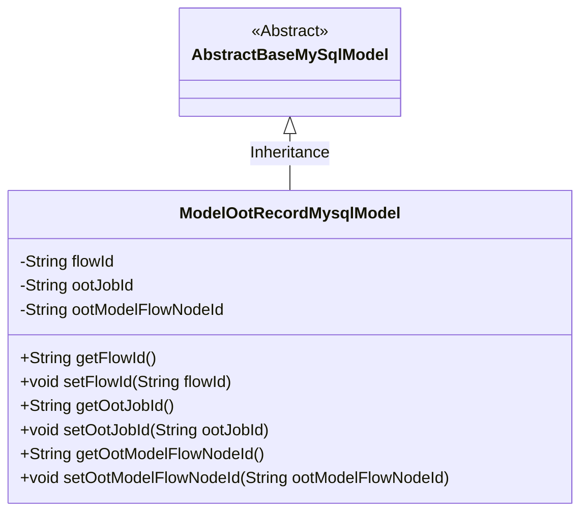
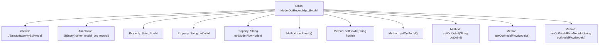

# Basic Information

|      |      |
|------|------|
| Name | ModelOotRecordMysqlModel |
| Language | .java |
| Code Path | WeFe/board/board-service/src/main/java/com/welab/wefe/board/service/database/entity/job/ModelOotRecordMysqlModel.java |
| Package Name | com.welab.wefe.board.service.database.entity.job |
| Dependencies | ['com.welab.wefe.board.service.database.entity.base.AbstractBaseMySqlModel', 'javax.persistence.Entity'] |
| Brief Description | The entity class ModelOotRecordMysqlModel contains three fields: process ID, OOTed job ID, and OOTed model ID, along with their corresponding getter and setter methods. |

# Description

This is a Java entity class named ModelOotRecordMysqlModel, which maps to the database table model_oot_record. It inherits from AbstractBaseMySqlModel and contains three string-type fields: flowId represents the process ID, ootJobId represents the OOT job ID, and ootModelFlowNodeId represents the OOT model node ID. Each field has corresponding getter and setter methods for accessing and modifying the property values.

# Class Summary

| Name   | Type  | Description |
|-------|------|-------------|
| ModelOotRecordMysqlModel | class | ModelOotRecordMysqlModel is an entity class for storing OOT records, containing three fields (process ID, OOTed job ID, and model node ID) along with their corresponding getter/setter methods. |

## Class ModelOotRecordMysqlModel

|      |      |
|------|------|
| Access Modifier | @Entity(name = "model_oot_record");public |
| Type | class |
| Name | ModelOotRecordMysqlModel |
| Description | ModelOotRecordMysqlModel is an entity class for storing OOT records, containing three fields (process ID, OOTed job ID, and model node ID) along with their corresponding getter/setter methods. |

### UML Class Diagram

This code demonstrates an entity class named ModelOotRecordMysqlModel, which inherits from the abstract base class AbstractBaseMySqlModel. The class is designed to store data related to model OOT (Out of Time) records, containing three core attributes: flow ID (flowId), OOT job ID (ootJobId), and OOT model flow node ID (ootModelFlowNodeId). Each attribute has corresponding getter and setter methods, adhering to the standard JavaBean specification. The @Entity annotation indicates this is a JPA entity class mapped to the "model_oot_record" table in the database. The class diagram clearly illustrates the inheritance relationship and the structure of class members.

### Internal Method Call Graph

This code defines an entity class named ModelOotRecordMysqlModel, which inherits from AbstractBaseMySqlModel and is marked as a database entity using the @Entity annotation. The class contains three private properties: flowId, ootJobId, and ootModelFlowNodeId, representing the flow ID, the OOT (Out of Time) job ID, and the OOT model node ID, respectively. Each property has corresponding getter and setter methods for reading and setting the property values. This class is primarily used for storing and managing OOT record-related information in the database.

### Field List

| Name  | Type  | Description |
|-------|-------|------|
| flowId | String | Define a string-type variable flowId to store the process ID. |
| ootModelFlowNodeId | String | The private string variable `ootModelFlowNodeId` is used to store the model flow node ID. |
| ootJobId | String | The private string variable ootJobId is used to store the task ID. |

### Method List

| Name  | Type  | Description |
|-------|-------|------|
| setOotModelFlowNodeId | void | Method for Setting OOT Model Process Node IDs. |
| setOotJobId | void | The method to set the OOT job ID assigns the parameter value to the class variable ootJobId. |
| getOotJobId | String | This is a Java method that returns the value of a string variable named ootJobId. |
| setFlowId | void | Method to set the flow ID: Assign the parameter flowId to the flowId property of the current object. |
| getOotModelFlowNodeId | String | Methods to Obtain OOT Model Process Node IDs, Returns Node ID Values in String Type. |
| getFlowId | String | Methods to obtain the current flow ID, returning a string-type flowId. |

