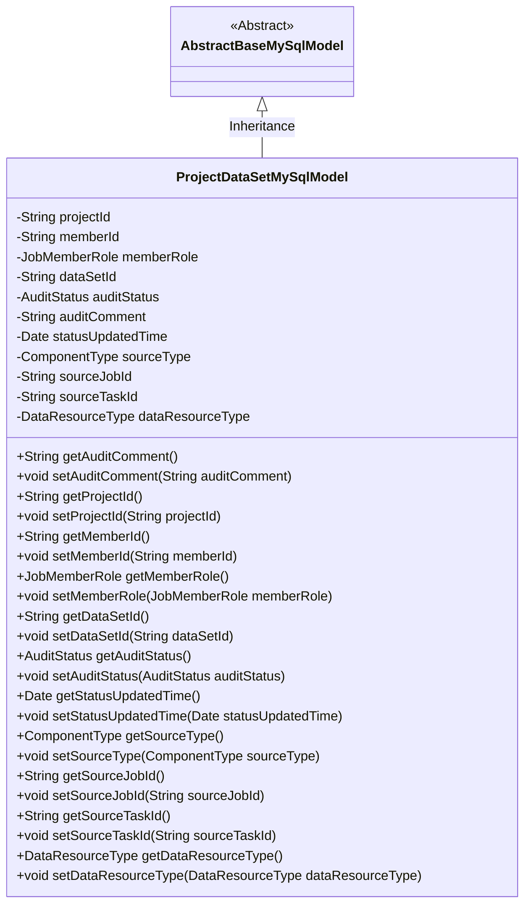

# Basic Information

|      |      |
|------|------|
| Name | ProjectDataSetMySqlModel |
| Language | .java |
| Code Path | WeFe/board/board-service/src/main/java/com/welab/wefe/board/service/database/entity/job/ProjectDataSetMySqlModel.java |
| Package Name | com.welab.wefe.board.service.database.entity.job |
| Dependencies | ['com.welab.wefe.board.service.database.entity.base.AbstractBaseMySqlModel', 'com.welab.wefe.common.wefe.enums.AuditStatus', 'com.welab.wefe.common.wefe.enums.ComponentType', 'com.welab.wefe.common.wefe.enums.DataResourceType', 'com.welab.wefe.common.wefe.enums.JobMemberRole', 'javax.persistence.Entity', 'javax.persistence.EnumType', 'javax.persistence.Enumerated', 'java.util.Date'] |
| Brief Description | Project dataset MySQL model class, containing fields such as project ID, member ID, role, dataset ID, review status, source component type, task ID, subtask ID, and dataset type, with getter/setter methods provided. |

# Description

This is a Java entity class named ProjectDataSetMySqlModel, mapped to the database table `project_data_set`. It inherits from `AbstractBaseMySqlModel` and includes core fields such as project ID, member ID, member role, and dataset ID. The member role uses the `JobMemberRole` enum to distinguish dataset ownership, while the status field `auditStatus` uses the `AuditStatus` enum to represent the review status. The class also contains fields such as review comments, status update time, source component type, source task ID, source subtask ID, and dataset type. All fields are equipped with corresponding getter and setter methods for easy data access and modification.

# Class Summary

| Name   | Type  | Description |
|-------|------|-------------|
| ProjectDataSetMySqlModel | class | Project dataset entity class, containing fields such as project ID, member ID, role, dataset ID, review status, source type, task ID, etc., used for managing dataset-related information. |

## Class ProjectDataSetMySqlModel

|      |      |
|------|------|
| Access Modifier | @Entity(name = "project_data_set");public |
| Type | class |
| Name | ProjectDataSetMySqlModel |
| Description | Project dataset entity class, containing fields such as project ID, member ID, role, dataset ID, review status, source type, task ID, etc., used for managing dataset-related information. |

### UML Class Diagram

Class diagram description: The ProjectDataSetMySqlModel class inherits from the AbstractBaseMySqlModel abstract class, representing the project dataset model in MySQL. It contains private fields such as projectId, memberId, memberRole, dataSetId, auditStatus, auditComment, statusUpdatedTime, sourceType, sourceJobId, sourceTaskId, and dataResourceType, along with corresponding getter and setter methods for each field. By inheriting from the base class, this class acquires generic database operation capabilities while extending properties and behaviors specific to project datasets.

### Internal Method Call Graph

```mermaid
graph TD
    A["Class ProjectDataSetMySqlModel"]
    B["Inherits: AbstractBaseMySqlModel"]
    C["Property: String projectId"]
    D["Property: String memberId"]
    E["Property: JobMemberRole memberRole"]
    F["Property: String dataSetId"]
    G["Property: AuditStatus auditStatus"]
    H["Property: String auditComment"]
    I["Property: Date statusUpdatedTime"]
    J["Property: ComponentType sourceType"]
    K["Property: String sourceJobId"]
    L["Property: String sourceTaskId"]
    M["Property: DataResourceType dataResourceType"]
    N["Method: getAuditComment/setAuditComment"]
    O["Method: getProjectId/setProjectId"]
    P["Method: getMemberId/setMemberId"]
    Q["Method: getMemberRole/setMemberRole"]
    R["Method: getDataSetId/setDataSetId"]
    S["Method: getAuditStatus/setAuditStatus"]
    T["Method: getStatusUpdatedTime/setStatusUpdatedTime"]
    U["Method: getSourceType/setSourceType"]
    V["Method: getSourceJobId/setSourceJobId"]
    W["Method: getSourceTaskId/setSourceTaskId"]
    X["Method: getDataResourceType/setDataResourceType"]

    A --> B
    A --> C
    A --> D
    A --> E
    A --> F
    A --> G
    A --> H
    A --> I
    A --> J
    A --> K
    A --> L
    A --> M
    A --> N
    A --> O
    A --> P
    A --> Q
    A --> R
    A --> S
    A --> T
    A --> U
    A --> V
    A --> W
    A --> X
```

This code defines a JPA entity class named ProjectDataSetMySqlModel, which inherits from AbstractBaseMySqlModel. The class contains 12 properties representing project ID, member ID, member role, dataset ID, audit status, audit comment, status update time, source component type, source job ID, source subtask ID, and dataset type. Each property has corresponding getter and setter methods. The class is used to map the project_data_set table in the database, implementing enum-to-string mapping through annotations, and includes comprehensive metadata management functionality for datasets.

### Field List

| Name  | Type  | Description |
|-------|-------|------|
| auditStatus | AuditStatus | The entity class field auditStatus uses a string enumeration type mapping. |
| dataResourceType | DataResourceType | Define an enum type field `dataResourceType`, storing enum values in string format. |
| auditComment | String | The private string-type variable auditComment is used to store audit comments. |
| projectId | String | Project ID string variable |
| memberRole | JobMemberRole | The enumeration type field `memberRole` stores role values in string format. |
| dataSetId | String | The private string variable for dataset ID. |
| memberId | String | Member ID string variable |
| sourceType | ComponentType | Define an enumeration type field `sourceType`, storing the enumeration values in string format. |
| serialVersionUID = 7360644396326460699L | long | Define the serialization version UID with a value of 7360644396326460699L. |
| sourceTaskId | String | Private string variable storing the source task ID. |
| sourceJobId | String | The private string variable sourceJobId is used to store the source job ID. |
| statusUpdatedTime | Date | Private date type variable, recording the timestamp of status updates. |

### Method List

| Name  | Type  | Description |
|-------|-------|------|
| setDataSetId | void | The method to set the dataset ID assigns the passed `dataSetId` to the property of the same name in the current object. |
| setStatusUpdatedTime | void | The method to set the status update time assigns the parameter value to the class member variable `statusUpdatedTime`. |
| setAuditStatus | void | The method to set the audit status assigns the incoming auditStatus to the auditStatus property of the current object. |
| setMemberRole | void | Method for setting member role: Assign the passed-in `memberRole` to the `memberRole` property of the current object. |
| getProjectId | String | The method returns the project ID string. |
| getAuditStatus | AuditStatus | Methods to obtain the audit status, returning the value of the auditStatus variable. |
| getAuditComment | String | Methods to obtain audit comments, returning the `auditComment` string. |
| setAuditComment | void | The method setAuditComment is used to set the value of the auditComment property. |
| getMemberRole | JobMemberRole | The method getMemberRole returns the member role object memberRole. |
| setProjectId | void | This is a Java method used to set the projectId property value of a class. The method takes a string parameter projectId and assigns it to the member variable of the same name in the class. |
| getStatusUpdatedTime | Date | Methods to obtain the status update time, returns the statusUpdatedTime value. |
| getSourceType | ComponentType | Methods to obtain the source component type, returning the value of the sourceType variable. |
| setMemberId | void | Java method: Set member ID, with a parameter of string memberId, assigned to the memberId property of the current object. |
| getMemberId | String | The method to obtain the member ID, which returns a string-type memberId. |
| setSourceType | void | Java Method: Setting Component Type Parameters. |
| getSourceJobId | String | Methods to obtain the sourceJobId, returning the sourceJobId value as a string type. |
| setSourceJobId | void | Method to set the source job ID, which assigns the input parameter to the class member variable sourceJobId. |
| getSourceTaskId | String | The method to obtain the source task ID directly returns the value of the member variable `sourceTaskId`. |
| setSourceTaskId | void | The method for setting the source task ID assigns the input parameter to the class member variable `sourceTaskId`. |
| getDataResourceType | DataResourceType | This method returns a data resource type object, dataResourceType. |
| setDataResourceType | void | This is a Java method used to set the data resource type property of a class. The method takes a parameter of type DataResourceType and assigns it to the member variable dataResourceType of the class. |
| getDataSetId | String | This method returns the dataset ID string. |

