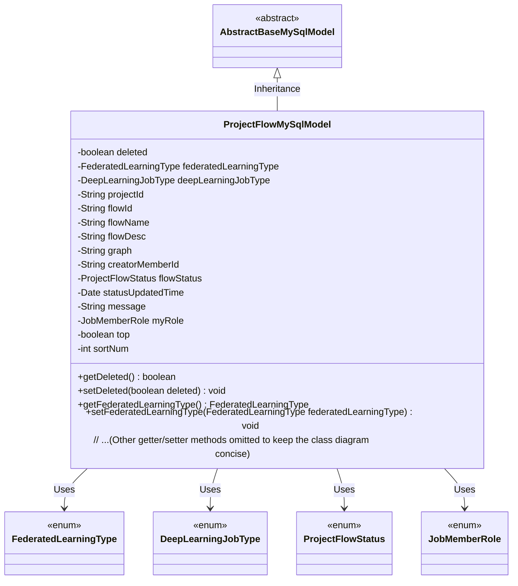

# Basic Information

|      |      |
|------|------|
| Name | ProjectFlowMySqlModel |
| Language | .java |
| Code Path | WeFe/board/board-service/src/main/java/com/welab/wefe/board/service/database/entity/job/ProjectFlowMySqlModel.java |
| Package Name | com.welab.wefe.board.service.database.entity.job |
| Dependencies | ['com.welab.wefe.board.service.database.entity.base.AbstractBaseMySqlModel', 'com.welab.wefe.common.wefe.enums.DeepLearningJobType', 'com.welab.wefe.common.wefe.enums.FederatedLearningType', 'com.welab.wefe.common.wefe.enums.JobMemberRole', 'com.welab.wefe.common.wefe.enums.ProjectFlowStatus', 'javax.persistence.Entity', 'javax.persistence.EnumType', 'javax.persistence.Enumerated', 'java.util.Date'] |
| Brief Description | Project Process Entity Class, including attributes such as process ID, name, description, status, type, creator, sorting, etc., used for managing federated learning project processes. |

# Description

This is a Java entity class named ProjectFlowMySqlModel, which maps to the database table project_flow. It inherits from AbstractBaseMySqlModel and includes a serialization ID along with multiple fields: deletion flag, federated learning type, deep learning task type, project ID, flow ID, name and description, flowchart data, creator ID, flow status and update time, message, our role, top flag, and sorting sequence. Each field has corresponding getter and setter methods.

# Class Summary

| Name   | Type  | Description |
|-------|------|-------------|
| ProjectFlowMySqlModel | class | Project process entity class, including attributes such as ID, name, description, status, type, creator, sorting, etc., used for managing federated learning and deep learning task processes. |

## Class ProjectFlowMySqlModel

|      |      |
|------|------|
| Access Modifier | @Entity(name = "project_flow");public |
| Type | class |
| Name | ProjectFlowMySqlModel |
| Description | Project process entity class, including attributes such as ID, name, description, status, type, creator, sorting, etc., used for managing federated learning and deep learning task processes. |

### UML Class Diagram

This code defines an entity class named ProjectFlowMySqlModel, which inherits from AbstractBaseMySqlModel and represents a database model for project workflows. The class contains multiple private fields such as flow ID, name, description, status, etc., along with corresponding getter and setter methods. It utilizes four enum types (FederatedLearningType, DeepLearningJobType, ProjectFlowStatus, JobMemberRole) to constrain the value ranges of specific fields. As a JPA entity, this class is mapped to the database table "project_flow" through the @Entity annotation and inherits common fields and methods from the base model class.

### Internal Method Call Graph

```mermaid
graph TD
    A["Class ProjectFlowMySqlModel"]
    B["Inheritance: AbstractBaseMySqlModel"]
    C["Attribute: boolean deleted"]
    D["Attribute: FederatedLearningType federatedLearningType"]
    E["Attribute: DeepLearningJobType deepLearningJobType"]
    F["Attribute: String projectId"]
    G["Attribute: String flowId"]
    H["Attribute: String flowName"]
    I["Attribute: String flowDesc"]
    J["Attribute: String graph"]
    K["Attribute: String creatorMemberId"]
    L["Attribute: ProjectFlowStatus flowStatus"]
    M["Attribute: Date statusUpdatedTime"]
    N["Attribute: String message"]
    O["Attribute: JobMemberRole myRole"]
    P["Attribute: boolean top"]
    Q["Attribute: int sortNum"]
    R["Method: getter/setter (total 22)"]

    A --> B
    A --> C
    A --> D
    A --> E
    A --> F
    A --> G
    A --> H
    A --> I
    A --> J
    A --> K
    A --> L
    A --> M
    A --> N
    A --> O
    A --> P
    A --> Q
    A -.-> R
```

This flowchart illustrates the complete structure of the ProjectFlowMySqlModel class, including attributes inherited from AbstractBaseMySqlModel and 15 core self-defined attributes covering key fields such as federated learning type, deep learning job type, and flow status. All attributes are equipped with corresponding getter/setter methods, with enum-type fields specially handled using @Enumerated annotation. The class design follows standard JPA entity specifications, implementing logical deletion functionality through the deleted flag, and supporting sorting requirements via sortNum and top fields.

### Field List

| Name  | Type  | Description |
|-------|-------|------|
| graph | String | Declaration of the private string variable `graph`. |
| federatedLearningType | FederatedLearningType | The enumeration type field `federatedLearningType` stores enumeration values in string format. |
| message | String | Declare a private string variable named message. |
| sortNum | int | The private integer variable sortNum is used for sorting numbering. |
| projectId | String | Project ID string variable |
| top | boolean | private boolean top; |
| flowName | String | The private string variable flowName is used to store the process name. |
| creatorMemberId | String | Private string variable storing the creator member ID. |
| flowDesc | String | The private string variable `flowDesc` is used to describe process information. |
| serialVersionUID = -2604406277609318163L | long | Declare a private static final serial version ID with the value -2604406277609318163L. |
| flowId | String | The private string variable flowId is used to store the process identifier. |
| myRole | JobMemberRole | The code defines an enumeration type field named myRole, which stores enumeration values in string format. |
| deleted = false | boolean | The boolean variable `deleted` marks the deletion status, with a default value of `false`. |
| flowStatus | ProjectFlowStatus | Define an enumeration type field `flowStatus` in the entity class, storing the enumeration values in string format. |
| deepLearningJobType | DeepLearningJobType | Entity class fields, annotated with string enumeration types, store deep learning task types. |
| statusUpdatedTime | Date | Private date type variable, recording the status update time. |

### Method List

| Name  | Type  | Description |
|-------|-------|------|
| getFlowName | String | The method returns the flowName string value. |
| setFlowDesc | void | The method for setting the flow description, which assigns the input parameter to the flowDesc property of the class. |
| getFlowDesc | String | The method returns a process description string. |
| getMessage | String | Methods to obtain the message string. |
| getDeepLearningJobType | DeepLearningJobType | Method to obtain the type of deep learning task, returns the currently set deepLearningJobType value. |
| getDeleted | boolean | The method returns a boolean value `deleted`, indicating the deletion status. |
| getProjectId | String | Methods to obtain the project ID, returning a string-type projectId. |
| setProjectId | void | The method to set the project ID assigns the input parameter projectId to the projectId property of the current object. |
| getStatusUpdatedTime | Date | Methods to obtain the status update time, returns the statusUpdatedTime value. |
| setMyRole | void | This is a Java method used to set the role attribute of the current object, with the parameter of type JobMemberRole. |
| setFederatedLearningType | void | The method to set the federated learning type, with the parameter of type FederatedLearningType. |
| setTop | void | This is a Java method used to set the boolean value of the top property. The method accepts a boolean parameter `top` and assigns it to the `top` field of the current object. |
| setDeleted | void | A boolean method for setting the deletion status of an object. |
| getMyRole | JobMemberRole | Get the current user's role information and return a JobMemberRole type object myRole. |
| setDeepLearningJobType | void | The method for setting the deep learning task type, with the parameter being of type DeepLearningJobType. |
| setGraph | void | Methods for setting graphic attributes, assigning the input string to the class variable graph. |
| setCreatorMemberId | void | The method to set the creator member ID assigns the parameter value to the class's member variable. |
| getFederatedLearningType | FederatedLearningType | The method to obtain the federated learning type returns the value of the private variable `federatedLearningType`. |
| getGraph | String | Methods to obtain the graph string. |
| getCreatorMemberId | String | Methods to obtain the creator member ID, returns a string-type creatorMemberId. |
| getFlowId | String | This is a Java method that returns the value of the string-type variable flowId. |
| setFlowName | void | The method to set the flow name assigns the input parameter to the class member variable flowName. |
| isTop | boolean | This is a Java method that returns a boolean value 'top', indicating whether the object is in the top state. |
| setMessage | void | This is a Java method used to set the value of the message attribute of a class. The method takes a string parameter message and assigns it to the member variable this.message of the class. |
| getSortNum | int | Methods to obtain the sorted number, returns the sortNum value. |
| setSortNum | void | Java Method: Set Sorting Numeric Attribute Value. |
| getFlowStatus | ProjectFlowStatus | Methods to obtain the project workflow status, returning the value of the flowStatus variable. |
| setFlowStatus | void | Method to set the project flow status, assigning the incoming parameter to the member variable flowStatus. |
| setStatusUpdatedTime | void | The method to set the status update time assigns the passed date parameter to the object's `statusUpdatedTime` property. |
| setFlowId | void | Method for setting the flow ID: Assign the parameter flowId to the flowId property of the current object. |

