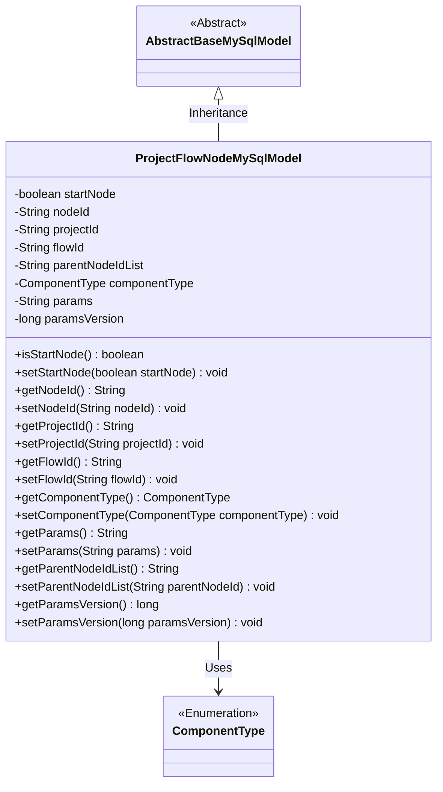

# Basic Information

|      |      |
|------|------|
| Name | ProjectFlowNodeMySqlModel |
| Language | .java |
| Code Path | WeFe/board/board-service/src/main/java/com/welab/wefe/board/service/database/entity/job/ProjectFlowNodeMySqlModel.java |
| Package Name | com.welab.wefe.board.service.database.entity.job |
| Dependencies | ['com.welab.wefe.board.service.database.entity.base.AbstractBaseMySqlModel', 'com.welab.wefe.common.wefe.enums.ComponentType', 'javax.persistence.Entity', 'javax.persistence.EnumType', 'javax.persistence.Enumerated'] |
| Brief Description | Project process node entity class, including fields such as start node identifier, node ID, project ID, process ID, parent node list, component type, parameters, and version number. |

# Description

This is a Java class named ProjectFlowNodeMySqlModel, which extends AbstractBaseMySqlModel and represents the data model for project flow nodes. The class includes multiple attributes: startNode indicates whether it is the starting node, nodeId stores the node ID generated by the frontend, projectId and flowId associate with the project and flow respectively, parentNodeIdList records the list of parent node IDs, componentType represents the component type enumeration, params stores component parameters, and paramsVersion records the parameter version timestamp. The class provides corresponding getter and setter methods for each attribute.

# Class Summary

| Name   | Type  | Description |
|-------|------|-------------|
| ProjectFlowNodeMySqlModel | class | Project process node entity class, including fields such as start node identifier, node ID, project ID, process ID, parent node list, component type, parameters, and version number. |

## Class ProjectFlowNodeMySqlModel

|      |      |
|------|------|
| Access Modifier | @Entity(name = "project_flow_node");public |
| Type | class |
| Name | ProjectFlowNodeMySqlModel |
| Description | Project process node entity class, including fields such as start node identifier, node ID, project ID, process ID, parent node list, component type, parameters, and version number. |

### UML Class Diagram

This class diagram illustrates that ProjectFlowNodeMySqlModel inherits from AbstractBaseMySqlModel and contains multiple private fields along with their corresponding getter/setter methods. The class represents project flow node data, including attributes such as node ID, project ID, flow ID, parent node list, and component type, where ComponentType is an enumeration. The model is marked as an entity class through JPA annotations for database persistence operations, suitable for storing and managing node data in workflow or project management systems.

### Internal Method Call Graph

```mermaid
graph TD
    A["Class ProjectFlowNodeMySqlModel"]
    B["Inherits: AbstractBaseMySqlModel"]
    C["Annotation: @Entity"]
    D["Field: boolean startNode"]
    E["Field: String nodeId"]
    F["Field: String projectId"]
    G["Field: String flowId"]
    H["Field: String parentNodeIdList"]
    I["Field: ComponentType componentType"]
    J["Field: String params"]
    K["Field: long paramsVersion"]
    L["Method: isStartNode()"]
    M["Method: setStartNode(boolean)"]
    N["Method: getNodeId()"]
    O["Method: setNodeId(String)"]
    P["Method: getProjectId()"]
    Q["Method: setProjectId(String)"]
    R["Method: getFlowId()"]
    S["Method: setFlowId(String)"]
    T["Method: getComponentType()"]
    U["Method: setComponentType(ComponentType)"]
    V["Method: getParams()"]
    W["Method: setParams(String)"]
    X["Method: getParentNodeIdList()"]
    Y["Method: setParentNodeIdList(String)"]
    Z["Method: getParamsVersion()"]
    AA["Method: setParamsVersion(long)"]

    A --> B
    A --> C
    A --> D
    A --> E
    A --> F
    A --> G
    A --> H
    A --> I
    A --> J
    A --> K
    A --> L
    A --> M
    A --> N
    A --> O
    A --> P
    A --> Q
    A --> R
    A --> S
    A --> T
    A --> U
    A --> V
    A --> W
    A --> X
    A --> Y
    A --> Z
    A --> AA
```

This flowchart illustrates the complete structure of the ProjectFlowNodeMySqlModel class, including inheritance relationships, entity annotation, 9 core fields with corresponding getter/setter methods. This JPA entity class stores project flow node data, containing key fields such as node identifier, project association ID, component type and parameters, with paramsVersion enabling parameter version control. All fields follow standard JavaBean specifications for encapsulation, supporting database persistence operations.

### Field List

| Name  | Type  | Description |
|-------|-------|------|
| params | String | Private string parameter `params`. |
| nodeId | String | Private string type variable nodeId. |
| startNode | boolean | Private boolean variable indicating whether it is the start node. |
| serialVersionUID = 2722275392448819712L | long | Defined a private static final long serialVersionUID with the value 2722275392448819712L. |
| projectId | String | Project ID string variable |
| parentNodeIdList | String | A private string variable storing the list of parent node IDs. |
| paramsVersion = System.currentTimeMillis() | long | Define a long integer variable paramsVersion with an initial value of the current system time in milliseconds. |
| componentType | ComponentType | Define an enumeration type field `componentType`, using string format to store enumeration values. |
| flowId | String | The private string variable flowId is used to store the process identifier. |

### Method List

| Name  | Type  | Description |
|-------|-------|------|
| setNodeId | void | Set the node ID by assigning the parameter nodeId to the nodeId property of the current object. |
| getProjectId | String | Methods to obtain the project ID, returning a string-type projectId. |
| setFlowId | void | The method `setFlowId` is used to set the value of the `flowId` property, with the parameter being of string type. |
| getComponentType | ComponentType | Methods to obtain the component type, returning the value of the componentType variable. |
| getNodeId | String | Methods to obtain the node ID, returning a string-type nodeId. |
| setStartNode | void | Method to set whether the current node is the start node, with a boolean parameter `startNode`. |
| getParams | String | Get the string value of the params parameter. |
| setComponentType | void | This is a Java method used to set the component type property. The method takes a ComponentType parameter and assigns it to the componentType member variable of the class. |
| getFlowId | String | This is a Java method that returns a flowId value of string type. |
| isStartNode | boolean | The method isStartNode returns a boolean value startNode, indicating whether it is the start node. |
| setProjectId | void | Defines a public method `setProjectId` for setting the `projectId` property value of the class. The parameter is of string type `projectId`. |
| setParams | void | This is a Java method used to set the params property value of a class. The method takes a string parameter params and assigns it to the member variable of the same name in the class. |
| getParentNodeIdList | String | Method for Obtaining Parent Node ID List. |
| setParentNodeIdList | void | Method for setting the parent node ID list, with the parameter being the parent node ID string. |
| getParamsVersion | long | The method to obtain the parameter version number returns a long integer value paramsVersion. |
| setParamsVersion | void | The method to set the parameter version number assigns the input value to the class member variable `paramsVersion`. |

