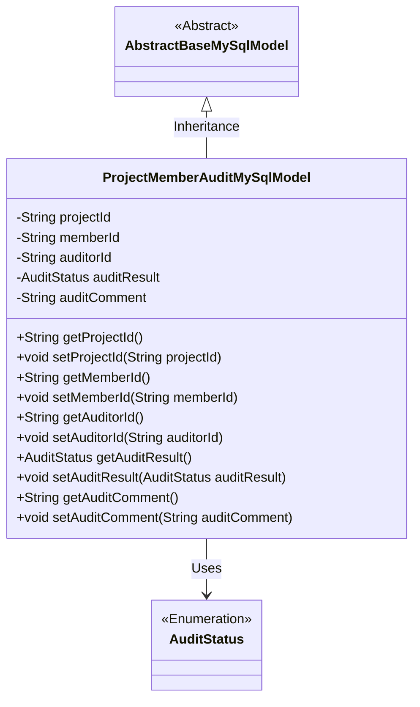

# Basic Information

|      |      |
|------|------|
| Name | ProjectMemberAuditMySqlModel |
| Language | .java |
| Code Path | WeFe/board/board-service/src/main/java/com/welab/wefe/board/service/database/entity/job/ProjectMemberAuditMySqlModel.java |
| Package Name | com.welab.wefe.board.service.database.entity.job |
| Dependencies | ['com.welab.wefe.board.service.database.entity.base.AbstractBaseMySqlModel', 'com.welab.wefe.common.wefe.enums.AuditStatus', 'javax.persistence.Entity', 'javax.persistence.EnumType', 'javax.persistence.Enumerated'] |
| Brief Description | Project member review entity class, containing fields for project ID, member ID, reviewer ID, review result, and review comments. |

# Description

This is a Java entity class named ProjectMemberAuditMySqlModel, designed to map to the database table project_member_audit. It extends the base class AbstractBaseMySqlModel and includes fields such as project ID, member ID, reviewer ID, audit result, and audit comments. The audit result is represented by the enum type AuditStatus, with possible values including adopt and disagree. The class provides standard getter and setter methods for each field and implements the serializable interface. This entity class is primarily used to record audit information for project members.

# Class Summary

| Name   | Type  | Description |
|-------|------|-------------|
| ProjectMemberAuditMySqlModel | class | Project member review entity class, containing fields for project ID, member ID, reviewer ID, review result, and review comments. |

## Class ProjectMemberAuditMySqlModel

|      |      |
|------|------|
| Access Modifier | @Entity(name = "project_member_audit");public |
| Type | class |
| Name | ProjectMemberAuditMySqlModel |
| Description | Project member review entity class, containing fields for project ID, member ID, reviewer ID, review result, and review comments. |

### UML Class Diagram

This code defines an entity class named ProjectMemberAuditMySqlModel, which inherits from the abstract class AbstractBaseMySqlModel and is used to store project member audit-related data. The class includes fields such as project ID, member ID, auditor ID, audit result (enumeration type), and audit comments, along with corresponding getter and setter methods. The class diagram clearly illustrates the inheritance relationship and the usage of the enumeration type, reflecting the basic structure of a JPA entity class.

### Internal Method Call Graph

```mermaid
graph TD
    A["Class ProjectMemberAuditMySqlModel"]
    B["Inherits: AbstractBaseMySqlModel"]
    C["Property: String projectId"]
    D["Property: String memberId"]
    E["Property: String auditorId"]
    F["Property: AuditStatus auditResult"]
    G["Property: String auditComment"]
    H["Method: getProjectId()"]
    I["Method: setProjectId(String)"]
    J["Method: getMemberId()"]
    K["Method: setMemberId(String)"]
    L["Method: getAuditorId()"]
    M["Method: setAuditorId(String)"]
    N["Method: getAuditResult()"]
    O["Method: setAuditResult(AuditStatus)"]
    P["Method: getAuditComment()"]
    Q["Method: setAuditComment(String)"]

    A --> B
    A --> C
    A --> D
    A --> E
    A --> F
    A --> G
    A --> H
    A --> I
    A --> J
    A --> K
    A --> L
    A --> M
    A --> N
    A --> O
    A --> P
    A --> Q
```

This code defines an entity class named ProjectMemberAuditMySqlModel for storing project member audit-related data. The class inherits from AbstractBaseMySqlModel and contains five core properties: project ID, member ID, auditor ID, audit result (enum type), and audit comment. Each property has corresponding getter and setter methods for data retrieval and modification. The class is marked as a JPA entity through the @Entity annotation, indicating its mapping relationship with the database table "project_member_audit". The overall structure is clear, adhering to JavaBean specifications, making it suitable for data persistence operations in ORM frameworks.

### Field List

| Name  | Type  | Description |
|-------|-------|------|
| serialVersionUID = 8870060097218263816L | long | Declare a private static final serial version ID with the value 8870060097218263816L. |
| auditResult | AuditStatus | The enumeration type field auditResult stores the audit status in string format. |
| auditComment | String | Private string-type variable used to store review comments. |
| projectId | String | Declare a private string variable projectId. |
| memberId | String | Member ID string type private variable. |
| auditorId | String | Private string type variable auditorId |

### Method List

| Name  | Type  | Description |
|-------|-------|------|
| setProjectId | void | This is a Java method used to set the projectId property of a class. The method takes a string parameter projectId and assigns it to the member variable of the same name in the current object. |
| setAuditorId | void | This is a Java method used to set the value of the auditorId property. The method takes a string parameter auditorId and assigns it to the auditorId field of the current object. |
| getAuditorId | String | Public method to obtain the auditorId, returns a string type auditorId. |
| setMemberId | void | The method to set the member ID assigns the passed string parameter to the class's member variable `memberId`. |
| getProjectId | String | Methods to obtain the project ID, returns a string-type projectId. |
| getAuditResult | AuditStatus | Methods to obtain audit results, returning a value of type AuditStatus. |
| getMemberId | String | This is a Java method that returns a member ID string. |
| setAuditResult | void | The method for setting audit results, with the parameter of type AuditStatus. |
| getAuditComment | String | Method to obtain audit comments, returns the auditComment string. |
| setAuditComment | void | The method to set the audit comment assigns the passed `auditComment` to the `auditComment` property of the current object. |

