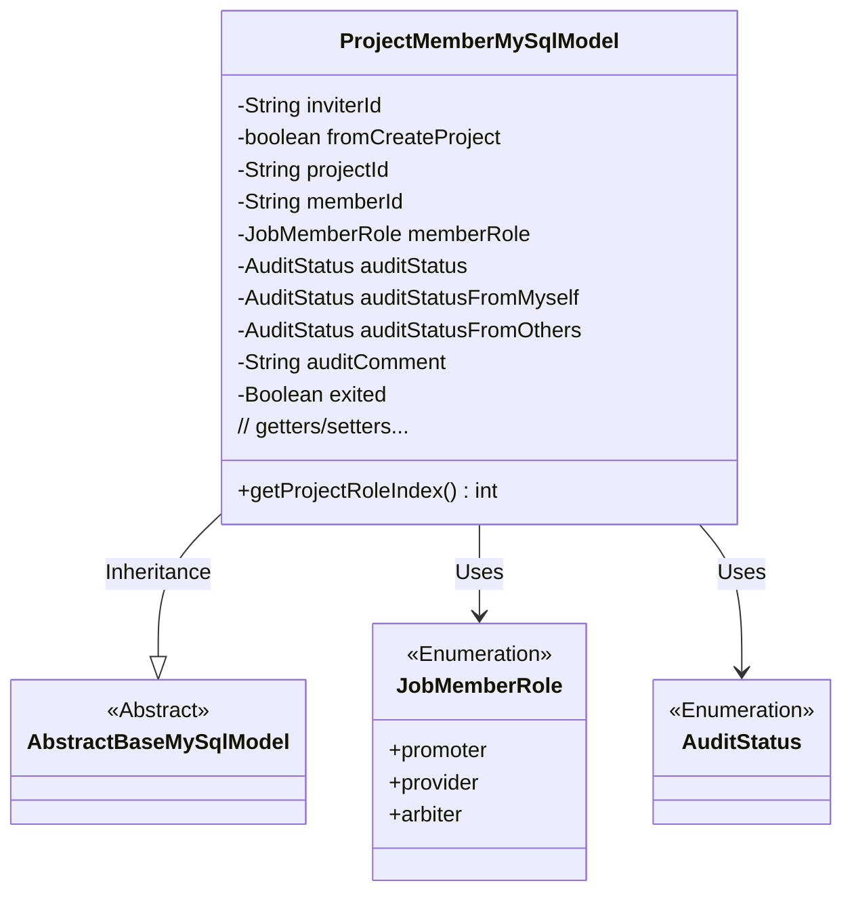
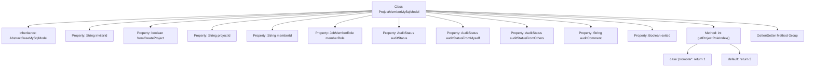

# Basic Information

|      |      |
|------|------|
| Name | ProjectMemberMySqlModel |
| Language | .java |
| Code Path | WeFe/board/board-service/src/main/java/com/welab/wefe/board/service/database/entity/job/ProjectMemberMySqlModel.java |
| Package Name | com.welab.wefe.board.service.database.entity.job |
| Dependencies | ['com.welab.wefe.board.service.database.entity.base.AbstractBaseMySqlModel', 'com.welab.wefe.common.wefe.enums.AuditStatus', 'com.welab.wefe.common.wefe.enums.JobMemberRole', 'javax.persistence.Entity', 'javax.persistence.EnumType', 'javax.persistence.Enumerated'] |
| Brief Description | Project member entity class, including fields such as member ID, project ID, inviter ID, role, review status and comments, whether exited, etc., providing sorting and getter/setter methods. |

# Description

This is a Java entity class named ProjectMemberMySqlModel, used to represent project member information. The class includes fields such as member ID, project ID, inviter ID, member role (promoter/provider/arbiter), whether the member is from the project creation flag, review status (comprehensive, self, others), review comments, and whether the member has exited. It provides getter and setter methods for each field, as well as a method that returns a sorting index based on the member role. This class inherits from AbstractBaseMySqlModel and uses JPA annotations for database mapping.

# Class Summary

| Name   | Type  | Description |
|-------|------|-------------|
| ProjectMemberMySqlModel | class | Project member entity class, including fields such as member ID, project ID, inviter ID, role, review status and comments, whether exited, etc., providing sorting and getter/setter methods. |

## Class ProjectMemberMySqlModel

|      |      |
|------|------|
| Access Modifier | @Entity(name = "project_member");public |
| Type | class |
| Name | ProjectMemberMySqlModel |
| Description | Project member entity class, including fields such as member ID, project ID, inviter ID, role, review status and comments, whether exited, etc., providing sorting and getter/setter methods. |

### UML Class Diagram

This class diagram illustrates that ProjectMemberMySqlModel inherits from AbstractBaseMySqlModel and contains multiple private fields and public methods. The class utilizes two enumeration types, JobMemberRole and AuditStatus, to represent member roles and audit statuses. As an entity class, ProjectMemberMySqlModel primarily stores project member information, including core attributes such as invitation relationships, audit statuses, and roles, while also providing helper methods for role-based sorting.

### Internal Method Call Graph

This code defines a JPA entity class named ProjectMemberMySqlModel for representing project member information. The class inherits from AbstractBaseMySqlModel and contains 11 member variables with corresponding getter/setter methods, along with a getProjectRoleIndex method that returns a sorting index based on member roles. Key properties include inviter ID, project ID, member ID, role type, audit status, etc., with enum-type persistence storage achieved through the @Enumerated annotation. The flowchart illustrates the class inheritance relationship, property definitions, and core method invocation structure.

### Field List

| Name  | Type  | Description |
|-------|-------|------|
| inviterId | String | The private string variable `inviterId` is used to store the inviter's ID. |
| serialVersionUID = -2632889286058354328L | long | Defined a private static final serial version ID with the value -2632889286058354328L. |
| auditStatus | AuditStatus | Define an enumeration type field `auditStatus` in the entity class, and use the `@Enumerated` annotation to specify storage as a string format. |
| memberId | String | Member ID string variable |
| memberRole | JobMemberRole | Define an enumeration type field memberRole, using string values to store role types. |
| exited = false | Boolean | Declared a private boolean variable named exited with an initial value of false. |
| projectId | String | Project ID string variable |
| auditComment | String | Private string type variable used to store review comments. |
| auditStatusFromOthers | AuditStatus | The entity field `auditStatusFromOthers` uses the `@Enumerated` annotation to store values of the enum type `AuditStatus` as strings. |
| auditStatusFromMyself | AuditStatus | The entity class field `auditStatusFromMyself` uses the `@Enumerated` annotation to store values of the enum type `AuditStatus` in string format. |
| fromCreateProject | boolean | Private boolean variable indicating whether it is from project creation. |

### Method List

| Name  | Type  | Description |
|-------|-------|------|
| getAuditStatusFromOthers | AuditStatus | Obtain the review status from other sources. |
| setAuditStatusFromMyself | void | Methods for setting self-audit status, with parameters of type AuditStatus. |
| setProjectId | void | A public method `setProjectId` is defined to set the `projectId` property value of the current object. The parameter is a string-type `projectId`. |
| getProjectId | String | This is a Java method that returns a string variable named projectId. |
| setFromCreateProject | void | A boolean method to determine if it is from creating a project. |
| setMemberRole | void | The method `setMemberRole` is used to set the member role, assigning the parameter `memberRole` to the member variable `memberRole` of the current object. |
| getProjectRoleIndex | int | The method returns the project role index based on the member's role, returning 1 for promoters and 3 for others. |
| setInviterId | void | The method to set the inviter ID assigns the parameter `inviterId` to the property of the same name in the current object. |
| setAuditStatus | void | The method setAuditStatus is used to set the value of the auditStatus property. |
| setMemberId | void | Methods for setting member IDs, assigning input parameters to the member variables of the class. |
| getMemberId | String | The method returns a member ID string. |
| getAuditStatusFromMyself | AuditStatus | This method returns the auditStatusFromMyself property value of the current object, with the type being AuditStatus. |
| getInviterId | String | Methods to obtain the inviter ID, returns a string-type inviterId. |
| getMemberRole | JobMemberRole | Method to obtain member roles, returns a member role object. |
| getAuditStatus | AuditStatus | Methods to obtain the audit status, returns the value of the auditStatus field. |
| isFromCreateProject | boolean | This is a Java method that returns a boolean value indicating whether it is from a created project. |
| setAuditStatusFromOthers | void | Set the audit status from other parties by assigning the parameter `auditStatusFromOthers` to the `auditStatusFromOthers` field of the current object. |
| getAuditComment | String | Method to obtain audit comments, returns the auditComment string. |
| setAuditComment | void | This is a Java method used to set the value of the auditComment property. The method accepts a string parameter auditComment and assigns it to the class's member variable this.auditComment. |
| isExited | Boolean | This is a method that returns a boolean value, checking whether it has exited. |
| setExited | void | Boolean method to set exit status. |

