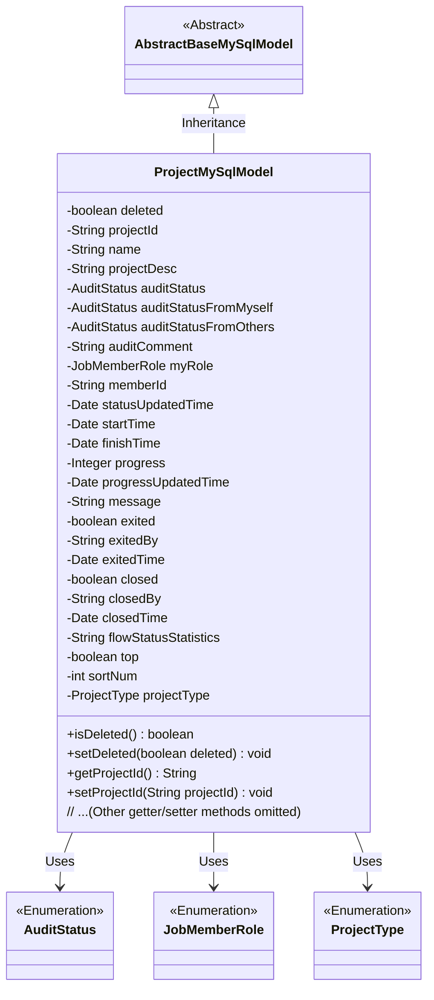

# Basic Information

|      |      |
|------|------|
| Name | ProjectMySqlModel |
| Language | .java |
| Code Path | WeFe/board/board-service/src/main/java/com/welab/wefe/board/service/database/entity/job/ProjectMySqlModel.java |
| Package Name | com.welab.wefe.board.service.database.entity.job |
| Dependencies | ['com.welab.wefe.board.service.database.entity.base.AbstractBaseMySqlModel', 'com.welab.wefe.common.wefe.enums.AuditStatus', 'com.welab.wefe.common.wefe.enums.JobMemberRole', 'com.welab.wefe.common.wefe.enums.ProjectType', 'javax.persistence.Entity', 'javax.persistence.EnumType', 'javax.persistence.Enumerated', 'java.util.Date'] |
| Brief Description | Project entity class, containing fields such as ID, name, description, review status, progress, time, member roles, and operation records, used for managing project information. |

# Description

This is a Java entity class named ProjectMySqlModel, representing a project data model. The class includes basic project information such as project ID, name, description, creator ID, as well as review-related statuses and comments. It also contains time-related fields such as start time, end time, and status update time. Additionally, there are fields for progress, message notes, exit and closure statuses. Enum types are used to represent review statuses, our identity, and project types. The class provides getter and setter methods for all fields.

# Class Summary

| Name   | Type  | Description |
|-------|------|-------------|
| ProjectMySqlModel | class | Project entity class, containing fields such as ID, name, description, review status, progress, time, operator, and status, used for managing project information. |

## Class ProjectMySqlModel

|      |      |
|------|------|
| Access Modifier | @Entity(name = "project");public |
| Type | class |
| Name | ProjectMySqlModel |
| Description | Project entity class, containing fields such as ID, name, description, review status, progress, time, operator, and status, used for managing project information. |

### UML Class Diagram

This code defines an entity class named ProjectMySqlModel, which inherits from the abstract class AbstractBaseMySqlModel. The class contains various attributes for project management, such as project ID, name, description, audit status, time information, progress, etc., and utilizes multiple enumeration types (AuditStatus, JobMemberRole, ProjectType) to represent specific field types. The class provides complete getter and setter methods for attribute access and modification. Marked with the @Entity annotation, this class serves as a JPA entity for database mapping.

### Internal Method Call Graph

This flowchart illustrates the complete structure of the ProjectMySqlModel class, including inheritance relationships, all attributes, and corresponding getter/setter methods. This JPA entity class represents a project data model, containing core fields such as basic project information, audit status, time-related data, progress tracking, and status change records. It utilizes enumeration types for specific status fields. All attributes are equipped with standard accessor methods to facilitate data manipulation and persistence handling.

### Field List

| Name  | Type  | Description |
|-------|-------|------|
| statusUpdatedTime | Date | The private date-type variable statusUpdatedTime records the time of status updates. |
| finishTime | Date | The private member variable finishTime, of type Date, represents the completion time. |
| exitedBy | String | The private string variable `exitedBy` is used to record information about the operator who performed the exit action. |
| top | boolean | The private boolean variable `top` indicates whether it is in the top state. |
| myRole | JobMemberRole | The enumeration field myRole uses a string type to store role values. |
| exitedTime | Date | Private date type variable, recording the exit time. |
| deleted | boolean | Boolean type field, indicating whether it has been deleted. |
| sortNum | int | The private integer variable sortNum is used for sorting numbering. |
| memberId | String | Member ID string variable |
| startTime | Date | Private date type variable startTime |
| flowStatusStatistics | String | Private string variable used to record process status statistics. |
| progress | Integer | The private integer variable `progress` is used to track the progress. |
| closedBy | String | The field `closedBy` indicates the executor of the close operation. |
| auditStatusFromMyself | AuditStatus | The field `auditStatusFromMyself` of the enum type `AuditStatus` is stored in string format. |
| closedTime | Date | The private date-type variable closedTime is used to record the closing time. |
| projectDesc | String | Project description field, stores project description information. |
| exited = false | boolean | The variable `exited` marks the exit status, initially set to false. |
| auditComment | String | The private string-type variable auditComment is used to store audit comments. |
| auditStatus | AuditStatus | Using a string format to store the field auditStatus of the enum type AuditStatus. |
| serialVersionUID = -2632889286058354328L | long | Declare a private static final long serialVersionUID with a value of -2632889286058354328. |
| message | String | Private string variable message |
| closed = false | boolean | The variable `closed` is initialized to false, indicating an unclosed state. |
| auditStatusFromOthers | AuditStatus | The entity class field `auditStatusFromOthers` stores values of the enumeration type `AuditStatus` in string format. |
| progressUpdatedTime | Date | The private date-type variable progressUpdatedTime records the time when the progress was updated. |
| projectId | String | Project ID string variable |
| projectType | ProjectType | Define enumeration type fields in entity classes, storing enumeration values in string format. |
| name | String | Private string variable name. |

### Method List

| Name  | Type  | Description |
|-------|-------|------|
| getClosedBy | String | Public method to obtain the closedBy field value. |
| getProgressUpdatedTime | Date | Method to obtain the progress update time, returns the progressUpdatedTime variable. |
| setFinishTime | void | Methods for setting the completion time: assign the parameter finishTime to the object's finishTime property. |
| getFinishTime | Date | The method returns a completion time object. |
| getExitedBy | String | Methods to obtain the information of the exited party, returning the exitedBy string. |
| setFlowStatusStatistics | void | Method for setting flow status statistics information, which assigns the input parameters to the class member variable `flowStatusStatistics`. |
| setStartTime | void | The method to set the start time assigns the parameter `startTime` to the member variable `startTime` of the class. |
| getAuditStatusFromOthers | AuditStatus | The method getAuditStatusFromOthers returns the value of auditStatusFromOthers. |
| isDeleted | boolean | This is a Java method that returns a boolean value `deleted`, indicating whether the object has been deleted. |
| getProgress | Integer | Methods to obtain the progress value, returns an integer-type progress variable. |
| setExitedBy | void | Set the exit method, assigning the parameter exitedBy to the current object's property of the same name. |
| getStartTime | Date | This is a Java method that returns a Date type object named startTime. |
| setClosed | void | Set the boolean method for the object's closed state. |
| setStatusUpdatedTime | void | The method to set the status update time assigns the parameter value to the class variable statusUpdatedTime. |
| isClosed | boolean | The method isClosed returns a boolean value closed, indicating whether the object is closed. |
| setDeleted | void | Boolean method for setting object deletion status. |
| setAuditComment | void | The method for setting audit comments involves assigning the parameter `auditComment` to the class's `auditComment` property. |
| getStatusUpdatedTime | Date | Method to obtain the status update time, returns the statusUpdatedTime value. |
| getExitedTime | Date | Methods to obtain the exit time, returning the exitedTime variable. |
| setAuditStatusFromOthers | void | Set the review status from other parties. |
| getProjectDesc | String | Methods to obtain the project description, returning the projectDesc string. |
| setName | void | Methods for setting object names, assigning the parameter `name` to the `name` property of the object. |
| setTop | void | Boolean method for setting the pinned status of an object. |
| setExited | void | Boolean method to set exit status. |
| setProjectDesc | void | This is a Java method used to set the project description. The method takes a string parameter projectDesc and assigns it to the class's member variable projectDesc. |
| getName | String | The method returns the value of the name variable of type string. |
| isTop | boolean | This is a Java method that returns the boolean value of top, used to determine if it is the top. |
| setMyRole | void | Java Method: Sets the member role attribute of the current object. The parameter is of type JobMemberRole. |
| getAuditStatusFromMyself | AuditStatus | This method returns the auditStatusFromMyself property value of the current object, with the type being AuditStatus. |
| setMemberId | void | Defines a public method `setMemberId` for setting the member ID. The method accepts a string parameter `memberId` and assigns it to the member variable `memberId` of the current object. |
| getProjectType | ProjectType | Methods to obtain the project type, returns the value of the projectType property. |
| getProjectId | String | The method returns the project ID string. |
| setExitedTime | void | The method to set the exit time assigns the parameter exitedTime to the class member variable this.exitedTime. |
| getMemberId | String | Methods to obtain the member ID, which returns a string-type memberId. |
| setClosedTime | void | The method to set the closing time is to assign the parameter `closedTime` to the member variable `closedTime` of the class. |
| setMessage | void | This is a Java method used to set the value of the message attribute in a class. The method takes a string parameter named message and assigns it to the member variable this.message of the class. |
| setProjectId | void | This is a Java method used to set the projectId property of a class, which accepts a string parameter projectId and assigns it to the member variable of the same name in the class. |
| getAuditStatus | AuditStatus | The method to obtain the audit status returns the value of the auditStatus property. |
| getClosedTime | Date | Methods to obtain the closing time, returning the closedTime variable. |
| getMessage | String | Methods to obtain the message string. |
| isExited | boolean | This method checks whether it has exited, returning the boolean state of exited. |
| setClosedBy | void | This is a Java method used to set the value of the closedBy property. The method accepts a string parameter closedBy and assigns it to the class's member variable closedBy. |
| setProjectType | void | The method for setting the project type assigns the parameter projectType to the projectType property of the current object. |
| setAuditStatusFromMyself | void | This method is used to set the object's own audit status, accepting an AuditStatus type parameter and assigning it to the member variable auditStatusFromMyself. |
| setProgressUpdatedTime | void | The method to set the progress update time assigns the parameter progressUpdatedTime to the class member variable of the same name. |
| getSortNum | int | This is a Java method that returns the integer value of sortNum. |
| setSortNum | void | Java Method: Set the sort number by assigning the input parameter sortNum to the sortNum property of the current object. |
| getMyRole | JobMemberRole | Get the current user's role information. |
| setProgress | void | Methods for setting the progress value: assign the input parameter `progress` to the class member variable `progress`. |
| setAuditStatus | void | The method to set the audit status assigns the incoming auditStatus to the auditStatus property of the current object. |
| getAuditComment | String | Method to obtain audit comments, returns the auditComment string. |
| getFlowStatusStatistics | String | Method for retrieving process status statistics, returns a string-type result. |

