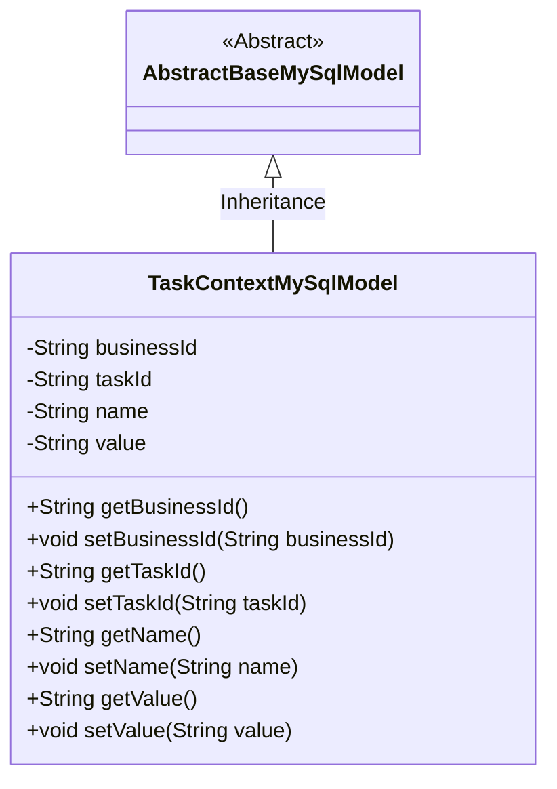

# Basic Information

|      |      |
|------|------|
| Name | TaskContextMySqlModel |
| Language | .java |
| Code Path | WeFe/board/board-service/src/main/java/com/welab/wefe/board/service/database/entity/job/TaskContextMySqlModel.java |
| Package Name | com.welab.wefe.board.service.database.entity.job |
| Dependencies | ['com.welab.wefe.board.service.database.entity.base.AbstractBaseMySqlModel', 'javax.persistence.Entity'] |
| Brief Description | TaskContextMySqlModel is a MySQL entity class that includes task ID, subtask ID, name and value fields along with their getter/setter methods. |

# Description

The content defines a Java class named TaskContextMySqlModel, which extends AbstractBaseMySqlModel and is annotated as an entity class, corresponding to the database table named task_context. The class contains four private fields: businessId represents the task ID, taskId represents the subtask ID, name represents the name, and value represents the value. Each field has corresponding getter and setter methods for accessing and modifying the field values.

# Class Summary

| Name   | Type  | Description |
|-------|------|-------------|
| TaskContextMySqlModel | class | The TaskContextMySqlModel class contains fields for task ID, subtask ID, name, and value, along with their corresponding getter/setter methods. |

## Class TaskContextMySqlModel

|      |      |
|------|------|
| Access Modifier | @Entity(name = "task_context");public |
| Type | class |
| Name | TaskContextMySqlModel |
| Description | The TaskContextMySqlModel class contains fields for task ID, subtask ID, name, and value, along with their corresponding getter/setter methods. |

### UML Class Diagram

This code describes an entity class named TaskContextMySqlModel, which inherits from the abstract base class AbstractBaseMySqlModel. The class contains four private fields: businessId (business ID), taskId (task ID), name (name), and value (value), along with public getter and setter methods for each field. The class is marked with the JPA annotation @Entity, indicating it is a persistent entity mapped to the "task_context" table in the database. This class is primarily used for storing task context-related data in a MySQL database.

### Internal Method Call Graph

```mermaid
graph TD
    A["Class TaskContextMySqlModel"]
    B["Inherits: AbstractBaseMySqlModel"]
    C["Attribute: String businessId"]
    D["Attribute: String taskId"]
    E["Attribute: String name"]
    F["Attribute: String value"]
    G["Method: getBusinessId()"]
    H["Method: setBusinessId(String)"]
    I["Method: getTaskId()"]
    J["Method: setTaskId(String)"]
    K["Method: getName()"]
    L["Method: setName(String)"]
    M["Method: getValue()"]
    N["Method: setValue(String)"]

    A --> B
    A --> C
    A --> D
    A --> E
    A --> F
    A --> G
    A --> H
    A --> I
    A --> J
    A --> K
    A --> L
    A --> M
    A --> N
```

This code defines an entity class named TaskContextMySqlModel, which inherits from AbstractBaseMySqlModel and represents task context data. The class contains four private attributes: businessId (task ID), taskId (subtask ID), name (name), and value (value), with corresponding getter and setter methods provided for each attribute. The entity class is mapped to the database table "task_context" through JPA annotations, primarily used for persisting task-related contextual information.

### Field List

| Name  | Type  | Description |
|-------|-------|------|
| businessId | String | The private string-type variable `businessId` is used to store the business identifier. |
| taskId | String | The private string-type variable taskId is used to store the task identifier. |
| value | String | Private string variable value. |
| name | String | private String variable name |

### Method List

| Name  | Type  | Description |
|-------|-------|------|
| getName | String | This is a Java method that returns the value of the string variable named "name". |
| getBusinessId | String | The method to obtain the business ID directly returns the value of the member variable businessId. |
| setTaskId | void | Methods for setting the task ID: assign the input parameter taskId to the taskId property of the current object. |
| setBusinessId | void | Defined a public method setBusinessId for setting the value of the businessId property in the class. |
| setName | void | The method to set the object name assigns the parameter `name` to the `name` property of the current object. |
| getValue | String | This is a Java method that returns the value of the member variable "value" of type String. |
| setValue | void | Methods for setting string-type values, assigning the input parameter to the object's value property. |
| getTaskId | String | Get the ID string of the current task. |

