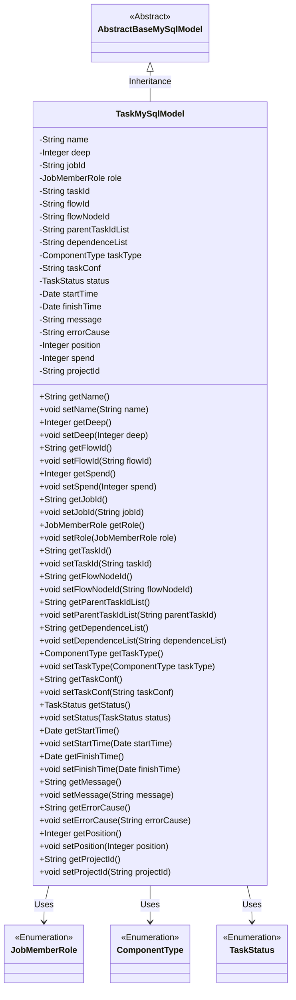

# Basic Information

|      |      |
|------|------|
| Name | TaskMySqlModel |
| Language | .java |
| Code Path | WeFe/board/board-service/src/main/java/com/welab/wefe/board/service/database/entity/job/TaskMySqlModel.java |
| Package Name | com.welab.wefe.board.service.database.entity.job |
| Dependencies | ['com.welab.wefe.board.service.database.entity.base.AbstractBaseMySqlModel', 'com.welab.wefe.common.wefe.enums.ComponentType', 'com.welab.wefe.common.wefe.enums.JobMemberRole', 'com.welab.wefe.common.wefe.enums.TaskStatus', 'javax.persistence.Entity', 'javax.persistence.EnumType', 'javax.persistence.Enumerated', 'java.util.Date'] |
| Brief Description | TaskMySqlModel is the task entity class, which includes fields such as name, depth, task ID, role, process number, node ID, parent task, dependency, type, configuration, status, time, message, error reason, execution order, duration, and project ID. |

# Description

TaskMySqlModel is a Java class representing task entities, which inherits from AbstractBaseMySqlModel. This class includes attributes such as task name, depth, task ID, role, business ID, process number, process node ID, parent task ID list, dependency list, task type, task configuration, status, start time, end time, message note, error reason, execution order, time consumption, and project ID. Each attribute has corresponding getter and setter methods for retrieving and setting attribute values. Task type and status are represented using enumeration types. This class is used to store and manage task-related information in a MySQL database.

# Class Summary

| Name   | Type  | Description |
|-------|------|-------------|
| TaskMySqlModel | class | The `TaskMySqlModel` class defines the task entity, including fields such as name, depth, task ID, role, process information, parent-child task relationships, task type, configuration, status, time, error messages, and execution order. |

## Class TaskMySqlModel

|      |      |
|------|------|
| Access Modifier | @Entity(name = "task");public |
| Type | class |
| Name | TaskMySqlModel |
| Description | The `TaskMySqlModel` class defines the task entity, including fields such as name, depth, task ID, role, process information, parent-child task relationships, task type, configuration, status, time, error messages, and execution order. |

### UML Class Diagram

This class diagram illustrates that TaskMySqlModel inherits from AbstractBaseMySqlModel and contains multiple private fields along with their corresponding getter/setter methods. TaskMySqlModel utilizes three enumeration types: JobMemberRole represents roles, ComponentType represents task types, and TaskStatus represents task states. This class is primarily used to store task-related information, including task name, depth, flow ID, status, etc., and inherits the functionality of the base model.

### Internal Method Call Graph

```mermaid
graph TD
    A["Class TaskMySqlModel"]
    B["Inheritance: AbstractBaseMySqlModel"]
    C["Entity Annotation: @Entity('task')"]
    D["Property: String name"]
    E["Property: Integer deep"]
    F["Property: String jobId"]
    G["Property: JobMemberRole role"]
    H["Property: String taskId"]
    I["Property: String flowId"]
    J["Property: String flowNodeId"]
    K["Property: String parentTaskIdList"]
    L["Property: String dependenceList"]
    M["Property: ComponentType taskType"]
    N["Property: String taskConf"]
    O["Property: TaskStatus status"]
    P["Property: Date startTime"]
    Q["Property: Date finishTime"]
    R["Property: String message"]
    S["Property: String errorCause"]
    T["Property: Integer position"]
    U["Property: Integer spend"]
    V["Property: String projectId"]
    W["Method Section: getter/setter"]

    A --> B
    A --> C
    A --> D
    A --> E
    A --> F
    A --> G
    A --> H
    A --> I
    A --> J
    A --> K
    A --> L
    A --> M
    A --> N
    A --> O
    A --> P
    A --> Q
    A --> R
    A --> S
    A --> T
    A --> U
    A --> V
    A --> W
```

This flowchart illustrates the structure of the TaskMySqlModel class, including its inheritance relationship, property definitions, and method section. The class is a JPA entity representing a task data model, containing core fields such as task name, depth, status, and time information, with enum types enforcing field constraints. All properties are equipped with standard getter/setter methods to support ORM framework operations. The diagram clearly presents the class's relationship with its parent class, property categorization, and method aggregation relationships.

### Field List

| Name  | Type  | Description |
|-------|-------|------|
| position | Integer | Private integer variable `position`, used to store location information. |
| errorCause | String | Private string variable used to store the error reason. |
| taskConf | String | The private string variable taskConf is used to store task configuration information. |
| startTime | Date | Private date type variable startTime. |
| taskType | ComponentType | Define an enumeration type field taskType, using string format to store enumeration values. |
| spend | Integer | The private integer variable "spend" is used to store the consumption amount. |
| name | String | Declare a private string variable name. |
| role | JobMemberRole | The enumeration type field `role` is stored in string format. |
| parentTaskIdList | String | Private string variable storing the list of parent task IDs. |
| projectId | String | Project ID string variable declaration. |
| dependenceList | String | The private string variable dependenceList is used to store the dependency list. |
| flowId | String | The private string variable flowId is used to store the process identifier. |
| jobId | String | Private string type variable jobId. |
| finishTime | Date | The private date-type variable finishTime is used to record the completion time. |
| deep | Integer | Private integer variable deep |
| message | String | Private string variable message. |
| status | TaskStatus | The enumeration type field `status` is stored in string format. |
| flowNodeId | String | The private string variable flowNodeId is used to store the process node identifier. |
| taskId | String | The private string variable `taskId` is used to store the task identifier. |

### Method List

| Name  | Type  | Description |
|-------|-------|------|
| setTaskId | void | Methods for setting the task ID: assign the parameter taskId to the class member variable taskId. |
| setErrorCause | void | This is a Java method used to set the error cause string. The method takes a string parameter `errorCause` and assigns it to the `errorCause` member variable of the current object. |
| setTaskConf | void | The method for setting task configuration parameters assigns the input string to the class variable taskConf. |
| setSpend | void | This is a Java method used to set the value of the class member variable 'spend'. The method accepts an Integer parameter and assigns it to the 'spend' property of the current object. |
| setStatus | void | The method `setStatus` is used to set the task status, assigning the passed `status` parameter to the `status` property of the current object. |
| setDeep | void | The method to set the depth value assigns the parameter `deep` to the class member variable `deep`. |
| getMessage | String | Methods to obtain the message string. |
| getRole | JobMemberRole | The method getRole returns a role value of type JobMemberRole. |
| getDependenceList | String | Methods to obtain the dependency list, directly return the `dependenceList` variable. |
| setFlowId | void | The method to set the flow ID is to assign the parameter flowId to the flowId property of the current object. |
| setStartTime | void | The method to set the start time assigns the parameter `startTime` to the member variable `startTime` of the class. |
| getDeep | Integer | Public method to get the deep value, returns an Integer type. |
| setFlowNodeId | void | Method for setting the flow node ID, which assigns the passed string parameter to the `flowNodeId` member variable of the class. |
| getParentTaskIdList | String | Methods to Obtain the Parent Task ID List. |
| getFinishTime | Date | Methods to obtain the completion time, returns a finishTime date object. |
| getTaskId | String | Methods to obtain the task ID, returns a string-type taskId. |
| setTaskType | void | This is a Java method used to set the task type. The method is named setTaskType, which takes a parameter of type ComponentType named taskType and assigns it to the taskType property of the current object. |
| setDependenceList | void | Method for setting dependency list strings. |
| setRole | void | This is a Java method used to set the member role attribute. The method is named setRole, which accepts a parameter of type JobMemberRole named role, and assigns it to the role field of the current object. |
| getStatus | TaskStatus | Methods to obtain the current task status, returning a status value of type TaskStatus. |
| setFinishTime | void | The method to set the completion time involves assigning the parameter finishTime to the object's finishTime property. |
| setMessage | void | This is a Java method used to set the value of the message attribute in a class. The method takes a string parameter message and assigns it to the member variable this.message of the class. |
| setName | void | Methods for setting the object name, assigning the parameter `name` to the `name` property of the object. |
| getTaskType | ComponentType | Methods for obtaining the task type, returning a taskType value of ComponentType type. |
| getSpend | Integer | Methods to obtain the integer value of spend. |
| getFlowNodeId | String | The method returns a flowNodeId string. |
| setPosition | void | Set the position attribute value of the object to the input integer value. |
| getProjectId | String | Methods to obtain the project ID, returning a string-type projectId. |
| setProjectId | void | This is a Java method used to set the projectId property value of a class. The method takes a string parameter projectId and assigns it to the member variable of the same name in the class. |
| getJobId | String | Get the unique identifier jobId of the current task. |
| setParentTaskIdList | void | The method to set the parent task ID list, with the parameter as parentTaskId, assigns the value to the member variable parentTaskIdList. |
| getPosition | Integer | Methods to obtain position values, returning an integer-type position variable. |
| getErrorCause | String | The method returns an error reason string. |
| getStartTime | Date | Method to get the start time, returns the startTime of Date type. |
| getTaskConf | String | Methods to obtain task configuration, returns the taskConf string. |
| getFlowId | String | This is a Java method that returns the value of the flowId variable of type String. |
| setJobId | void | Methods for setting the task ID: Assign the input parameter jobId to the jobId property of the current object. |
| getName | String | Methods to obtain the object name, returning the value of the name attribute as a string type. |

