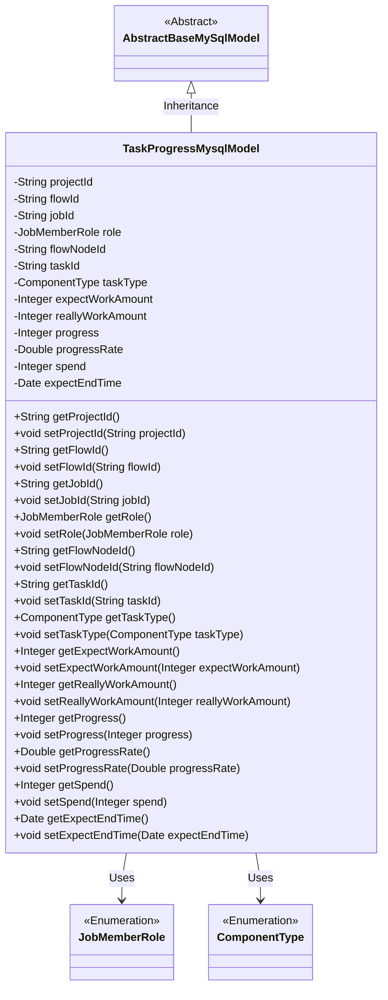

# Basic Information

|      |      |
|------|------|
| Name | TaskProgressMysqlModel |
| Language | .java |
| Code Path | WeFe/board/board-service/src/main/java/com/welab/wefe/board/service/database/entity/job/TaskProgressMysqlModel.java |
| Package Name | com.welab.wefe.board.service.database.entity.job |
| Dependencies | ['com.welab.wefe.board.service.database.entity.base.AbstractBaseMySqlModel', 'com.welab.wefe.common.wefe.enums.ComponentType', 'com.welab.wefe.common.wefe.enums.JobMemberRole', 'javax.persistence.Entity', 'javax.persistence.EnumType', 'javax.persistence.Enumerated', 'java.util.Date'] |
| Brief Description | Task progress entity class, including fields such as project ID, process number, task ID, role, node ID, task type, workload, progress, time consumed, and estimated end time. |

# Description

The code defines a Java class named `TaskProgressMysqlModel`, which represents task progress information. The class includes multiple attributes such as project ID, process number, task ID, role, process node ID, task type, estimated and actual quantities, progress value, progress percentage, time consumed, and estimated end time. Each attribute has corresponding getter and setter methods. This class inherits from `AbstractBaseMySqlModel` and is marked as a database entity using the `@Entity` annotation.

# Class Summary

| Name   | Type  | Description |
|-------|------|-------------|
| TaskProgressMysqlModel | class | Task progress MySQL model, including fields such as project ID, process number, task ID, role, process node ID, subtask type, estimated/actual workload, progress, time consumed, and estimated end time. |

## Class TaskProgressMysqlModel

|      |      |
|------|------|
| Access Modifier | @Entity(name = "task_progress");public |
| Type | class |
| Name | TaskProgressMysqlModel |
| Description | Task progress MySQL model, including fields such as project ID, process number, task ID, role, process node ID, subtask type, estimated/actual workload, progress, time consumed, and estimated end time. |

### UML Class Diagram

Class diagram description: The TaskProgressMysqlModel class inherits from the AbstractBaseMySqlModel abstract class, representing a MySQL storage model for task progress data. It contains core fields such as project ID, flow ID, job ID, along with statistical metrics like work amount, progress, and time spent. The role and taskType fields use enumeration types. The design leverages inheritance for base class functionality reuse and enforces field value standardization through enumerations, fully complying with JPA entity specifications.

### Internal Method Call Graph

```mermaid
graph TD
    A["Class TaskProgressMysqlModel"]
    B["Inherits: AbstractBaseMySqlModel"]
    C["Property: String projectId"]
    D["Property: String flowId"]
    E["Property: String jobId"]
    F["Property: JobMemberRole role"]
    G["Property: String flowNodeId"]
    H["Property: String taskId"]
    I["Property: ComponentType taskType"]
    J["Property: Integer expectWorkAmount"]
    K["Property: Integer reallyWorkAmount"]
    L["Property: Integer progress"]
    M["Property: Double progressRate"]
    N["Property: Integer spend"]
    O["Property: Date expectEndTime"]
    P["Method: getProjectId()/setProjectId()"]
    Q["Method: getFlowId()/setFlowId()"]
    R["Method: getJobId()/setJobId()"]
    S["Method: getRole()/setRole()"]
    T["Method: getFlowNodeId()/setFlowNodeId()"]
    U["Method: getTaskId()/setTaskId()"]
    V["Method: getTaskType()/setTaskType()"]
    W["Method: getExpectWorkAmount()/setExpectWorkAmount()"]
    X["Method: getReallyWorkAmount()/setReallyWorkAmount()"]
    Y["Method: getProgress()/setProgress()"]
    Z["Method: getProgressRate()/setProgressRate()"]
    AA["Method: getSpend()/setSpend()"]
    AB["Method: getExpectEndTime()/setExpectEndTime()"]

    A --> B
    A --> C
    A --> D
    A --> E
    A --> F
    A --> G
    A --> H
    A --> I
    A --> J
    A --> K
    A --> L
    A --> M
    A --> N
    A --> O
    A --> P
    A --> Q
    A --> R
    A --> S
    A --> T
    A --> U
    A --> V
    A --> W
    A --> X
    A --> Y
    A --> Z
    A --> AA
    A --> AB
```

This code defines an entity class named TaskProgressMysqlModel for tracking task progress information. The class inherits from AbstractBaseMySqlModel and contains 13 properties representing project ID, flow ID, job ID, role type, flow node ID, task ID, task type, expected work amount, actual work amount, progress value, progress percentage, time spent, and expected end time. Each property has corresponding getter and setter methods for data retrieval and modification. This class is primarily used to store and manage task progress-related data in MySQL databases.

### Field List

| Name  | Type  | Description |
|-------|-------|------|
| flowId | String | The private string variable flowId is used to store the process identifier. |
| expectEndTime | Date | The private date-type variable expectEndTime represents the expected end time. |
| jobId | String | Private string type variable jobId. |
| flowNodeId | String | Define a private string variable flowNodeId. |
| projectId | String | Project ID string variable declaration |
| progress | Integer | The private integer variable `progress` is used to record the progress. |
| expectWorkAmount | Integer | Private integer variable indicating the expected workload. |
| role | JobMemberRole | Define an enum type field `role`, using string values to store enum constants. |
| reallyWorkAmount | Integer | Private integer variable representing the actual workload. |
| taskType | ComponentType | Define an enumeration type field `taskType`, storing the enumeration values in string format. |
| taskId | String | Task ID string variable |
| spend | Integer | Private integer variable `spend`, used to store numerical values. |
| progressRate | Double | The private double-precision floating-point variable progressRate is used to store the progress ratio. |

### Method List

| Name  | Type  | Description |
|-------|-------|------|
| getTaskId | String | The method getTaskId returns the taskId value of string type. |
| getTaskType | ComponentType | Methods for obtaining the task type, returning a ComponentType object. |
| setFlowId | void | The method to set the flow ID assigns the input parameter flowId to the flowId property of the current object. |
| setProgressRate | void | The method to set the progress rate accepts a parameter of type Double and assigns it to the member variable progressRate. |
| getRole | JobMemberRole | The method getRole returns the value of the member variable role of type JobMemberRole. |
| setRole | void | This is a Java method used to set the member role attribute. The method is named setRole, which accepts a parameter of type JobMemberRole named role, and assigns it to the role field of the current object. |
| setExpectWorkAmount | void | This is a Java method used to set the integer value of the expected workload. The method is named setExpectWorkAmount, which accepts an Integer parameter and assigns it to the class member variable expectWorkAmount. |
| getProgressRate | Double | This method returns a progress rate value progressRate of type Double. |
| setJobId | void | Methods for setting the task ID: Assign the input parameter jobId to the jobId property of the current object. |
| getSpend | Integer | The method to obtain the consumption amount, returns an integer value spend. |
| setSpend | void | This is a Java method used to set the value of the spend variable. The method accepts an Integer parameter and assigns it to the class's member variable spend. |
| getExpectEndTime | Date | This is a Java method that returns a Date type variable named expectEndTime. |
| setExpectEndTime | void | Method for setting the expected end time, with the parameter being of Date type. |
| getProgress | Integer | The method getProgress returns the value of the integer variable progress. |
| setTaskId | void | Methods for setting the task ID: Assign the passed `taskId` to the `taskId` property of the current object. |
| getProjectId | String | Methods to obtain the project ID, returning a string-type projectId. |
| getFlowId | String | This is a Java method that returns the value of the flowId variable of type String. |
| setReallyWorkAmount | void | Java Method: Set Actual Workload Parameters. |
| setProgress | void | Method to set the progress value: Assign the input parameter 'progress' to the 'progress' property of the current object. |
| setProjectId | void | This is a Java method used to set the projectId property of a class. The method takes a string parameter projectId and assigns it to the member variable of the same name in the class. |
| setFlowNodeId | void | Method for setting the flow node ID: Assign the parameter flowNodeId to the property of the same name in the current object. |
| getFlowNodeId | String | The method to obtain the current flow node ID returns a string-type flowNodeId value. |
| setTaskType | void | The method `setTaskType` is used to set the task type, with the parameter being of type `ComponentType`, and assigns the value to the member variable `taskType`. |
| getJobId | String | Get the unique identifier jobId of the current task. |
| getExpectWorkAmount | Integer | Get the integer value of the expected workload. |
| getReallyWorkAmount | Integer | Method for obtaining the integer value of actual workload. |

