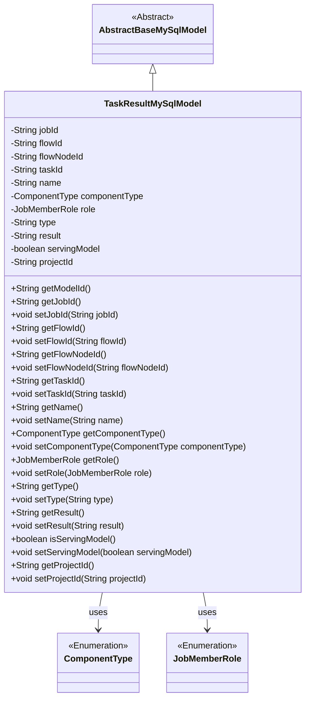
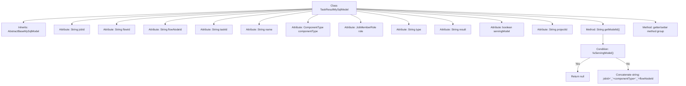

# Basic Information

|      |      |
|------|------|
| Name | TaskResultMySqlModel |
| Language | .java |
| Code Path | WeFe/board/board-service/src/main/java/com/welab/wefe/board/service/database/entity/job/TaskResultMySqlModel.java |
| Package Name | com.welab.wefe.board.service.database.entity.job |
| Dependencies | ['com.welab.wefe.board.service.database.entity.base.AbstractBaseMySqlModel', 'com.welab.wefe.common.wefe.enums.ComponentType', 'com.welab.wefe.common.wefe.enums.JobMemberRole', 'javax.persistence.Entity', 'javax.persistence.EnumType', 'javax.persistence.Enumerated'] |
| Brief Description | The TaskResultMySqlModel class stores task result data, including fields such as task ID, process ID, node ID, task name, component type, member role, result type, execution result, and whether the model can be exported, and provides getter/setter methods. |

# Description

TaskResultMySqlModel is an entity class that inherits from AbstractBaseMySqlModel, corresponding to the database table task_result. This class contains task-related fields: jobId (task ID), flowId (process ID), flowNodeId (process node ID), taskId (subtask ID), name (task name), componentType (component type enum), role (member role enum), type (result type), result (execution result), servingModel (flag indicating whether the model can be exported), projectId (project ID). The modelId is generated by concatenating jobId, componentType, and flowNodeId, provided that servingModel is true. The class provides getter and setter methods for all fields.

# Class Summary

| Name   | Type  | Description |
|-------|------|-------------|
| TaskResultMySqlModel | class | The TaskResultMySqlModel class stores task results, including fields such as task ID, process ID, node ID, task name, component type, member role, result type, execution result, whether the model can be exported, and project ID. It also provides the getModelId method to generate the model ID. |

## Class TaskResultMySqlModel

|      |      |
|------|------|
| Access Modifier | @Entity(name = "task_result");public |
| Type | class |
| Name | TaskResultMySqlModel |
| Description | The TaskResultMySqlModel class stores task results, including fields such as task ID, process ID, node ID, task name, component type, member role, result type, execution result, whether the model can be exported, and project ID. It also provides the getModelId method to generate the model ID. |

### UML Class Diagram

This code defines an entity class named `TaskResultMySqlModel`, which inherits from the abstract base class `AbstractBaseMySqlModel` and is used to store task execution result information. The class includes multiple private fields such as job ID, flow ID, node ID, etc., and provides public getter and setter methods for accessing and modifying these fields. `ComponentType` and `JobMemberRole` are enumeration types used to represent component types and member roles. Notably, the `getModelId()` method generates a model ID based on specific conditions. The overall design reflects the mapping relationship between database entities and business models.

### Internal Method Call Graph

This code defines a JPA entity class named TaskResultMySqlModel, which inherits from AbstractBaseMySqlModel. The class primarily contains attributes related to task execution results, such as basic information like task ID, flow ID, node ID, as well as enumerated fields like component type and member role. Notably, the getModelId() method determines whether to return a model ID concatenated from multiple fields based on the servingModel flag. All attributes are equipped with standard getter/setter methods, complying with JavaBean specifications.

### Field List

| Name  | Type  | Description |
|-------|-------|------|
| taskId | String | Task ID string variable |
| type | String | Declare a private string variable type. |
| flowId | String | The private string variable flowId is used to store the process identifier. |
| servingModel | boolean | Boolean variable indicating whether the model is being served. |
| role | JobMemberRole | The enumeration type field `role` stores the `JobMemberRole` enumeration using string values. |
| name | String | private String variable name |
| componentType | ComponentType | The enumeration type field componentType is stored in string format. |
| flowNodeId | String | The private string variable flowNodeId is used to store the process node identifier. |
| projectId | String | Project ID string variable |
| result | String | Declare a private string variable named result. |
| jobId | String | The private string-type variable jobId is used to store the task ID. |

### Method List

| Name  | Type  | Description |
|-------|-------|------|
| getName | String | The method returns the value of the name variable of type string. |
| setComponentType | void | Set the component type by method, with the parameter being a ComponentType object, and assign it to the member variable componentType. |
| getFlowNodeId | String | The method returns a flowNodeId string. |
| getFlowId | String | This is a Java method that returns the value of the flowId variable of type String. |
| setJobId | void | The method to set the task ID assigns the parameter jobId to the class member variable jobId. |
| getTaskId | String | This is a Java method that returns the value of the private variable taskId. |
| getModelId | String | This method returns the model ID, or null if no model is running. If the model is running, the model ID is generated by concatenating the task ID, component type, and process node ID. |
| setFlowNodeId | void | Method for setting the flow node ID, assigning the parameter flowNodeId to the property of the same name in the current object. |
| getType | String | This is a Java method that returns the value of a string-type variable named "type". |
| getRole | JobMemberRole | Get the role information of the current object. |
| getJobId | String | Get the unique identifier jobId of the current task. |
| setName | void | This is a Java method used to set the name property of an object, assigning the passed string parameter to the member variable name. |
| setRole | void | The method `setRole` is used to set the member role, with the parameter of type `JobMemberRole`, and assigns the value to the `role` property of the current object. |
| setFlowId | void | The method to set the flow ID involves assigning the parameter flowId to the flowId property of the current object. |
| setTaskId | void | Methods for setting the task ID: Assign the input parameter `taskId` to the `taskId` property of the current object. |
| getComponentType | ComponentType | Methods to obtain the component type, returns the componentType. |
| setType | void | This is a Java method used to set the type property of an object. The method is named setType, which takes a String parameter type and assigns it to the type member variable of the current object. |
| getResult | String | This is a Java method that returns the value of the string-type variable `result`. |
| setResult | void | Methods for setting the result string. |
| isServingModel | boolean | This method returns a boolean value servingModel, indicating whether the model is currently being served. |
| setServingModel | void | Methods for setting the service model status, with the parameter servingModel as a boolean value, used to update the current object's state. |
| getProjectId | String | Methods to obtain the project ID, returning a string-type projectId. |
| setProjectId | void | This is a Java method used to set the projectId property of a class. It accepts a string parameter projectId and assigns it to the class member variable of the same name. |

