# Basic Information

|      |      |
|------|------|
| Name | job |
| Language | .java |
| Code Path | WeFe/board/board-service/src/main/java/com/welab/wefe/board/service/database/entity/job |
| Package Name | docs.board.board-service.src.main.java.com.welab.wefe.board.service.database.entity.job |
| Brief Description | ModelOotRecordMysqlModel maps to the model_oot_record table, containing fields such as process ID, job ID, and node ID. TaskMySqlModel represents the task entity, with attributes like name, depth, and status. JobMemberMySqlModel maps to the job_member table, including fields such as project ID and role. TaskResultMySqlModel corresponds to the task_result table, with fields like task ID and result type. ProjectMemberAuditMySqlModel records member audit information. JobMySqlModel represents federated learning tasks. ProjectFlowNodeMySqlModel denotes process nodes. ProjectFlowMySqlModel maps to the project_flow table. ProjectDataSetMySqlModel represents project datasets. TaskProgressMysqlModel records task progress. TaskContextMySqlModel stores task context. ProjectMySqlModel represents project data. ProjectMemberMySqlModel records project member information. |

# Description

## Overview  
This module serves as the core data model layer of the federated learning platform, responsible for managing entity relationships such as projects, tasks, members, and workflows. All entity classes inherit from the `AbstractBaseMySqlModel` base class and are mapped to MySQL tables via JPA annotations. For example, `JobMySqlModel` records horizontal/vertical federated tasks, while `ProjectFlowNodeMySqlModel` stores workflow node topologies. Key data structures include flow ID (`flowId`), task ID (`jobId`), role enumerations (promoter/provider/arbiter), and audit status enumerations (adopt/disagree). The primary dependencies are the MySQL database and JPA specifications, resembling a traditional CRUD architectural pattern.  

## Key Business Scenarios  
The module supports full lifecycle management of federated learning. For instance, `ProjectFlowMySqlModel` defines flowcharts, `TaskMySqlModel` tracks subtask statuses, and `TaskResultMySqlModel` stores component execution results. A typical interaction pattern involves: members joining projects via `ProjectMemberMySqlModel`, workflow nodes constructing DAGs through `ProjectFlowNodeMySqlModel`, and task progress being monitored by `TaskProgressMysqlModel`. Integration cases include model OOT records (`ModelOotRecordMysqlModel`) and dataset audits (`ProjectDataSetMySqlModel`), forming an end-to-end workflow.

### Package Internal Structure View

```mermaid
graph TD
    job --> ModelOotRecordMysqlModel.java
    job --> TaskMySqlModel.java
    job --> JobMemberMySqlModel.java
    job --> TaskResultMySqlModel.java
    job --> ProjectMemberAuditMySqlModel.java
    job --> JobMySqlModel.java
    job --> ProjectFlowNodeMySqlModel.java
    job --> ProjectFlowMySqlModel.java
    job --> ProjectDataSetMySqlModel.java
    job --> TaskProgressMysqlModel.java
    job --> TaskContextMySqlModel.java
    job --> ProjectMySqlModel.java
    job --> ProjectMemberMySqlModel.java
```

This flowchart illustrates the entity class file structure under the job directory in the board-service module of the WeFe project. All Java entity class files are directly subordinate to the job directory, including various database entity classes such as task models, project models, member models, etc., totaling 13 file nodes. It clearly presents the file organization relationships within this directory.

# File List

| Name   | Type  | Description |
|-------|------|-------------|
| [ModelOotRecordMysqlModel.java](ModelOotRecordMysqlModel.md) | file | The entity class ModelOotRecordMysqlModel contains three fields: process ID, OOT job ID, and OOT model ID, along with their corresponding getter and setter methods. |
| [TaskMySqlModel.java](TaskMySqlModel.md) | file | TaskMySqlModel is the task entity class, which includes fields such as name, depth, task ID, role, process number, node ID, parent task, dependency, type, configuration, status, time, message, error reason, execution order, duration, and project ID. |
| [JobMemberMySqlModel.java](JobMemberMySqlModel.md) | file | The JobMemberMySqlModel class represents a job member, containing project, workflow, and task IDs, member roles (promoter/provider/arbiter), member ID, and dataset ID. |
| [TaskResultMySqlModel.java](TaskResultMySqlModel.md) | file | The TaskResultMySqlModel class stores task result data, including fields such as task ID, process ID, node ID, task name, component type, member role, result type, execution result, and whether the model can be exported, along with providing getter/setter methods. |
| [ProjectMemberAuditMySqlModel.java](ProjectMemberAuditMySqlModel.md) | file | Project member review entity class, including fields for project ID, member ID, reviewer ID, review result, and review comments. |
| [JobMySqlModel.java](JobMySqlModel.md) | file | The JobMySqlModel class defines the data model for federated learning tasks, including fields such as task type, ID, status, time, progress, and configuration, supporting JSON storage for configuration information. |
| [ProjectFlowNodeMySqlModel.java](ProjectFlowNodeMySqlModel.md) | file | Project process node entity class, including fields such as start node identifier, node ID, project ID, process ID, parent node list, component type, parameters, and version number. |
| [ProjectFlowMySqlModel.java](ProjectFlowMySqlModel.md) | file | Project process entity class, containing attributes such as process ID, name, description, status, type, creator, sorting, etc., used for managing federated learning project processes. |
| [ProjectDataSetMySqlModel.java](ProjectDataSetMySqlModel.md) | file | Project dataset MySQL model class, including fields such as project ID, member ID, role, dataset ID, review status, source component type, task ID, subtask ID, and dataset type, with getter/setter methods provided. |
| [TaskProgressMysqlModel.java](TaskProgressMysqlModel.md) | file | Task progress entity class, including fields such as project ID, process number, task ID, role, node ID, task type, work quantity, progress, time consumed, and estimated end time. |
| [TaskContextMySqlModel.java](TaskContextMySqlModel.md) | file | TaskContextMySqlModel is a MySQL entity class that contains fields for task ID, subtask ID, name, and value, along with their corresponding getter/setter methods. |
| [ProjectMySqlModel.java](ProjectMySqlModel.md) | file | Project entity class, containing fields such as ID, name, description, review status, progress, time, member roles, and operation records, used for managing project information. |
| [ProjectMemberMySqlModel.java](ProjectMemberMySqlModel.md) | file | Project member entity class, including fields such as member ID, project ID, inviter ID, role, review status and comments, whether exited, etc., providing sorting and getter/setter methods. |

