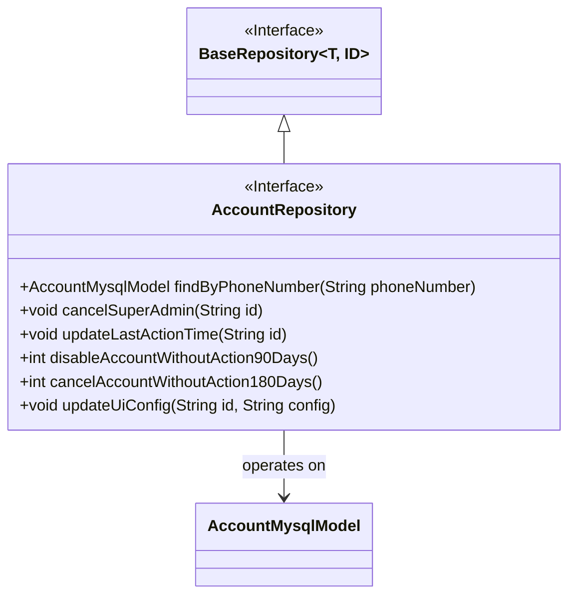
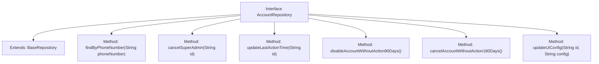

# Basic Information

|      |      |
|------|------|
| Name | AccountRepository |
| Language | .java |
| Code Path | WeFe/board/board-service/src/main/java/com/welab/wefe/board/service/database/repository/AccountRepository.java |
| Package Name | com.welab.wefe.board.service.database.repository |
| Dependencies | ['com.welab.wefe.board.service.database.entity.AccountMysqlModel', 'com.welab.wefe.board.service.database.repository.base.BaseRepository', 'org.springframework.data.jpa.repository.Modifying', 'org.springframework.data.jpa.repository.Query', 'org.springframework.stereotype.Repository', 'org.springframework.transaction.annotation.Transactional'] |
| Brief Description | The AccountRepository interface provides account management functionalities, including querying by phone number, revoking administrator privileges, updating the last operation time, disabling accounts inactive for 90 days, deleting accounts inactive for 180 days, and updating UI configurations. |

# Description

The AccountRepository is an interface that extends BaseRepository, designed for manipulating AccountMysqlModel data. It includes multiple methods: querying accounts by phone number, revoking super administrator privileges, updating the last operation time, disabling accounts inactive for 90 days, deleting accounts inactive for 180 days, and updating user UI configurations. All modification operations are annotated with @Modifying and @Transactional to ensure automatic cache clearance and transaction rollback. Some methods employ native SQL to implement specific business logic, such as time difference calculations and conditional updates.

# Class Summary

| Name   | Type  | Description |
|-------|------|-------------|
| AccountRepository | interface | The AccountRepository interface extends BaseRepository, providing account management functionalities: query by mobile number, revoke administrator privileges, update last operation time, deactivate accounts inactive for 90 days, delete accounts inactive for 180 days, and update UI configurations. |

## Class AccountRepository

|      |      |
|------|------|
| Access Modifier | @Repository;public |
| Type | interface |
| Name | AccountRepository |
| Description | The AccountRepository interface extends BaseRepository, providing account management functionalities: query by mobile number, revoke administrator privileges, update last operation time, deactivate accounts inactive for 90 days, delete accounts inactive for 180 days, and update UI configurations. |

### UML Class Diagram

This code describes a Spring Data JPA AccountRepository interface that extends the BaseRepository interface and provides various account management functionalities. The interface includes six methods: querying accounts by phone number, revoking super admin privileges, updating last action time, disabling accounts inactive for 90 days, canceling accounts inactive for 180 days, and updating UI configurations. All modification operations are annotated with @Modifying and @Transactional to ensure transactional behavior and automatic persistence context clearance. The interface directly interacts with the database through native SQL statements, primarily focusing on account status management and last action time tracking.

### Internal Method Call Graph

This code defines a Spring Data JPA Repository interface AccountRepository, which extends BaseRepository and provides multiple database operation methods. Key functionalities include querying accounts by phone number, revoking admin privileges, updating last action time, disabling inactive accounts for 90 days, canceling inactive accounts for 180 days, and updating user UI configurations. All modification operations come with transaction management and automatic cache clearance configurations to ensure data consistency and performance optimization.

### Field List

| Name  | Type  | Description |
|-------|-------|------|

### Method List

| Name  | Type  | Description |
|-------|-------|------|
| updateLastActionTime | void | The method uses transaction annotations to roll back in case of exceptions. It automatically clears the cache and updates the last_action_time of the specified ID record to the current time via native SQL. |
| cancelSuperAdmin | void | Update the account table to revoke super administrator and administrator privileges based on ID. |
| cancelAccountWithoutAction180Days | int | Using transaction annotations and native SQL to automatically deactivate accounts inactive for 180 days, with cache clearance executed automatically upon completion. |
| disableAccountWithoutAction90Days | int | Spring Data JPA method using transactional annotation, automatically disabling inactive accounts after 90 days, executing native SQL update operations. |
| findByPhoneNumber | AccountMysqlModel | Query account information based on mobile number - MySQL model method. |
| updateUiConfig | void | The method uses transactional annotations to ensure rollback on exceptions, automatically clears the cache, and updates the ui_config field for a specified ID via native SQL. |

