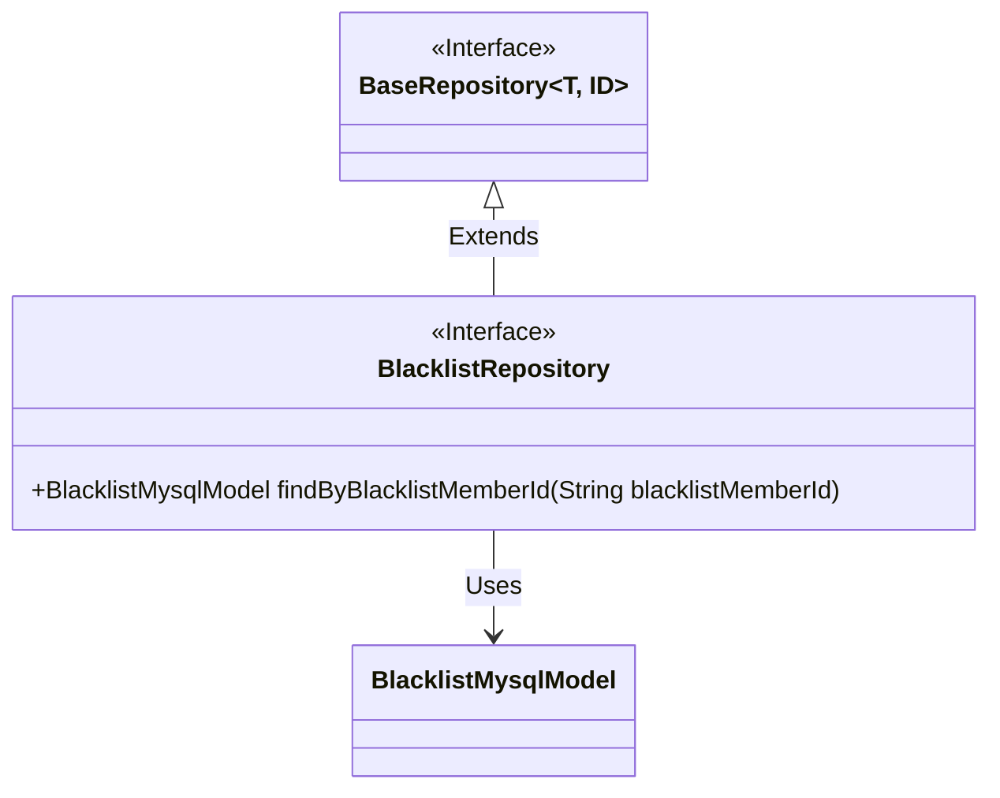
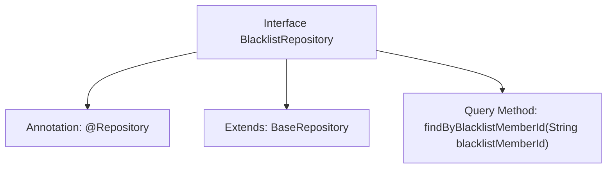

# Basic Information

|      |      |
|------|------|
| Name | BlacklistRepository |
| Language | .java |
| Code Path | WeFe/board/board-service/src/main/java/com/welab/wefe/board/service/database/repository/BlacklistRepository.java |
| Package Name | com.welab.wefe.board.service.database.repository |
| Dependencies | ['com.welab.wefe.board.service.database.entity.BlacklistMysqlModel', 'com.welab.wefe.board.service.database.repository.base.BaseRepository', 'org.springframework.stereotype.Repository'] |
| Brief Description | This is a Spring Data JPA repository interface that extends the base repository class and provides a method for querying blacklist data by member ID. |

# Description

This is a Spring Data repository interface named BlacklistRepository, annotated with @Repository. It extends the BaseRepository base class, with generic parameters specifying the entity type as BlacklistMysqlModel and the primary key type as String. The interface defines a query method findByBlacklistMemberId, which retrieves the corresponding blacklist record by the blacklistMemberId field. This design follows Spring Data JPA's naming conventions, enabling automatic generation of query implementations.

# Class Summary

| Name   | Type  | Description |
|-------|------|-------------|
| BlacklistRepository | interface | This is a Spring repository interface that extends the base repository, used to query models corresponding to blacklisted member IDs. |

## Class BlacklistRepository

|      |      |
|------|------|
| Access Modifier | @Repository;public |
| Type | interface |
| Name | BlacklistRepository |
| Description | This is a Spring repository interface that extends the base repository, used to query models corresponding to blacklisted member IDs. |

### UML Class Diagram

This class diagram illustrates that the BlacklistRepository interface inherits from the generic BaseRepository interface and is associated with the BlacklistMysqlModel entity class. BaseRepository is a generic interface accepting type parameters T and ID; BlacklistRepository, as a data access layer interface, inherits basic CRUD capabilities from BaseRepository while extending a specific method to query by blacklistMemberId. The diagram clearly demonstrates the typical inheritance relationship of Repository interfaces in Spring Data JPA and the mechanism of generic parameter passing.

### Internal Method Call Graph

This flowchart illustrates the structure of the BlacklistRepository interface in Spring Data JPA. It is an interface annotated with @Repository, extending BaseRepository and declaring a query method to find by blacklistMemberId. The interface automatically generates SQL queries through method naming conventions to retrieve blacklist member data from the database, embodying Spring Data's "convention over configuration" design principle.

### Field List

| Name  | Type  | Description |
|-------|-------|------|

### Method List

| Name  | Type  | Description |
|-------|-------|------|
| findByBlacklistMemberId | BlacklistMysqlModel | Query the MySQL model record of the blacklist based on the blacklisted member ID. |

