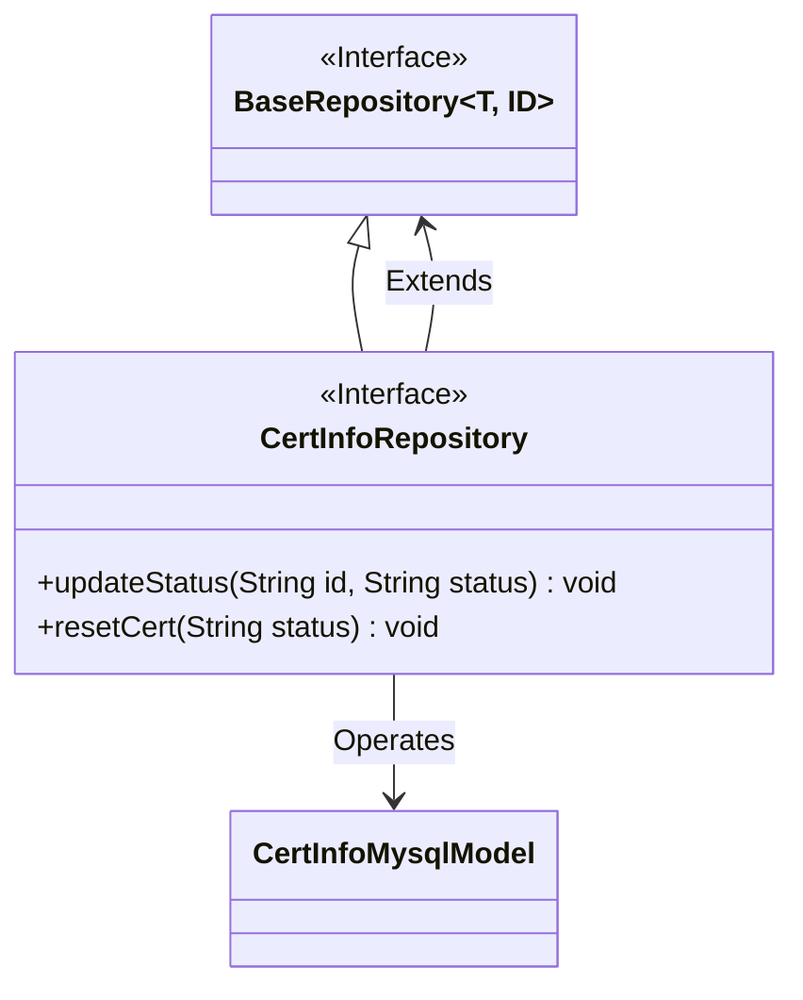
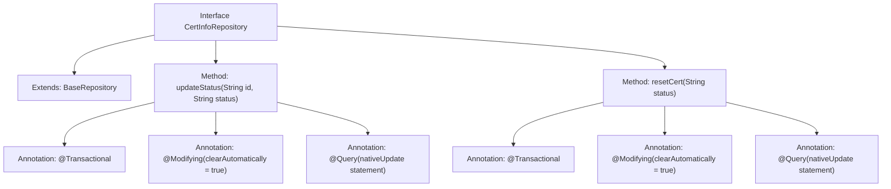

# Basic Information

|      |      |
|------|------|
| Name | CertInfoRepository |
| Language | .java |
| Code Path | WeFe/board/board-service/src/main/java/com/welab/wefe/board/service/database/repository/CertInfoRepository.java |
| Package Name | com.welab.wefe.board.service.database.repository |
| Dependencies | ['org.springframework.data.jpa.repository.Modifying', 'org.springframework.data.jpa.repository.Query', 'org.springframework.stereotype.Repository', 'org.springframework.transaction.annotation.Transactional', 'com.welab.wefe.board.service.database.entity.cert.CertInfoMysqlModel', 'com.welab.wefe.board.service.database.repository.base.BaseRepository'] |
| Brief Description | The CertInfoRepository interface defines two methods: updateStatus updates the status based on ID, and resetCert resets the status of all certificates. Both use native SQL and support transactions. |

# Description

This is a Spring Data JPA repository interface named CertInfoRepository, which extends BaseRepository and operates on the CertInfoMysqlModel entity class with a primary key type of String. The interface contains two data modification methods: the updateStatus method updates the status field of a specified ID record using native SQL, and the resetCert method batch updates the status field of all records using native SQL. Both methods are annotated with @Transactional to ensure transactional behavior and use @Modifying(clearAutomatically=true) to automatically clear the persistence context.

# Class Summary

| Name   | Type  | Description |
|-------|------|-------------|
| CertInfoRepository | interface | The CertInfoRepository interface extends BaseRepository and provides two native SQL update methods: updateStatus updates the status by ID, and resetCert resets all statuses. It utilizes transactions and automatic cache clearing. |

## Class CertInfoRepository

|      |      |
|------|------|
| Access Modifier | @Repository;public |
| Type | interface |
| Name | CertInfoRepository |
| Description | The CertInfoRepository interface extends BaseRepository and provides two native SQL update methods: updateStatus updates the status by ID, and resetCert resets all statuses. It utilizes transactions and automatic cache clearing. |

### UML Class Diagram

This code demonstrates a Spring Data JPA `CertInfoRepository` interface that extends the generic `BaseRepository` interface, specifically designed to operate on the `CertInfoMysqlModel` entity class. The interface defines two update methods: `updateStatus` modifies the status of a single record by ID, while `resetCert` batch-resets the status of all records. The `@Repository` annotation marks it as a persistence layer component, and `@Transactional` with `@Modifying` indicates database-modifying operations. The class diagram clearly illustrates the interface inheritance and entity association, adhering to JPA design patterns.

### Internal Method Call Graph

This code demonstrates a Spring Data JPA repository interface CertInfoRepository, which extends BaseRepository and defines two data modification methods. The updateStatus method updates the status field of a specified record by ID using native SQL, while the resetCert method batch updates the status field of all records. Both methods employ @Transactional to ensure atomicity, @Modifying(clearAutomatically=true) to automatically clear the persistence context after execution, and define native SQL update statements directly via @Query annotations. This interface is typically used in certificate status management scenarios, providing atomic status update operations.

### Field List

| Name  | Type  | Description |
|-------|-------|------|

### Method List

| Name  | Type  | Description |
|-------|-------|------|
| updateStatus | void | Define native SQL update methods using Spring Data JPA annotations to modify entity status fields by ID. |
| resetCert | void | Using native SQL to update entity states, automatically clearing cache, with transaction support. |

