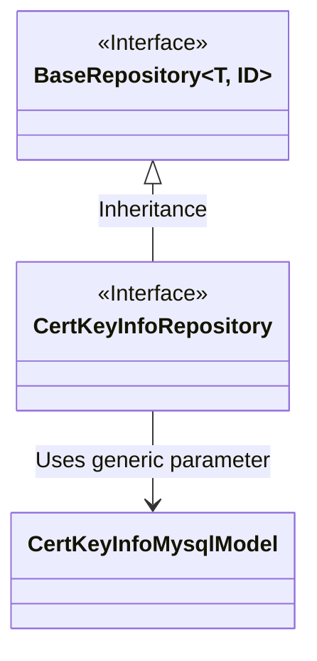
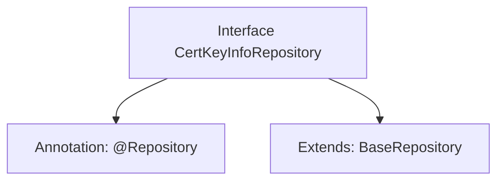

# Basic Information

|      |      |
|------|------|
| Name | CertKeyInfoRepository |
| Language | .java |
| Code Path | WeFe/board/board-service/src/main/java/com/welab/wefe/board/service/database/repository/CertKeyInfoRepository.java |
| Package Name | com.welab.wefe.board.service.database.repository |
| Dependencies | ['org.springframework.stereotype.Repository', 'com.welab.wefe.board.service.database.entity.cert.CertKeyInfoMysqlModel', 'com.welab.wefe.board.service.database.repository.base.BaseRepository'] |
| Brief Description | This is a Spring JPA repository interface that extends the base repository class, designed to operate on the CertKeyInfoMysqlModel data model with a primary key type of String. |

# Description

The content defines a Spring Data repository interface named `CertKeyInfoRepository`, identified by the `@Repository` annotation. This interface extends the generic base class `BaseRepository`, specifying the entity type as `CertKeyInfoMysqlModel` and the primary key type as `String`. This indicates that the repository is used to operate on data entities of type `CertKeyInfoMysqlModel` and provides basic CRUD functionality. The entire definition is concise and clear, conforming to the standard repository interface specifications of Spring Data JPA.

# Class Summary

| Name   | Type  | Description |
|-------|------|-------------|
| CertKeyInfoRepository | interface | The interface CertKeyInfoRepository extends BaseRepository and is used to operate CertKeyInfoMysqlModel data, with the primary key type being String. |

## Class CertKeyInfoRepository

|      |      |
|------|------|
| Access Modifier | @Repository;public |
| Type | interface |
| Name | CertKeyInfoRepository |
| Description | The interface CertKeyInfoRepository extends BaseRepository and is used to operate CertKeyInfoMysqlModel data, with the primary key type being String. |

### UML Class Diagram

This class diagram illustrates the repository interface inheritance relationship in Spring Data JPA. The CertKeyInfoRepository interface extends the generic BaseRepository interface, specifying CertKeyInfoMysqlModel as the entity type and String as the ID type. BaseRepository is a generic base class marked as an interface, providing basic CRUD operations. CertKeyInfoMysqlModel is a concrete entity class, associated with the repository through generic parameters. This structure embodies Spring Data's generic repository pattern, achieving type-safe database operations through interface inheritance.

### Internal Method Call Graph

This code defines a Spring Data JPA repository interface `CertKeyInfoRepository`, marked as a persistence layer component with the `@Repository` annotation, and extends the `BaseRepository` interface specifying the entity type `CertKeyInfoMysqlModel` and primary key type `String`. The interface inherits basic CRUD operation capabilities without requiring manual method implementation, as Spring Data JPA automatically generates the implementation. The flowchart illustrates the annotation and inheritance relationships of the interface, presenting a clear hierarchy.

### Field List

| Name  | Type  | Description |
|-------|-------|------|

### Method List

| Name  | Type  | Description |
|-------|-------|------|

