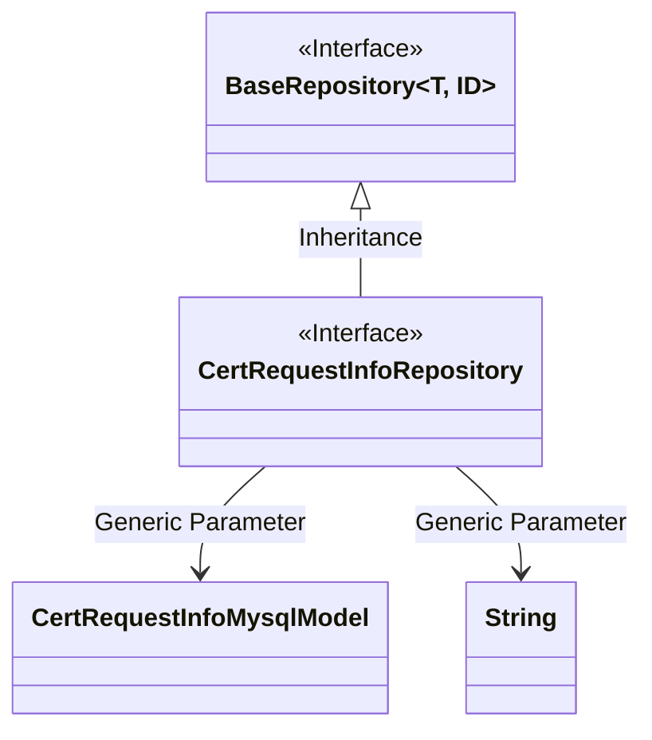
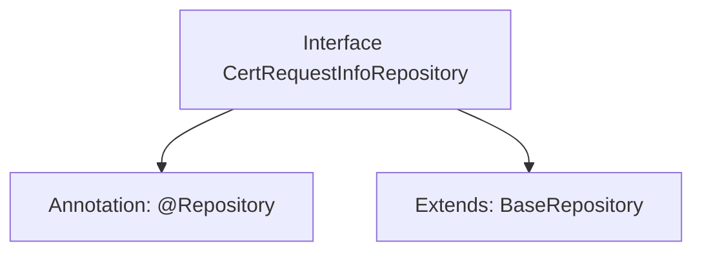

# Basic Information

|      |      |
|------|------|
| Name | CertRequestInfoRepository |
| Language | .java |
| Code Path | WeFe/board/board-service/src/main/java/com/welab/wefe/board/service/database/repository/CertRequestInfoRepository.java |
| Package Name | com.welab.wefe.board.service.database.repository |
| Dependencies | ['org.springframework.stereotype.Repository', 'com.welab.wefe.board.service.database.entity.cert.CertRequestInfoMysqlModel', 'com.welab.wefe.board.service.database.repository.base.BaseRepository'] |
| Brief Description | The interface CertRequestInfoRepository extends BaseRepository and is used to operate CertRequestInfoMysqlModel data, with the primary key type being String. |

# Description

The content defines a Spring Data repository interface named `CertRequestInfoRepository`, marked as a persistence layer component with the `@Repository` annotation. This interface extends the generic base class `BaseRepository`, specifying the entity type as `CertRequestInfoMysqlModel` and the primary key type as `String`. This indicates that the repository is used for data access operations related to certificate request information, implemented based on a MySQL database.

# Class Summary

| Name   | Type  | Description |
|-------|------|-------------|
| CertRequestInfoRepository | interface | This is a Spring repository interface that extends the base repository class, designed to manage MySQL model data for certificate request information. |

## Class CertRequestInfoRepository

|      |      |
|------|------|
| Access Modifier | @Repository;public |
| Type | interface |
| Name | CertRequestInfoRepository |
| Description | This is a Spring repository interface that extends the base repository class, designed to manage MySQL model data for certificate request information. |

### UML Class Diagram

This class diagram illustrates the relationship where the CertRequestInfoRepository interface inherits from the generic BaseRepository interface. BaseRepository is an interface with two generic parameters T and ID, where T is materialized as the CertRequestInfoMysqlModel entity class and ID as the String type. As a data access layer interface, CertRequestInfoRepository acquires basic CRUD operation capabilities by inheriting from BaseRepository, while specifying the entity type and primary key type through generic parameters. This design follows the Repository pattern of Spring Data JPA, achieving abstraction for data access to the CertRequestInfoMysqlModel entity.

### Internal Method Call Graph

This code defines a Spring Data repository interface named CertRequestInfoRepository, marked as a persistence layer component with the @Repository annotation. The interface extends the generic BaseRepository interface, specifying the entity type as CertRequestInfoMysqlModel and the primary key type as String. The flowchart clearly illustrates the annotation marking and inheritance relationship of the interface, demonstrating the typical pattern in Spring Data JPA for rapidly implementing CRUD operations by extending base repository interfaces.

### Field List

| Name  | Type  | Description |
|-------|-------|------|

### Method List

| Name  | Type  | Description |
|-------|-------|------|

