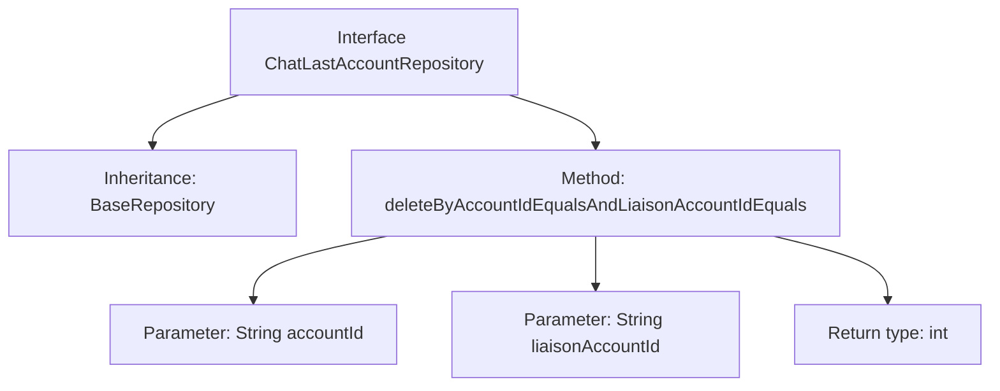

# Basic Information

|      |      |
|------|------|
| Name | ChatLastAccountRepository |
| Language | .java |
| Code Path | WeFe/board/board-service/src/main/java/com/welab/wefe/board/service/database/repository/ChatLastAccountRepository.java |
| Package Name | com.welab.wefe.board.service.database.repository |
| Dependencies | ['com.welab.wefe.board.service.database.entity.chat.ChatLastAccountMysqlModel', 'com.welab.wefe.board.service.database.repository.base.BaseRepository', 'org.springframework.stereotype.Repository'] |
| Brief Description | This is a Spring Repository interface designed for manipulating ChatLastAccountMysqlModel data, providing methods to delete records by accountId and liaisonAccountId. |

# Description

This is a Spring Data repository interface named ChatLastAccountRepository, which extends the BaseRepository base class. The interface is annotated with @Repository, operates on the ChatLastAccountMysqlModel entity class, and has a primary key type of String. The interface defines a delete method deleteByAccountIdEqualsAndLiaisonAccountIdEquals, which deletes matching records based on two equality condition parameters, accountId and liaisonAccountId, and returns the number of affected rows.

# Class Summary

| Name   | Type  | Description |
|-------|------|-------------|
| ChatLastAccountRepository | interface | The interface ChatLastAccountRepository extends BaseRepository and provides a method to delete data by accountId and liaisonAccountId. |


## Class ChatLastAccountRepository

|      |      |
|------|------|
| Access Modifier | @Repository;public |
| Type | interface |
| Name | ChatLastAccountRepository |
| Description | The interface ChatLastAccountRepository extends BaseRepository and provides a method to delete data by accountId and liaisonAccountId. |


### UML Class Diagram

```mermaid
classDiagram
    class BaseRepository~T, ID~ {
        <<Interface>>
    }
    
    class ChatLastAccountRepository {
        <<Interface>>
        +deleteByAccountIdEqualsAndLiaisonAccountIdEquals(String accountId, String liaisonAccountId) int
    }
    
    BaseRepository <|-- ChatLastAccountRepository
    // ChatLastAccountRepository inherits from the generic interface BaseRepository
    // Defines a delete method to remove records based on two account IDs
```

This class diagram illustrates the structure of a Spring Data JPA repository interface. The ChatLastAccountRepository interface extends the generic base interface BaseRepository, specifying the entity type ChatLastAccountMysqlModel and primary key type String. It defines a delete method that removes records using two account IDs as conditions. This design adheres to Spring Data's repository pattern, providing type-safe database operations while maintaining interface simplicity.


### Internal Method Call Graph



This flowchart illustrates the structure of a Repository interface in Spring Data JPA. The ChatLastAccountRepository interface extends BaseRepository and declares a custom delete method. The method matches conditions using two String parameters (accountId and liaisonAccountId) and returns the number of affected rows (int). This design follows Spring Data's derived query naming convention, enabling deletion of database records through composite conditions.

### Field List

| Name  | Type  | Description |
|-------|-------|------|

### Method List

| Name  | Type  | Description |
|-------|-------|------|
| deleteByAccountIdEqualsAndLiaisonAccountIdEquals | int | Delete records matching the specified account ID and contact account ID. |


